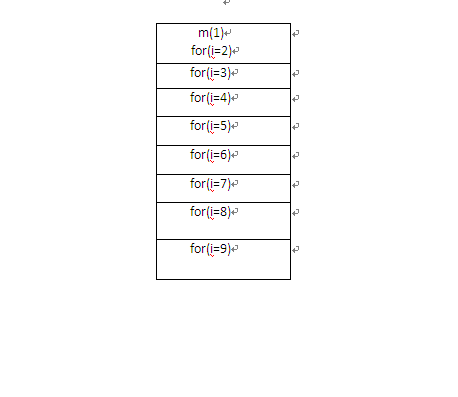

递归算法
==========

要理解递归，首先要理解递归

99乘法表的例子  
----------------------

1：普通实现99乘法表太简单，是个程序员都会，实现如下：

.. code:: java

     
    public class Test99 {
      
      public static void main(String[] args) {
      
      for(int i=1; i<=9;i++){
       for(int j=1; j<=i; j++){
       System.out.print(j+" * "+i+ " = "+(i*j) +" ");
       }
       System.out.println();
      }
    }
       
    }

2：用递归方式实现 99乘法表

.. code:: java

     
    public class MultiTable {
     public static void main(String args[]) { 
        m(9); 
      } 
      
      /** 
       * 打印出九九乘法表 
       * @param i 
       */
      public static void m(int i) { 
        if (i == 1) { 
          System.out.println("1*1=1 "); 
        } else { 
          m(i - 1); 
          for (int j = 1; j <= i; j++) { 
            System.out.print(j + "*" + i + "=" + j * i + " "); 
          } 
          System.out.println(); 
        } 
      }  
    }

递归的方式调用图示：

每一个方法的调用都会产生一个栈帧，压入到方法栈，当递归调用的时候，方法栈中栈帧的图示和上图类似。
去掉方法中栈帧的引用关系更加直观：如下图所示：

简化掉相应的方法调用最后执行情况如上图所示，注意 i 一直在变  j每次都是从1开始 然后递增到和i相等。
这样上图依次出栈后就得到了 99 乘法表：

**总结：**

嵌套for循环 和  用递归实现 的比较:

栈 主要是用来存放栈帧的，每执行一个方法就会出现压栈操作，所以采用递归的时候产生的栈帧比较多，递归就会影响到内存，非常消耗内存，而使用for循环就执行了一个方法，压入栈帧一次，只存在一个栈帧，所以比较节省内存。

一个链表反转的例子，理解了好久
---------------------------------

递归反转法：在反转当前节点之前先反转后续节点。这样从头结点开始，层层深入直到尾结点才开始反转指针域的指向。简单的说就是从尾结点开始，逆向反转各个结点的指针域指向，其过程图如下所示：

::

   head：是前一结点的指针域（PS：前一结点的指针域指向当前结点）
   head.getNext()：是当前结点的指针域（PS：当前结点的指针域指向下一结点）
   reHead：是反转后新链表的头结点（即原来单链表的尾结点）

.. code:: java

    public class javatest1 {
        public static void main(String[] args) {
            Node head = new Node(0);
            Node node1 = new Node(1);
            Node node2 = new Node(2);
            Node node3 = new Node(3);
            head.setNext(node1);
            node1.setNext(node2);
            node2.setNext(node3);
     
            // 打印反转前的链表
            Node h = head;
            while (null != h) {
                System.out.print(h.getData() + " ");
                h = h.getNext();
            }
            // 调用反转方法
            head = Reverse1(head);
     
            System.out.println("\n**************************");
            // 打印反转后的结果
            while (null != head) {
                System.out.print(head.getData() + " ");
                head = head.getNext();
            }
        }
     
        /**
         * 递归，在反转当前节点之前先反转后续节点
         */
        public static Node Reverse1(Node head) {
            // head看作是前一结点，head.getNext()是当前结点，reHead是反转后新链表的头结点
            if (head == null || head.getNext() == null) {
                return head;// 若为空链或者当前结点在尾结点，则直接还回
            }
            Node reHead = Reverse1(head.getNext());// 先反转后续节点head.getNext()
            head.getNext().setNext(head);// 将当前结点的指针域指向前一结点
            head.setNext(null);// 前一结点的指针域令为null;
            return reHead;// 反转后新链表的头结点
        }
    }
     
        class Node {
            private int Data;// 数据域
            private Node Next;// 指针域
     
            public Node(int Data) {
                // super();
                this.Data = Data;
            }
     
            public int getData() {
                return Data;
            }
     
            public void setData(int Data) {
                this.Data = Data;
            }
     
            public Node getNext() {
                return Next;
            }
     
            public void setNext(Node Next) {
                this.Next = Next;
            }
        }

遍历反转法：递归反转法是从后往前逆序反转指针域的指向，而遍历反转法是从前往后反转各个结点的指针域的指向。

::

   基本思路是：将当前节点cur的下一个节点 cur.getNext()缓存到temp后，然后更改当前节点指针指向上一结点pre。也就是说在反转当前结点指针指
              向前，先把当前结点的指针域用tmp临时保存，以便下一次使用，其过程可表示如下：
   pre：上一结点
   cur: 当前结点
   tmp: 临时结点，用于保存当前结点的指针域（即下一结点）

.. code:: java

        /**
         * 遍历，将当前节点的下一个节点缓存后更改当前节点指针
         */
        public static Node reverse2(Node head) {
            if (head == null)
                return head;
            Node pre = head;// 上一结点
            Node cur = head.getNext();// 当前结点
            Node tmp;// 临时结点，用于保存当前结点的指针域（即下一结点）
            while (cur != null) {// 当前结点为null，说明位于尾结点
                tmp = cur.getNext();
                cur.setNext(pre);// 反转指针域的指向
     
                // 指针往下移动
                pre = cur;
                cur = tmp;
            }
            // 最后将原链表的头节点的指针域置为null，还回新链表的头结点，即原链表的尾结点
            head.setNext(null);
            
            return pre;
        }