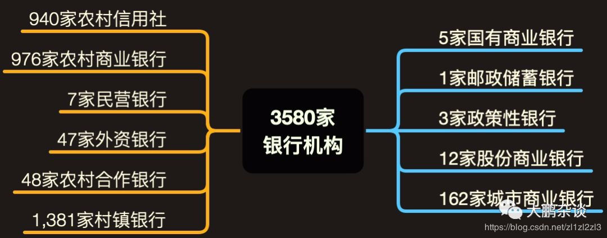
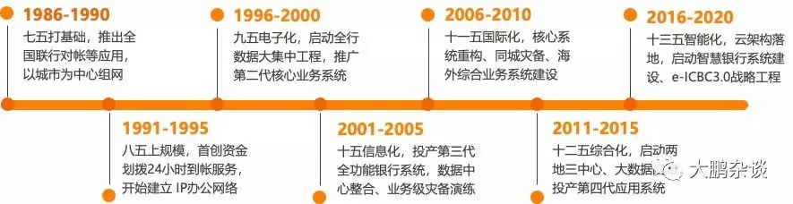
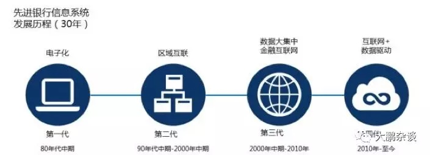
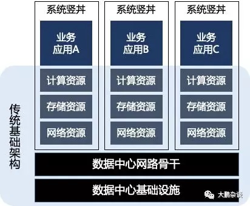
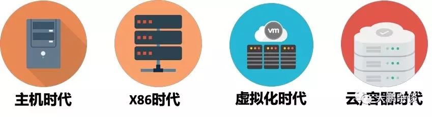

银行IT架构变迁史
===================

要谈银行IT架构的前世今生，就要先从中国银行业的阶级划分讲起，理解了这些背景知识之后，才好探讨我们更关注的技术。

**国内有多少家银行**

我相信很多人大概只知道像中农工建交五大行，以及招商、中信、民生这些街头常见的银行，还有一部分自己身边从小到大接触到的邮储、地方性银行等，那中国究竟有多少家银行金融机构呢？

我查了下资料，发现截至2017年9月5日，我国共有法人银行机构3580家，包括：

3家政策性银行、5家大型商业银行、12家股份制商业银行、1家邮政储蓄银行、47家外资银行、4家金融资产管理公司、162家城市商业银行、7家民营银行、976家农村商业银行、48家农村合作银行、940家农村信用社、1,381家村镇银行.

如下图：

虽然中国有3000多家银行，其中被银监会信息科技监管重点关注银行大概有245家，这里面有我们熟悉的老派稳重的5大行，也有富有活力的股份制银行，还有最近来势汹汹的城商行，以及正在改制中蹉跎前行的农商行，而这些银行又基本上可以分为4个梯队。

**皇亲国戚：五大行**

首先说第一阵营的工农中建交五大行是国家直接管控的大型国有商业银行，有国家信用担保，资金实力雄厚，这类银行IT起步也比较早，拿中行来举例，早在1974年人家就引进第一套理光-8型计算机来进行电子对账，后来更是在信息化建设上的道路上一路买买买，使得国内外最优质的IT资源、人才都向五大行倾斜，近些年来更是各种先进理念的践行者和标准的制定者，明显处于权贵阶层。

**大都市精英白领：股份制银行**

除了五大行外，像我们平常经常接触到的招行、浦发、中信、兴业、光大、民生等这些全国性的股份制银行都属于第二阵营，由于成立时间短（招行1987年4月才成立），业务模式相对灵活，具有国际视野，虽然没法跟五大行正面刚（吸储能力），但是发展出了不少金融创新和特色服务，比如招行在零售方面做得特别好，它的信用卡业务在全国首屈一指，由于这类银行没有历史包袱，IT建设轻装上阵，在小机和X86时代，纷纷响应号召建立信息科技价值评估体系，推动实施内部成本核算、成本分摊与内部服务定价机制，率先尝试成立金融科技公司化运作。这类银行相对活的比较滋润，相当于大都市精英白领阶层。当然还有邮储、政策性银行，这些年IT建设发展迅速，也是第二阵营的佼佼者。

**地方电视台女主播：城商行**

除了国有商业银行和股份制银行外，还有一批由城市信用合作社改制组建的城商行，服务地方中小型企业，比如我们常见的北京银行、上海银行、包商银行、徽商银行属于第三梯队，由于行政上归属地方政府，是当地的钱袋子，算的上当地名流偶像，由于国内城市发展差距较大，比如北京上海这些一线城商行规模甚至比股份制商业银行都要大，在IT建设投入、人才储备方面也相对比较充裕，活的比较滋润，但绝大多数城商行规模、体量、实力都相比股份制银行相差甚远，有些城商行IT建设由于资金、人才缺失选择抱团取暖加入类似山东城商联盟这样的受银监会监管的金融IT服务公司，借此提升自己的IT建设水平，这类银行生存状态相对比较艰难，类似于地方电视台女主播，属于第三阵营。

**过气网红：省联社/农商行**

除了上述银行，还有一支比较特殊的分支省农信联合社，在历史中起到了中流砥柱的作用，比如山东农信、四川农信、江苏农信等，但是随着城市化进程大型银行和城商行也开始聚焦三农与小微，不断下沉渠道，利用资金、人才和技术优势侵蚀联合社/农商行的根据地，尤其是伴随邮储银行的成立，农村金融机构发展愈发困难，目前大多省联社也正处在改制中，比如有些地方已经组建统一法人的省级农商银行（北京、上海、重庆、天津完成了辖内法人机构的统一，实现了农商银行做大做强，成效显著），而有些地方省联社转型为金融控股公司或金融服务公司目前都还前景未明，自身生存问题都很迷茫更无心大力发展科技，有点像过气网红，大致属于第四阵营。

至于民营银行、外资银行，这些业务比较单一，我平时接触不多有很多因此IT建设不太好评估，权且搁置，虽然国内银行业看起来天下初分，实则暗流涌动，毕竟IT没有金融好玩。

了解了国内银行业的圈子划分，接下来我们拿几个实际的客户案例来介绍下，IT建设在银行业的发展历程，以及现如今银行业的IT建设现状，故事先从宇宙行的诞生讲起，信息如果有偏差，欢迎大家指正。

**宇宙行的诞生**

987-1988年，符合中国国情的SAFEII第一版在工行网点大量上线，于此同时，中行的 SAFEII上线几乎与工行同步，而建行的SAFE应用在随后两年也上线，在当时多数银行业务还依靠‘流水账式’手工操作的业务模式下，中国银行业几乎没见过真正的银行核心应用是什么，透过SAFEII，银行才有了对系统的认识，也开启了信息科技的发展之路，各家银行都借助IT之力开始规模扩张。

由于IBM当初给银行客户提供一个完整的商业应用SAFEII，并且以博大的胸怀对SAFE源代码开放并帮助客户改造应用，铸就了其后三十年主机在中国银行业的“霸主”地位，时至今日四大行的核心系统还都跑在其上，而工行则在2014年终成全球市值最大、客户存款第一和盈利最多的上市银行并雄霸至今，俗称“宇宙行”，因此也有了“爱存不存”的美誉，这一切离不开IT从业者这30年来不懈努力和辛勤付出。

如今，随着银行业越来越重视其IT的投入和建设，2016年底银监会也在《银行业信息科技“十三五”发展规划监管指导意见》中明确声明要让首席信息官（CIO）进入决策层，共同参与制定银行未来发展整体战略规划，信息科技这个曾经的后勤保障部门，完美实现屌丝逆袭。

**轰轰烈烈的数据大集中**

而在这过往三十年间，中国银行业投入大量的时间、人力及金钱用于银行的信息系统建设，信息化程度一直走在各行各业前面。银行的信息系统架构经历了电子化、区域互联、数据大集中几个阶段，2010年以后各大行开始尝试向互联网+数据驱动转型。

G行也很早以前就从当初各省分行业务独立运行、IT分散建设模式中考虑到不利于整体业务今后的发展，以及为了解决IT分散管理（各分行也有大机且独立运行一套核心系统，好浪费啊）和容灾的问题，于1999年启动数据大集中工程，建立北京和上海两大数据中心，将全国省分行的业务系统进行上收。

后续上线的业务系统都要部署在X86平台之上，那些曾经风光一时的大机也开始逐渐退出历史舞台（谁曾想IBM给大机开发了三个操作系统VSE、MVS和VM（类似于在PC平台上可以装DOS， Windows和Linux一样）。

当年安装一套MVS操作系统，居然要长达4-6个月的时间，而且还要不同的系统软件工程师去分别安装），虽然使用了X86替代大机拥有了更多的灵活性，但是随着企业业务规模越来越大，上线的应用系统就越来越多，由此也诞生了所谓竖井式应用，也就是我们现在称之为传统IT架构（后续有机会我再补充下分行在这些年业务上收之后的生存现状，先留个尾巴）。

而各中小银行的科技状况目前基本处于区域互联至数据大集中之间，近几年我们可以看到有一大批中小银行都在升级核心系统。自身IT传统架构必然要经历一个渐近式的演进过程，新旧架构并存将持续3-5年。

**背锅的竖井式应用**

由于新的应用系统通常会考虑未来3-5年的业务发展以及突发需求，为满足其性能、容量需求往往在选择计算、存储和网络等硬件设备的配置时会留有一定比例的余量。但实际在硬件资源上线后，应用系统在一定时间内的负载并不会太高，使得设备资源利用率不高。

而用户实际上也是看到了这种情形，当需要上线新的应用系统时，会优先考虑部署在既有的基础架构上，但因为不同的应用系统所需的运行环境、对资源的抢占会有很大的差异，将新、旧应用系统整合在一套基础架构上的难度非常大，更重要的是考虑到X86平台可靠性、稳定性、运维管理问题，更多的用户往往还是选择新增一套计算、存储和网络等设备资源。

而这种部署模式，造成了每套硬件与所承载应用系统的“专机专用”，多套硬件和应用系统构成了“竖井式”部署架构，使得整体资源利用率不高，占用过多的机房空间和能源，随着应用系统的增多，IT资源的效率、扩展性、可管理性都面临很大的挑战。

**先行者们的IT架构变革**

为了提高IT资源利用率，降低运行成本，G行在2008年开始全面部署服务器虚拟化，花了两年时间基本全覆盖数据中心和分行的服务器虚拟化，而这个时间点也差不多是国内银行业X86虚拟化的起点，业内也都普遍采用VMware的X86服务器的虚拟化技术，VMware当时被业界认为其X86虚拟化技术无人能及。

但随着云概念日渐兴起，众多厂商开始在基于VMWare服务器虚拟化的基础上自主研发IaaS平台，G行也于2012年基于VMware服务器虚拟化自主研发和推广第一代基础设施云平台（IaaS 1.0），后来由于开源OpenStack技术的发展。

2015年，G行又开始转向基于OpenStack研发第二代基础设施云平台（IaaS 2.0），与此同时基于Docker的LXC容器技术以其高敏捷性、灵活性、高效率开始备受关注，并在银行业界开始大规模运用，成为PaaS建设的主流方案，G行也在2017年完成PaaS 1.0技术储备，开始大范围部署应用平台云。

回首望去，过去三十年的峥嵘岁月里银行业IT建设像刚出生的蹒跚学步的婴儿从主机时代走向青葱少年般的X86时代，又走过怒放的青年虚拟化时代，到现在终于走向成熟稳重的中年云/容器时代。

由此云的时代算是在银行业正式来开序幕，而作为规模略小一点的HF银行在2015年6月制定了建设金融云平台的目标，规划横跨台三地六中心的金融云整体布局，拟定了详细的金融科技推进战略，历时两年时间于2016年7月完成包括核心银行系统、网上银行、手机银行在内的130个主要应用系统向其云架构数据中心迁移，实现主要应用系统的云化升级改造。

而对于规模更小一些比如TZ银行，在2015年底通过借船出海的策略使用平安架构开发升级上线全新APP，该行客户入口、APP后台和令牌服务器在平安平台，验证服务器在行内，既充分利用了平安成熟的云平台和大数据分析技术，又保障了银行的客户安全。

由于各大银行都努力基于云架构来构建新的分布式应用，并持续开展主机下移进程，这就形成了银行业务系统独有的集中式（大机上的集中式架构核心系统）+分布式（云上的分布式架构应用系统）架构体系，并结合云计算、大数据等新技术手段，不断优化改进应用架构、扩展节点弹性计算能力、增强系统高可用性，借此大大提升了业务推陈出新的快速组合创新能力，而后同业也纷纷效仿积极参与架构转型……

难道这一切发生都是偶然？我想是必然。