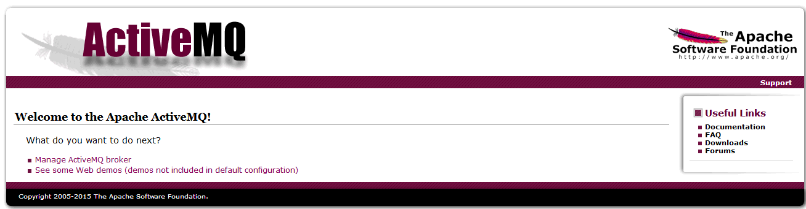

activeMQ基本使用
================

下载
-----

https://activemq.apache.org/download-archives.html

下载版本 5.15.0

安装
--------

无需配置环境变量，直接解压后

不同版本启动命令不一样!

::

    1、V5.8使用下面的命令行启动
    D:\apache-activemq-5.8.0\bin>activemq xbean:../conf/activemq-demo.xml
    2、V5.9使用下面的命令行启动
    D:\apache-activemq-5.9.1\bin>activemq xbean:../examples/conf/activemq-demo.xml
    3、V5.15.0使用下面的命令行启动
    D:\apache-activemq-5.15.0\bin>activemq start xbean:file:../examples/conf/activemq-demo.xml

当然你还可以用绝对的文件目录方式：activemq start xbean:file:D:\apache-activemq-5.15.0\conf/activemq-demo.xml

使用
-----

http://localhost:8161/

点击‘manage ActiveMQ broker’连接，可以进入管理主界面（默认的用户和密码都是admin）。以上就是Apache ActiveMQ消息中间件最简的安装和运行方式。在后续的文章中，我们会陆续讨论ActiveMQ的集群和高性能优化，那时会介绍对应的ActiveMQ的配置问题。

代码示例见 activemqdemo

参考
----------

https://blog.csdn.net/yinwenjie/article/details/50916518

https://www.jianshu.com/p/8caa6d66b10d