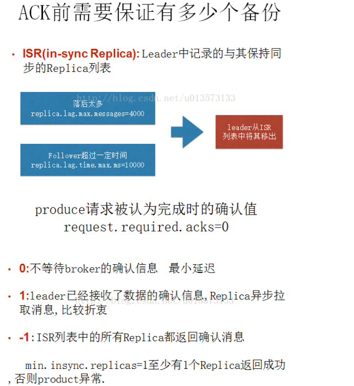

Kafka 关键名词解释
=========================

控制器
---------

第一个启动的broker --> 到zookeeper中创建临时节点 /controller --> 其他broker也去创建,收到节点已存在异常 --> 然后其他broker 在控制器节点上创建 zookeeper watch对象,这样他们就可以收到这个节点的变更通知,这种方式确保节点只有一个控制器

当

控制器失效或者与zookeeper断开连接  --> zookeeper 上的临时节点消失 --> 其他broker通过watch对象得到控制器节点消失的通知 --> 尝试让自己成为新的控制器 --> 第一个成功在zookeeper里创建节点的成为新的控制器  --> 其他broker 收到节点已存在异常 ,然后在新的controller上创建watch对象,新的controller的epoch递增 --> 其他broker知道新的epoch后,如果收到有控制器发出的包含较旧epoch消息,就会忽略他们

当 

控制器发现一个broker离开集群(通过观察相关的zookeeper路径),他就知道哪些失去首领的分区需要一个新的首领(这些分区的首领刚好在这个broker上) --> 控制器遍历这些分区,并确定谁该成为新的首领(简单来说就是分区副本列表里的下一个副本) --> 然后向所有包含新首领或现有跟随者的broker发送请求,该请求消息包含了谁是新首领以及谁是分区跟随者信息 --> 新首领处理来自生产者消费者的请求  --> 跟随者从新首领那里复制消息

副本
-------

replica数 = 首领副本 + 跟随者副本

同步 --> 跟随者向首领发送获取数据请求 --> 同步的副本 --> 当首领失效时,只有同步副本才有可能被选为新首领

在 Kafka 中并不是所有的副本都能被拿来替代主副本，所以在 Kafka 的 Leader 节点中维护着一个 ISR(In Sync Replicas)集合。
翻译过来也叫正在同步中集合，在这个集合中的需要满足两个条件：

- 节点必须和 ZK 保持连接。
- 在同步的过程中这个副本不能落后主副本太多。

另外还有个 AR(Assigned Replicas)用来标识副本的全集，OSR 用来表示由于落后被剔除的副本集合。

所以公式如下：ISR = Leader + 没有落后太多的副本;AR = OSR+ ISR。

broker宕机
------------

broker宕机 --> kafka broker controller会读取该宕机broker上所有的partition在zookeeper上的状态，并选取ISR列表中的一个replica作为partition leader

消息的生产
--------------

producer先把message发送到partition leader  -->  跟随者向首领发送获取数据请求 --> leader响应消息 

在向Producer发送ACK前需要保证有多少个Replica已经收到该消息：根据ack配的个数而定