Kafka2.3.0 windows10阅读环境搭建
===================================

下载需要软件
----------------

**1. 下载 gradle 解压并配置环境变量(5.6以上)**

- 下载 gradle-5.6.2-bin.zip

- 解压 C:\\installs\\gradle-5.6.2

- 环境变量

::

  GRADLE_HOME --> C:\installs\gradle-5.6.2
  PATH --> %GRADLE_HOME%\bin

- 修改仓库下载地址,提速

  `Gradle 修改 Maven 仓库地址`_

**2. 官网下载kafka源码并解压**

- 下载 kafka-2.3.0-src.tgz

- 解压 D:\\sd\\kafka-2.3.0-src

**3. 官网下载zookeeper**

- 下载 apache-zookeeper-3.5.5-bin.tar.gz
- 解压 D:\\zookeeper\\apache-zookeeper-3.5.5-bin

**4. 使用最新的idea,配置scala插件**

- idea版本:2018.3

- 注意scala插件版本需与idea版本匹配 scala-intellij-bin-2018.3.4.zip

**5. 官网下载并安装scala 2.12.8**

- 下载zip包 scala-2.12.8.zip

- 解压 D:\\soft\\idea\\scala-2.12.8

开始搭建阅读环境
------------------

**1. 编译Kafka源码**

::

  pushd D:\sd\kafka-2.3.0-src
  gradle idea // 第一次时间较长,10分钟左右

**2. 导入源码到idea,配置 scala SDK 2.12.8**

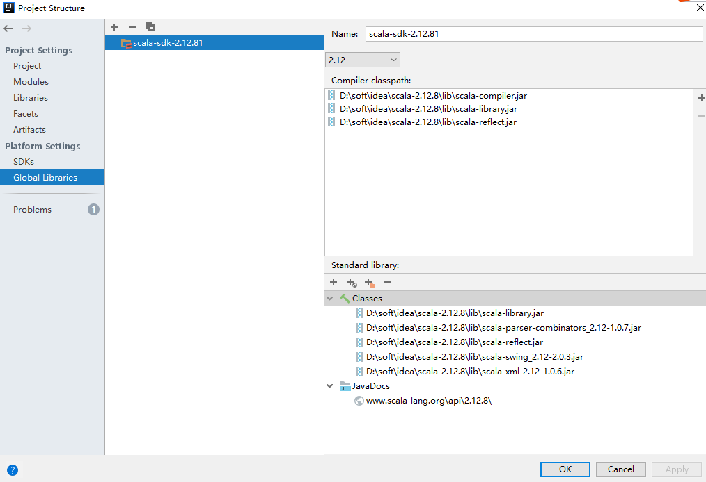

**3. 复制config/log4.properties到core/src/main/scala目录下**

**4. 配置server.properties文件，一般只需要修改以下一些配置项**

::

  log.dirs=D:\\tmp\\kafka-logs
  zookeeper.connect=localhost:2181

**5. 配置kafka application**

::

  Main class --> kafka.Kafka

  VM options --> 
  -Dkafka.logs.dir=D:\sd\kafka-2.3.0-src\logs; -Dlog4j.configuration=D:\sd\kafka-2.3.0-src\config\log4j.properties

  programe argument --> D:\sd\kafka-2.3.0-src\config\server.properties

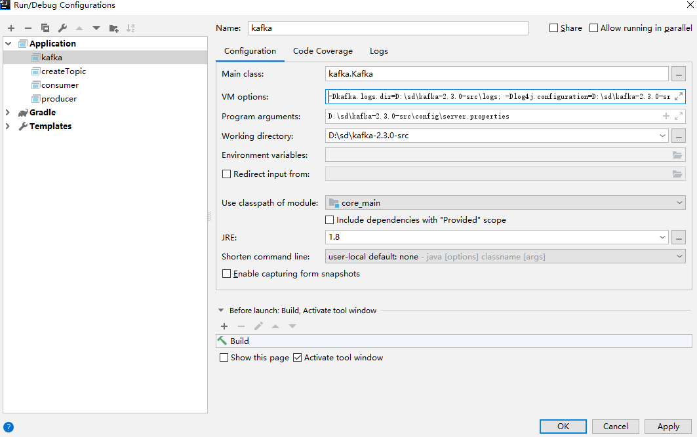

**6. 创建主题 application**

::

  Main class --> kafka.admin.TopicCommand

  programe argument --> 
  --create --zookeeper localhost:2181 --replication-factor 1 --partitions 1 --topic test

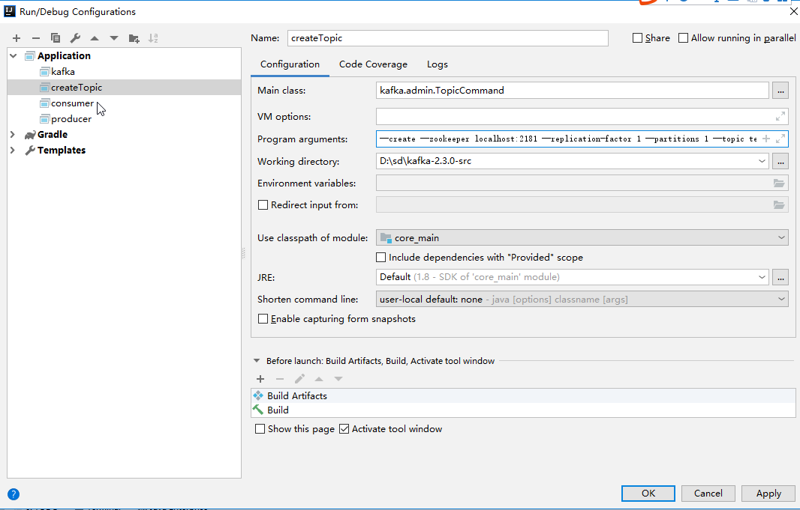

**7. 创建生产者**

::

  Main class --> kafka.tools.ConsoleProducer

  programe argument --> 
  --broker-list localhost:9092 --topic test

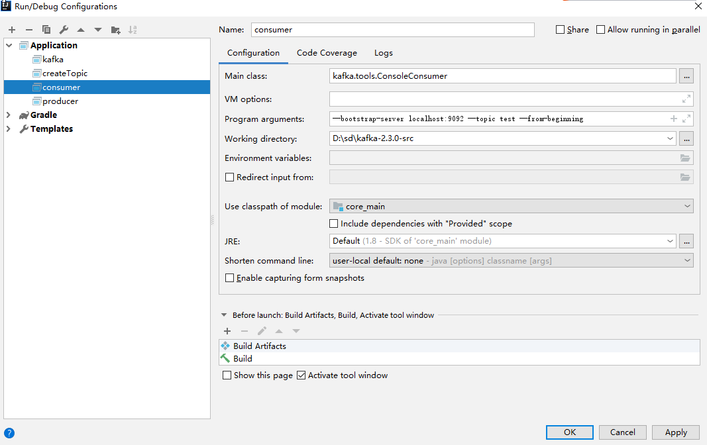

**8. 创建消费者**

::

  Main class --> kafka.tools.ConsoleConsumer

  programe argument --> 
  --bootstrap-server localhost:9092 --topic test --from-beginning

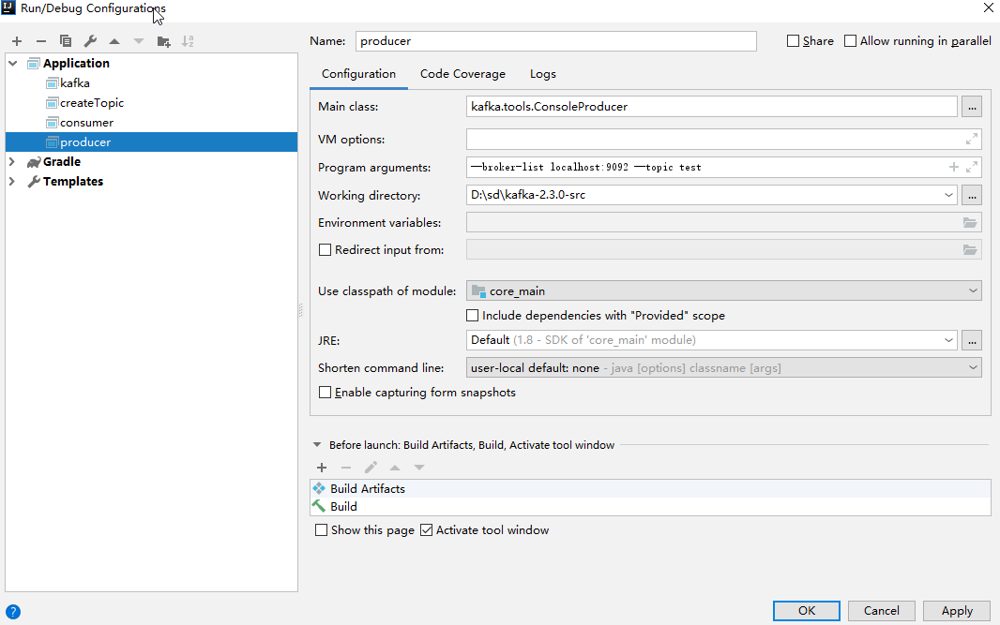

**9. 增加日志包**

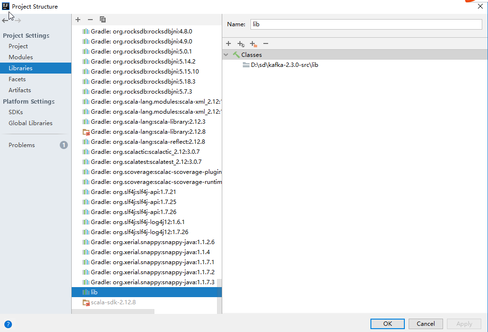

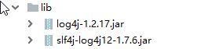

**10. 启动 zookeeper**

::

  pushd D:\zookeeper\apache-zookeeper-3.5.5-bin\bin
  zkServer.cmd

**11. 启动 Kafka,创建主题,启动生产者,启动消费者**

**启动Kafka**

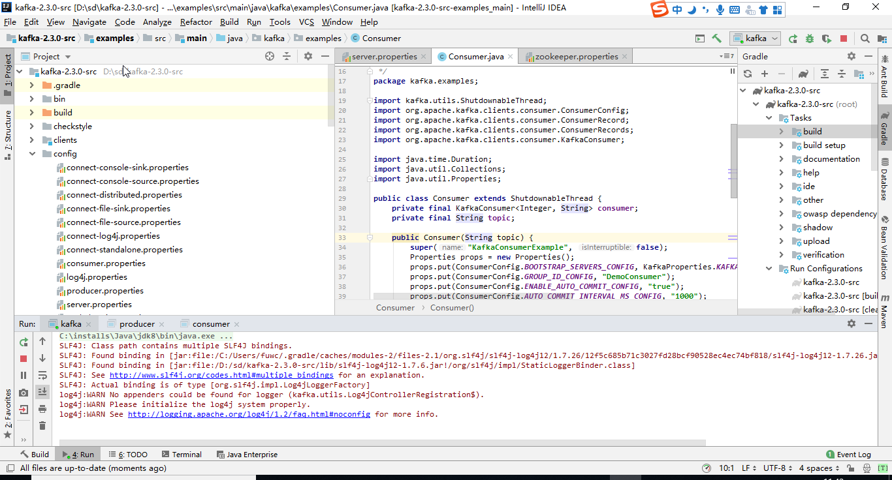

**创建主题**

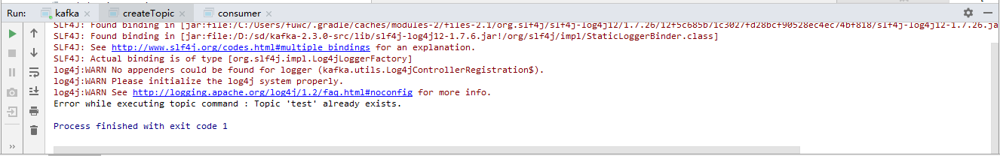

**启动生产者**

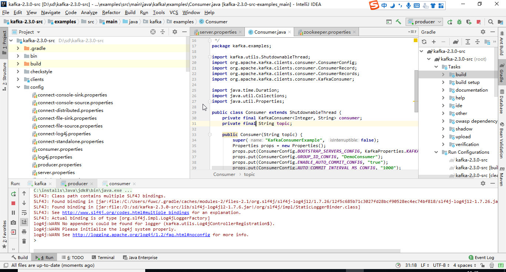

**启动消费者**

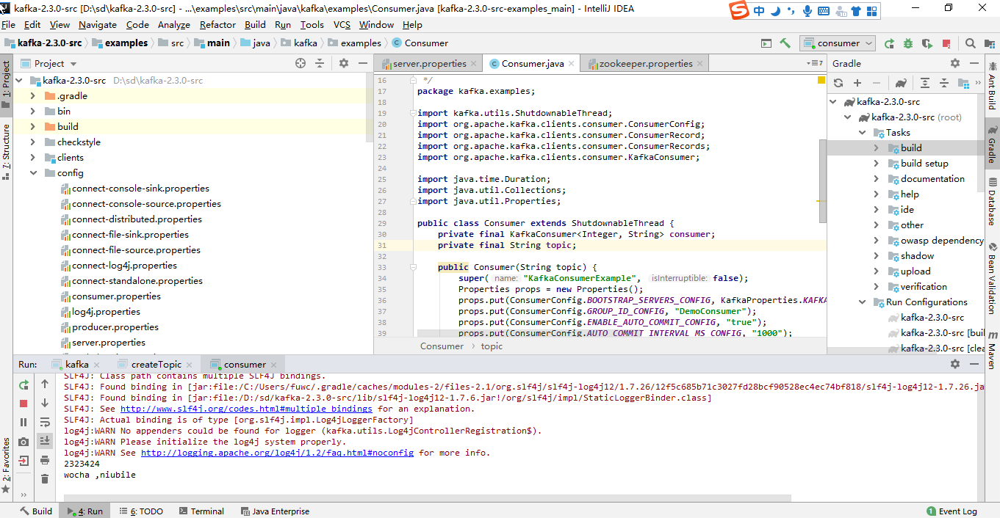

问题总结
--------------

**1. 编译不通过**

gradlew spotlessApply

**2. 日志类**

解决Failed to load class "org.slf4j.impl.StaticLoggerBinder"

参考
------

.. _`Gradle 修改 Maven 仓库地址`: https://blog.csdn.net/matthewei6/article/details/84000496