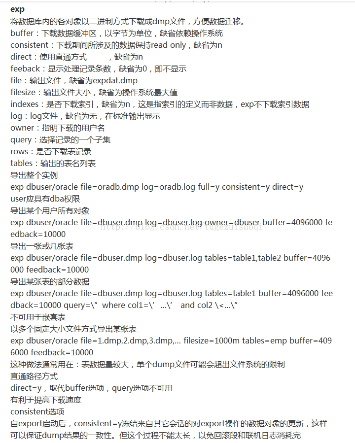
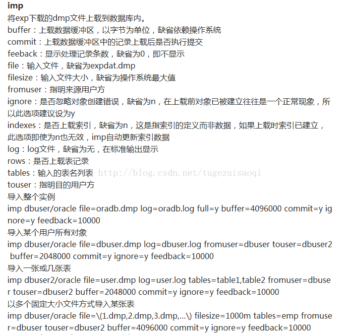

oracle 导入导出命令
=======================

exp导出
-------------

exp gd_base/11@192.168.13.211/oanet file=D:\export\gd_base.dmp log=D:\export\gd_base.log full=y

导出实例：

exp user/password@sid(实例) owner=user file=D:\user.dmp feedback=10000 buffer=10240000

::

    具体：
    owner指的是表的所有者（指明下载的用户名）
    freeback=10000代表显示处理记录条数，缺省为0，即不显示
    buffer=10240000定义了每一次读取导入/导出文件的数据量，设的越大，就越减少imp/exp进程读取数据的次数,从而提高了
    导入/导出效率。（设置缓存区域的大小，当数据满的时候,bind array(结束数组),执行inset（插入）.提交）
    indexes=n 是否下载索引，缺省为n,只是指索引的定义而非数据，exp不下载索引数据

实例

::

    -- 全量导出
    exp system/manager@TEST file=d:\daochu.dmp full=y

    -- 将数据库中system用户与sys用户的表导出
    exp system/manager@TEST file=d:\daochu.dmp owner=(system,sys)

    -- 将数据库中的表table1中的字段filed1以"00"打头的数据导出
    exp system/manager@TEST file=d:\daochu.dmp tables=(table1) query=\" where filed1 like '00%'\"

    -- 将数据库中的表table1/table2导出
    exp system/manager@TEST file=d:\daochu.dmp tables=(table1,table2)

expdp导出
------------

- sqlplus sys/sys@192.168.13.211/oanet as sysdba
- create or replace directory dump_dir as 'D:\fzb';
- 在操作系统上创建相应的目录，如在D盘目录下建立文件夹fzb
- 连接数据库执行导出命令

::

    把base库和dbwizard库全部导入

    expdp system/123123@192.168.13.211/oanet   directory=dump_dir dumpfile=XX.dmp   schemas=gd_base,gd_dbwizard;

    把该实例下所有数据库导出

    expdp system/123123@192.168.13.211/oanet   directory=dump_dir dumpfile=XX.dmp   Full=y;

imp导入
--------

imp user/password@sid(实例)  file=D:\user.dmp fromuser=user touser=user rows=y commit=y feedback=10000 buffer=10240000

::

    具体：
    fromuser=user 指明来源用户（就是当前的dmp文件来自user用户下的数据）
    touser=user  指明目的用户（就是把现在dmp文件中的数据导入到目标库user用户下的库）
    rows=y  是否上传表记录（确定导入的数据行）
    commit=y 上传数据缓存区中记录上载后立即执行提交（表示每个数据缓冲满了之后提交一次，而不是导完一张表提交一次。这样会大大减少对系统回滚段等资源的消耗，对顺利完成导入是有益的）
    freeback=10000  显示处理记录条数，缺省为0，即不显示
    buffer=10240000  上载数据缓存区，以字节为单位，缺省依赖操作系统

    indexes=n 指如果上传时索引已建立，此举项即使为n也无效，imp自动更新索引数据

ignore: 默认会去创建表，如果表存在的话，将会创建该表，然后报错，ignore=y即为忽略该错误，继续导入数据。默认追加的方式。

DESTROY=Y ： 覆盖已存在的表 默认N

实例

::

    imp system/manager@TEST file=d:\daochu.dmp tables=(table1,table2)

impdp
------

oracle10g之后impdp的table_exists_action参数

table_exists_action选项：

{skip 是如果已存在表，则跳过并处理下一个对象；append是为表增加数据；truncate是截断表，然后为其增加新数据；replace是删除已存在表，重新建表并追加数据}

例：

    impdp user/password directory=dpdir dumpfile=xxx.dmp table_exists_action=replace logfile=xxx.log
    
