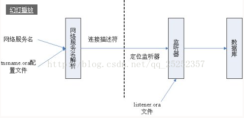

oracle 监听
=================

lsnrctl [start|stop|status]

监听原理
------------------

Oracle监听器是做什么的呢？它设置在服务端，是基于服务端的一种网络服务，用于监听客户端向数据库端发出的连接

请求。判断一下连接请求是否正确，请求有效就连接，失败就拒绝。所以你要连接远程数据库，那么远程数据库就要配置

监听器，客户端则不需要配置。

下面是连接过程：

-----

1. 服务器端打开监听

2. 用户在客户端(pl/sql sqlplus 等)输入服务器端给你的用户名密码以及service name alias（假设为wenchao）

3. 然后客户端会先查找tnsnames.ora(该文件在客户端定义)，找到对应的网络服务名（ HEHEDA ）的配置，
将网络服务名映射为包含服务器端给的Oracle服务地址（12.12.30.1）、
服务器端给的端口号（1521）、服务器端给的全局数据库名的连接描述符（ wenchao_service_name )

以sqlplus为例

::

    HEHEDA=

      (DESCRIPTION =
        (ADDRESS_LIST =
          (ADDRESS = (PROTOCOL = TCP)(HOST = 12.12.30.1)(PORT = 1521))
        )
        (CONNECT_DATA =
          (SERVICE_NAME =wenchao_service_name)
        )
      )

4. 客户端通过tcp/ip协议发送请求，被服务器的监听器监听，根据全局数据库名的连接描述符(wenchao_service_name)定位到相应的监听器，并通过网络将连接信息发送给监听器

5. 监听器通过配置文件 listener.ora 找到相应的数据库服务器，客户端和服务器开始通信

oracle更改监听端口号
-------------------------

1. 查看监听状态 lsnrctl status

2. 停止监听 lsnrctl stop

3. 修改监听文件的端口号 

    vi $ORACLE_HOME/network/admin/listener.ora

    改为 1523

4. 修改初始化参数 local_listener

::

    sqlplus / as sysdba
    show parameter local_listener
    alter system set local_listener="(address=(protocal=tcp)(host=skate)(port=1523))"

5. 重启监听器 lnsrctl start

6. 修改完毕，使用新端口登录测试

::

    netstat -an|grep "1523"

    sqlplus sys/sys@skate:1523/orcl as sysdba

7. tnsping orcl
    
    报错，修改tnsnames.ora的端口号，重启监听器，再tnspign

