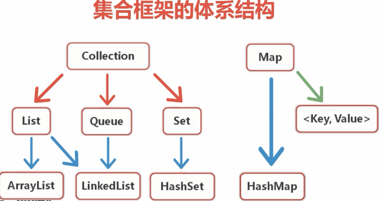
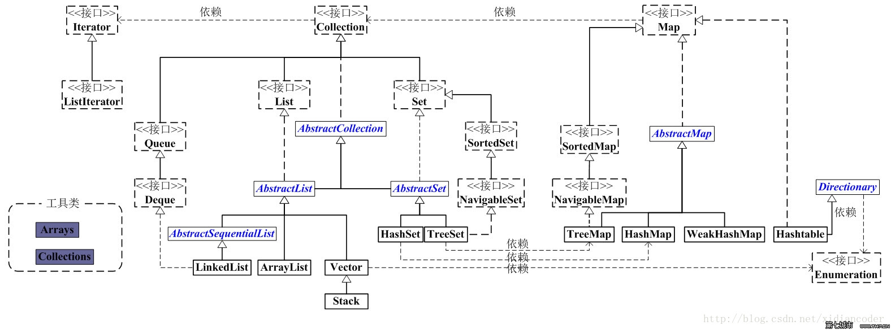

集合
==============

集合的体系结构
--------------------

HashMap 是内部基于哈希表实现，该类继承了AbstractMap,实现了Map接口

HashTable是线程安全的，HashMap是线程不安全的

Properties 类继承了HashTable类，而HashTable类则继承Dictionary

HashMap 允许将null作为一个entry的key或者value，而Hashtable不允许。
TreeMap的key不能为null，但是value可以为null

另一个区别是HashMap的迭代器(Iterator)是fail-fast迭代器，而Hashtable的enumerator迭代器不是fail-fast的。所以当有其它线程改变了HashMap的结构（增加或者移除元素），将会抛出ConcurrentModificationException，但迭代器本身的remove()方法移除元素则不会抛出ConcurrentModificationException异常。但这并不是一个一定发生的行为，要看JVM。这条同样也是Enumeration和Iterator的区别。fail-fast机制如果不理解原理，可以查看这篇文章：http://www.cnblogs.com/alexlo/archive/2013/03/14/2959233.html

Hashtable中hash数组默认大小是11，增加的方式是 old*2+1。HashMap中hash数组的默认大小是16，而且一定是2的指数。

两者通过hash值散列到hash表的算法不一样：
HashTbale是古老的除留余数法，直接使用hashcode;
而后者是强制容量为2的幂，重新根据hashcode计算hash值，在使用hash 位与 （hash表长度 – 1），也等价取膜，但更加高效，取得的位置更加分散，偶数，奇数保证了都会分散到。前者就不能保证

**fast-fail 机制**

迭代器的快速失败行为无法得到保证，因为一般来说，不可能对是否出现不同步并发修改做出任何硬性保证。快速失败迭代器会尽最大努力抛出 ConcurrentModificationException，为提高这类迭代器的正确性而编写一个依赖于此异常的程序是错误的做法：迭代器的快速失败行为应该仅用于检测 bug。

它是Java集合的一种错误检测机制。当多个线程对集合进行结构上的改变的操作时，有可能会产生fail-fast机制。记住是有可能，而不是一定。

ConcurrentModificationException不会始终指出对象已经由不同线程并发修改，如果单线程违反了规则，同样也有可能会抛出该异常。

迭代器在调用next()、remove()方法时都是调用checkForComodification()方法，该方法主要就是检测modCount == expectedModCount ? 若不等则抛出ConcurrentModificationException 异常，从而产生fail-fast机制。

