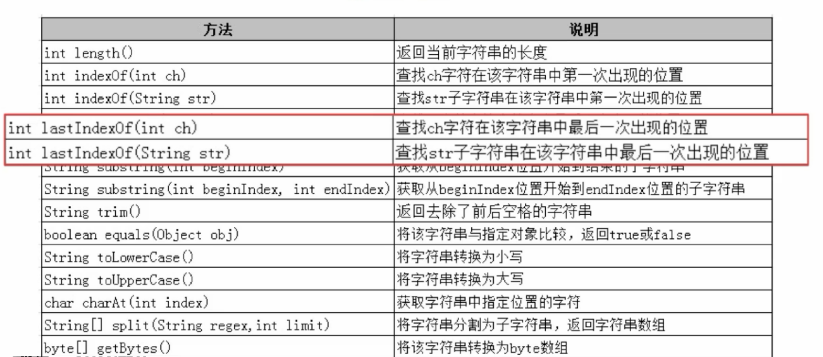
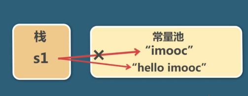

String的使用
=================

String的常用方法
----------------------

创建String对象
------------------

.. image:: ./images/String_equals.png

s1 == s2 ture

s1 == s3 false

**String str4 = new String("imooc")**

str3 == str4 false

String的不可变性
----------------------

一旦创建不可修改

所谓的修改是创建了新的对象，所指向的内存空间不变

字节数组与字符串的转换
-----------------------

bytes[] byte = str.getBytes("GBK");

String str = new String(byte,"GBK");

== 和 equals 的区别
--------------------------

== 比较的是 地址

equals 比较的是 值

StringBuilder
---------------------

可变的

当频繁操作字符串的时候，使用StringBuilder

StringBuffer
--------------

和 StringBuild基本相似

StringBuffer 是线程安全的

StringBuilder 性能略高

**方法**
 
delete 

substring

append

insert

String,StringBuffer,StringBuilder效率与内存占用比较
-----------------------------------------------------

分别使用String，StringBuffer，StringBuilder进行10000次的字符串拼接操作，计算运行时间以及java程序运行时的内存占用。

.. code:: java

	public class StringWasteMemoryTest {
	    public static void main(String[] args) {
	        long beforeTime = System.currentTimeMillis();
	         StringTest();
	//       StringBufferTest();
	//       StringBuilderTest();
	        long afterTime = System.currentTimeMillis();
	        System.out.println("time: " + (afterTime - beforeTime));
	        long memory = Runtime.getRuntime().totalMemory()
	                - Runtime.getRuntime().freeMemory();
	        System.out.println("memory: " + memory);
	    }

	    private static void StringTest() {

	        String s = "";
	        for (int i = 0; i < 10000; i++) {
	            s += "qwertyuiopasdfghjklzxcvbnmqazwsxedcrfvtgbyhnujmiklopplokmnjiuhbvgytfcxdrzsewaq";
	        }
	    }

	    private static void StringBufferTest() {

	        StringBuffer stringBuffer = new StringBuffer("");
	        for (int i = 0; i < 10000; i++) {
	            stringBuffer = stringBuffer
	                    .append("qwertyuiopasdfghjklzxcvbnmqazwsxedcrfvtgbyhnujmiklopplokmnjiuhbvgytfcxdrzsewaq");
	        }
	    }

	    private static void StringBuilderTest() {

	        StringBuilder stringBuilder = new StringBuilder("");
	        for (int i = 0; i < 10000; i++) {
	            stringBuilder = stringBuilder
	                    .append("qwertyuiopasdfghjklzxcvbnmqazwsxedcrfvtgbyhnujmiklopplokmnjiuhbvgytfcxdrzsewaq");
	        }
	    }
	}

运行结果如下：

::

	String:
	    time: 6296
	    memory: 178993040

	StringBuffer:
	    time: 3
	    memory: 6834488

	StringBuilder:
	    time: 4
	    memory: 6834400