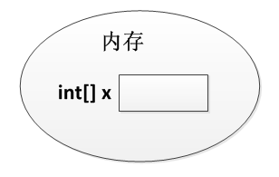
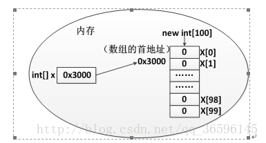
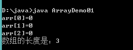
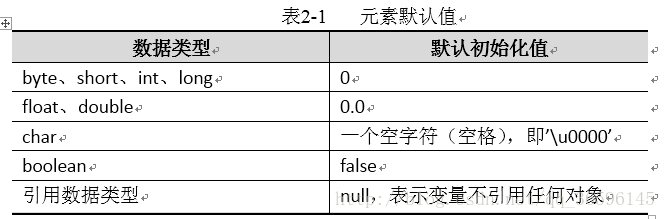
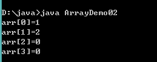
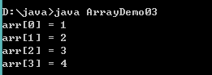
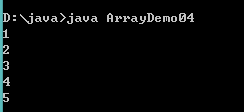
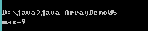
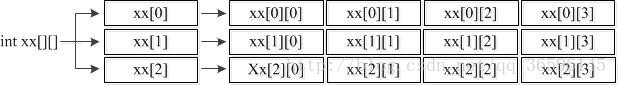
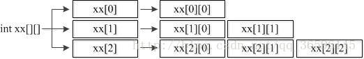

Java 数组
==================

在生活中，我们可能会碰到如下的场景。 
现在需要统计某公司员工的工资情况，例如计算平均工资、最高工资等。假设该公司有50名员工，用前面所学的知识完成，那么程序首先需要声明50个变量来分别记住每位员工的工资，这样做会显得很麻烦。 
其实在Java中，我们可以使用一个数组来记住这50名员工的工资。数组是指一组数据的集合，数组中的每个数据被称作元素。在数组中可以存放任意类型的元素，但同一个数组里存放的元素类型必须一致。

数组的定义
--------------------

在Java中，可以使用以下格式来定义一个数组。如下 
数据类型[] 数组名 = new 数据类型[元素个数或数组长度]; 

    int[] x = new int[100]; 

上述语句就相当于在内存中定义了100个int类型的变量，第一个变量的名称为x[0]，第二个变量的名称为x[1]，以此类推，第100个变量的名称为x[99]，这些变量的初始值都是0。为了更好地理解数组的这种定义方式，可以将上面的一句代码分成两句来写，具体如下：

::

    int[] x;              // 声明一个int[]类型的变量
    x = new int[100];   // 创建一个长度为100的数组

接下来，通过两张内存图来详细地说明数组在创建过程中内存的分配情况。 
第一行代码 int[] x; 声明了一个变量x，该变量的类型为int[]，即一个int类型的数组。变量x会占用一块内存单元，它没有被分配初始值。内存中的状态如下图所示。

第二行代码 x = new int[100]; 创建了一个数组，将数组的地址赋值给变量x。在程序运行期间可以使用变量x来引用数组，这时内存中的状态会发生变化，如下图所示。

在上图中描述了变量x引用数组的情况。该数组中有100个元素，初始值都为0。数组中的每个元素都有一个索引(也可称为角标)，要想访问数组中的元素可以通过“x[0]、x[1]、……、x[98]、x[99]”的形式。需要注意的是，数组中最小的索引是0，最大的索引是“数组的长度-1”。在Java中，为了方便我们获得数组的长度，提供了一个length属性，在程序中可以通过“数组名.length”的方式来获得数组的长度，即元素的个数。 

接下来，通过一个案例来演示如何定义数组以及访问数组中的元素，如下所示。ArrayDemo01.java

.. code:: java

     public class ArrayDemo01 {
          public static void main(String[] args) {
              int[] arr; // 声明变量
              arr = new int[3]; // 创建数组对象
              System.out.println("arr[0]=" + arr[0]); // 访问数组中的第一个元素
              System.out.println("arr[1]=" + arr[1]); // 访问数组中的第二个元素
              System.out.println("arr[2]=" + arr[2]); // 访问数组中的第三个元素
              System.out.println("数组的长度是：" + arr.length); // 打印数组长度
          }
      }

运行结果如下图所示。

在上述代码中声明了一个int[]类型变量arr，并将数组在内存中的地址赋值给它。在5~7行代码中通过角标来访问数组中的元素，在第8行代码中通过length属性访问数组中元素的个数。从打印结果可以看出，数组中的三个元素初始值都为0，这是因为当数组被成功创建后，数组中元素会被自动赋予一个默认值，根据元素类型的不同，默认初始化的值也是不一样的。具体如下表所示。

如果在使用数组时，不想使用这些默认初始值，也可以显式地为这些元素赋值。接下来通过一个程序来学习如何为数组的元素赋值，如下所示。ArrayDemo02.java

.. code:: java

      public class ArrayDemo02 {
          public static void main(String[] args) {
              int[] arr = new int[4]; // 定义可以存储4个整数的数组
              arr[0] = 1; // 为第1个元素赋值1
              arr[1] = 2; // 为第2个元素赋值2
              // 下面的代码是打印数组中每个元素的值
              System.out.println("arr[0]=" + arr[0]);
              System.out.println("arr[1]=" + arr[1]);
              System.out.println("arr[2]=" + arr[2]);
              System.out.println("arr[3]=" + arr[3]);
          }
      }

运行结果如下图所示。

在上述代码中，第3行代码定义了一个数组，此时数组中每个元素都为默认初始值0。第2、3行代码通过赋值语句将数组中的元素arr[0]和arr[1]分别赋值为1和2，而元素arr[2]和arr[3]没有赋值，其值仍为0，因此打印结果中四个元素的值依次为1、2、0、0。 
在定义数组时只指定数组的长度，由系统自动为元素赋初值的方式称作动态初始化。 
在初始化数组时还有一种方式叫做静态初始化，就是在定义数组的同时就为数组的每个元素赋值。数组的静态初始化有两种方式，具体格式如下：

::

    类型[] 数组名 = new 类型[]{元素，元素，……};
    类型[] 数组名 = {元素，元素，元素，……};    

上面的两种方式都可以实现数组的静态初始化，但是为了简便，建议采用第二种方式。接下来通过一段代码来演示数组静态初始化的效果，如下所示。ArrayDemo03.java

.. code:: java

     public class ArrayDemo03 {
          public static void main(String[] args) {
              int[] arr = { 1, 2, 3, 4 }; // 静态初始化
              // 下面的代码是依次访问数组中的元素
              System.out.println("arr[0] = " + arr[0]);
              System.out.println("arr[1] = " + arr[1]);
              System.out.println("arr[2] = " + arr[2]);
              System.out.println("arr[3] = " + arr[3]);
          }
      }

运行结果如下图所示。

上述代码中采用静态初始化的方式为数组每个元素赋予初值，分别是1、2、3、4。需要注意的是，第3行代码千万不可写成int[] arr = new int[4]{1,2,3,4};，这样写编译器会报错。原因在于编译器会认为数组限定的元素个数[4]与实际存储的元素{1,2,3,4}个数有可能不一致，存在一定的安全隐患。

数组遍历
--------------

在操作数组时，经常需要依次访问数组中的每个元素，这种操作称作数组的遍历。接下来通过一个案例来学习如何使用for循环来遍历数组，如下所示。ArrayDemo04.java

.. code:: java

    public class ArrayDemo04 {
        public static void main(String[] args) {
            int[] arr = { 1, 2, 3, 4, 5 }; // 定义数组
            // 使用for循环遍历数组的元素
            for (int i = 0; i < arr.length; i++) {
                System.out.println(arr[i]); // 通过索引访问元素
            }
        }
    }

运行结果如下图所示。 

上述代码中，定义一个长度为5的数组arr，数组的角标为0~4。由于for循环中定义的变量i的值在循环过程中为0~4，因此可以作为索引，依次去访问数组中的元素，并将元素的值打印出来。

数组的常见问题
-------------------

数组在编写程序时应用非常广泛，灵活地使用数组对实际开发很重要。接下来，本节将针对数组的常见操作进行详细地讲解，如数组的遍历、最值的获取、数组的排序等。

**数组最值**

在操作数组时，经常需要获取数组中元素的最值。接下来通过一个案例来演示如何获取数组中元素的最大值，如下所示。ArrayDemo05.java

.. code:: java

    public class ArrayDemo05 {
        public static void main(String[] args) {
            int[] arr = { 4, 1, 6, 3, 9, 8 }; // 定义一个数组
            int max = arr[0]; // 定义变量max用于记住最大数，首先假设第一个元素为最大值
            // 下面通过一个for循环遍历数组中的元素
            for (int x = 1; x < arr.length; x++) {
                if (arr[x] > max) { // 比较 arr[x]的值是否大于max
                    max = arr[x]; // 条件成立，将arr[x]的值赋给max
                }
            }
            System.out.println("max=" + max); // 打印最大值
        }
    }

运行结果如下图所示。 

上述代码中，定义了一个临时变量max，用于记住数组的最大值。通过for 循环获取数组中的最大值，赋值给max变量。 

首先假设数组中第一个元素arr[0]为最大值，然后使用for循环对数组进行遍历，在遍历的过程中只要遇到比max值还大的元素，就将该元素赋值给max。这样一来，变量max就能够在循环结束时记住数组中的最大值。需要注意的是，在for循环中的变量i是从1开始的，这样写的原因是程序已经假设第一个元素为最大值，for循环中只需要从第二个元素开始比较，从而提高程序的运行效率。

**数组异常**

*数组越界异常*

每个数组的索引都有一个范围，即0~length-1。在访问数组的元素时，索引不能超出这个范围，否则程序会报错，如下所示。ArrayDemo06.java

二维数组
-------------

程序中可以通过一个数组来保存某个班级学生的考试成绩，试想一下，如果要统计一个学校各个班级学生的考试成绩，又该如何实现呢？这时就需要用到多维数组，多维数组可以简单地理解为在数组中嵌套数组。在程序中比较常见的就是二维数组，接下来针对二维数组进行详细地讲解。

二维数组的定义格式

二维数组的定义有很多方式，接下来针对几种常见的方式进行详细地讲解，具体如下： 

第一种方式：

    int[][] arr = new int[3][4];

上面的代码相当于定义了一个3*4的二维数组，即二维数组的长度为3，二维数组中的每个元素又是一个长度为4的数组，接下来通过一个图来表示这种情况，如下图所示。

第二种方式：

    int[][] arr = new int[3][];

第二种方式和第一种类似，只是数组中每个元素的长度不确定，接下来通过一个图来表示这种情况，如下图所示。

对二维数组中元素的访问也是通过角标的方式，如需访问二维数组中第一个元素数组的第二个元素，具体代码如下：

    arr[0][1];

**二维数组元素的访问**

操作二维数组时，经常需要获取数组中元素的值。接下来通过一个案例来演示如何获取数组中元素值，如下所示。ArrayDemo08.java

.. code:: java

    class ArrayDemo08 {
        public static void main(String[] args){

            //定义二维数组的方式
            int[][] arr = new int[3][4];

            System.out.println( arr );
            System.out.println("二维数组的长度: " + arr.length);
            //获取二维数组的3个元素
            System.out.println( arr[0] );
            System.out.println( arr[1] );
            System.out.println( arr[2] );

            System.out.println("打印第一个一维数组的元素值");
            System.out.println( arr[0][0] );
            System.out.println( arr[0][1] );//访问的为二维数组中第1个一维数组的第2个元素
            System.out.println( arr[0][2] );
            System.out.println( arr[0][3] );

            System.out.println("打印第二个一维数组的元素值");
            System.out.println( arr[1][0] );
            System.out.println( arr[1][1] );
            System.out.println( arr[1][2] );
            System.out.println( arr[1][3] );

            System.out.println("打印第三个一维数组的元素值");
            System.out.println( arr[2][0] );
            System.out.println( arr[2][1] );
            System.out.println( arr[2][2] );
            System.out.println( arr[2][3] );
        }
    }

**二维数组元素遍历与数组元素累加和**

.. code:: java

    class ArrayDemo09 {
        public static void main(String[] args){
            //一维数组的求累加和并遍历
            int[] arr = {10,20,30,40,50};
            int sum = 0; 
            for (int i=0; i<arr.length; i++) {
                  //System.out.println(arr[i]);
                sum += arr[i];
            }
            System.out.println("sum= " + sum);
            System.out.println("---------------------");

    //二维数组的求累加和并遍历
            int[][] arr2 = { {1,2},{3,4,5},{6,7,8,9,10} };
            int sum2 = 0;
            for (int i=0; i<arr2.length; i++) {
                for (int j=0; j<arr2[i].length; j++) {
                     //System.out.println(arr2[i][j])
                    sum2 += arr2[i][j];
                }
            }
            System.out.println("sum2= "+ sum2);
        }
    }

