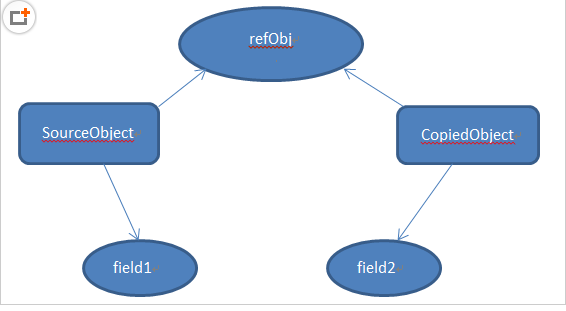
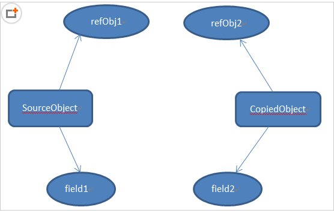

深拷贝和浅拷贝
============================

2018年6月21日 09:48:43

先介绍一点铺垫知识：Java中的数据类型分为基本数据类型和引用数据类型。对于这两种数据类型，在进行赋值操作、用作方法参数或返回值时，会有值传递和引用（地址）传递的差别。

浅拷贝（Shallow Copy）
------------------------------

1. 对于数据类型是基本数据类型的成员变量，浅拷贝会直接进行值传递，也就是将该属性值复制一份给新的对象。因为是两份不同的数据，所以对其中一个对象的该成员变量值进行修改，不会影响另一个对象拷贝得到的数据。

2. 对于数据类型是引用数据类型的成员变量，比如说成员变量是某个数组、某个类的对象等，那么浅拷贝会进行引用传递，也就是只是将该成员变量的引用值（内存地址）复制一份给新的对象。因为实际上两个对象的该成员变量都指向同一个实例。在这种情况下，在一个对象中修改该成员变量会影响到另一个对象的该成员变量值。

浅拷贝的实现方式主要有三种：

一、通过拷贝构造方法就行浅拷贝

二、通过重写clone()方法进行浅拷贝：

Object类是类结构的根类，其中有一个方法为protected Object clone() throws CloneNotSupportedException，这个方法就是进行的浅拷贝。有了这个浅拷贝模板，我们可以通过调用clone()方法来实现对象的浅拷贝。

但是需要注意：

1、Object类虽然有这个方法，但是这个方法是受保护的（被protected修饰），所以我们无法直接使用。

2、使用clone方法的类必须实现Cloneable接口，否则会抛出异常CloneNotSupportedException。

对于这两点，我们的解决方法是，在要使用clone方法的类中重写clone()方法，通过super.clone()调用Object类中的原clone方法。

参考代码如下：对Student类的对象进行拷贝，直接重写clone()方法，通过调用clone方法即可完成浅拷贝。

.. code:: java

    package me.wenchao.javabasic.basic;

    import lombok.AllArgsConstructor;
    import lombok.Data;
    import lombok.ToString;

    /**
     * @Author wenchaofu
     * @DATE 10:51 2018/6/21
     * @DESC
     */
    /* clone方法实现浅拷贝 */
    public class ShallowCopy {
        public static void main(String[] args) {
            Age a=new Age(20);
            Student stu1=new Student("wenchao1",a,175);

            //通过调用重写后的clone方法进行浅拷贝
            Student stu2=(Student)stu1.clone();
            System.out.println(stu1.toString());
            System.out.println(stu2.toString());

            //尝试修改stu1中的各属性，观察stu2的属性有没有变化
            stu1.setName("changedName");
            //改变age这个引用类型的成员变量的值
            a.setAge(99);
            //stu1.setaAge(new Age(99));    使用这种方式修改age属性值的话，stu2是不会跟着改变的。因为创建了一个新的Age类对象而不是改变原对象的实例值
            stu1.setLength(216);
            System.out.println(stu1.toString());
            System.out.println(stu2.toString());
        }
    }

    /*
     * 创建年龄类
     */
    @Data
    @ToString
    @AllArgsConstructor
    class Age{
        private int age;
    }
    /*
     * 创建学生类
     */
    @Data
    @ToString
    @AllArgsConstructor
    class Student implements Cloneable{
        //学生类的成员变量（属性）,其中一个属性为类的对象
        private String name;
        private Age age;
        private int length;

        //重写Object类的clone方法
        public Object clone() {
            Object obj=null;
            //调用Object类的clone方法，返回一个Object实例
            try {
                obj= super.clone();
            } catch (CloneNotSupportedException e) {
                e.printStackTrace();
            }
            return obj;
        }
    }

运行结果

::

    Student(name=wenchao1, age=Age(age=20), length=175)
    Student(name=wenchao1, age=Age(age=20), length=175)
    Student(name=changedName, age=Age(age=99), length=216)
    Student(name=wenchao1, age=Age(age=99), length=175)

深拷贝
-------

首先介绍对象图的概念。设想一下，一个类有一个对象，其成员变量中又有一个对象，该对象指向另一个对象，另一个对象又指向另一个对象，直到一个确定的实例。这就形成了对象图。那么，对于深拷贝来说，不仅要复制对象的所有基本数据类型的成员变量值，还要为所有引用数据类型的成员变量申请存储空间，并复制每个引用数据类型成员变量所引用的对象，直到该对象可达的所有对象。也就是说，对象进行深拷贝要对整个对象图进行拷贝！

简单地说，深拷贝对引用数据类型的成员变量的对象图中所有的对象都开辟了内存空间；而浅拷贝只是传递地址指向，新的对象并没有对引用数据类型创建内存空间。

深拷贝模型如图所示：可以看到所有的成员变量都进行了复制。

深拷贝的实现方法主要有两种：

**一、通过重写clone方法来实现深拷贝**

与通过重写clone方法实现浅拷贝的基本思路一样，只需要为对象图的每一层的每一个对象都实现Cloneable接口并重写clone方法，最后在最顶层的类的重写的clone方法中调用所有的clone方法即可实现深拷贝。简单的说就是：每一层的每个对象都进行浅拷贝=深拷贝。

.. code:: java

    package me.wenchao.javabasic.basic;

    import lombok.AllArgsConstructor;
    import lombok.Data;
    import lombok.ToString;

    /**
     * @Author wenchaofu
     * @DATE 10:51 2018/6/21
     * @DESC
     */
    /* clone方法实现浅拷贝 */
    public class DeepCopy {
        public static void main(String[] args) {
            Age2 a=new Age2(20);
            Student2 stu1=new Student2("wenchao1",a,175);

            //通过调用重写后的clone方法进行浅拷贝
            Student2 stu2=(Student2)stu1.clone();
            System.out.println(stu1.toString());
            System.out.println(stu2.toString());

            //尝试修改stu1中的各属性，观察stu2的属性有没有变化
            stu1.setName("changedName");
            //改变age这个引用类型的成员变量的值
            a.setAge(99);
            //stu1.setaAge(new Age(99));    使用这种方式修改age属性值的话，stu2是不会跟着改变的。因为创建了一个新的Age类对象而不是改变原对象的实例值
            stu1.setLength(216);
            System.out.println(stu1.toString());
            System.out.println(stu2.toString());
        }
    }

    /*
     * 创建年龄类
     */
    @Data
    @ToString
    @AllArgsConstructor
    class Age2 implements Cloneable{
        private int age;

        //重写Object类的clone方法
        @Override
        public Object clone() {
            Object obj=null;
            //调用Object类的clone方法，返回一个Object实例
            try {
                obj= super.clone();
            } catch (CloneNotSupportedException e) {
                e.printStackTrace();
            }
            return obj;
        }
    }

    /*
     * 创建学生类
     */
    @Data
    @ToString
    @AllArgsConstructor
    class Student2 implements Cloneable{
        //学生类的成员变量（属性）,其中一个属性为类的对象
        private String name;
        private Age2 age;
        private int length;

        //重写Object类的clone方法
        public Object clone() {
            Object obj=null;
            //调用Object类的clone方法，返回一个Object实例
            try {
                obj= super.clone();
            } catch (CloneNotSupportedException e) {
                e.printStackTrace();
            }
            Student2 stu2 = (Student2) obj;
            stu2.age = (Age2)stu2.getAge().clone();
            return obj;
        }
    }

:: 

    Student2(name=wenchao1, age=Age2(age=20), length=175)
    Student2(name=wenchao1, age=Age2(age=20), length=175)
    Student2(name=changedName, age=Age2(age=99), length=216)
    Student2(name=wenchao1, age=Age2(age=20), length=175)

**二、 通过对象序列化实现深拷贝**

虽然层次调用clone方法可以实现深拷贝，但是显然代码量实在太大。特别对于属性数量比较多、层次比较深的类而言，每个类都要重写clone方法太过繁琐。

将对象序列化为字节序列后，默认会将该对象的整个对象图进行序列化，再通过反序列即可完美地实现深拷贝。

.. code:: java

    package me.wenchao.javabasic.basic;

    /**
     * @Author wenchaofu
     * @DATE 11:13 2018/6/21
     * @DESC
     */
    import lombok.AllArgsConstructor;
    import lombok.Data;
    import lombok.ToString;

    import java.io.ByteArrayInputStream;
    import java.io.ByteArrayOutputStream;
    import java.io.IOException;
    import java.io.ObjectInputStream;
    import java.io.ObjectOutputStream;
    import java.io.Serializable;

    /* 通过序列化实现深拷贝 */
    public class CopyDeepWithSerialization {
        public static void main(String[] args) throws IOException, ClassNotFoundException  {
            Age3 a=new Age3(20);
            Student3 stu1=new Student3("wenchaofu",a,175);
            //通过序列化方法实现深拷贝
            ByteArrayOutputStream bos=new ByteArrayOutputStream();
            ObjectOutputStream oos=new ObjectOutputStream(bos);
            oos.writeObject(stu1);
            oos.flush();
            ObjectInputStream ois=new ObjectInputStream(new ByteArrayInputStream(bos.toByteArray()));
            Student3 stu2=(Student3)ois.readObject();
            System.out.println(stu1.toString());
            System.out.println(stu2.toString());
            System.out.println();
            //尝试修改stu1中的各属性，观察stu2的属性有没有变化
            stu1.setName("chanedName");
            //改变age这个引用类型的成员变量的值
            a.setAge(99);
            stu1.setLength(216);
            System.out.println(stu1.toString());
            System.out.println(stu2.toString());
        }
    }

    /*
     * 创建年龄类
     */
    @Data
    @ToString
    @AllArgsConstructor
    class Age3 implements Serializable{
        //年龄类的成员变量（属性）
        private int age;
    }
    /*
     * 创建学生类
     */
    @Data
    @AllArgsConstructor
    @ToString
    class Student3 implements Serializable{
        //学生类的成员变量（属性）,其中一个属性为类的对象
        private String name;
        private Age3 aage;
        private int length;
    }

::

    Student3(name=wenchaofu, aage=Age3(age=20), length=175)
    Student3(name=wenchaofu, aage=Age3(age=20), length=175)

    Student3(name=chanedName, aage=Age3(age=99), length=216)
    Student3(name=wenchaofu, aage=Age3(age=20), length=175)

可以通过很简洁的代码即可完美实现深拷贝。不过要注意的是，如果某个属性被transient修饰，那么该属性就无法被拷贝了。

以上是浅拷贝的深拷贝的区别和实现方式。

------------

数组的浅拷贝
-------------

Clone方式
^^^^^^^^^^^

**基本类型**

.. code:: java

  public static void main(String[] args) {
        ArrayList<String> listStr = new ArrayList<>();
        for(int i = 0 ; i < 3 ;i++){
            listStr.add(i+"");
        }
        //clone一次
        ArrayList<String> listStrCopy = (ArrayList<String>) listStr.clone();
        //修改clone后对象的值
        listStrCopy.remove(2);
        listStrCopy.add(100+"");
        for (int i = 0; i < listStr.size(); i++) {
            System.out.println(listStr.get(i).toString());
            System.out.println(listStrCopy.get(i).toString());
        }
    }

实验结果 ， 可以看出修改对原始数据没有改变，是复制了值

::

    0
    0
    1
    1
    2
    100

**引用类型**

.. code:: java

    public class Copy {

        public static void main(String[] args) {
            ArrayList<Person> listStr = new ArrayList<>();
            for (int i = 0; i < 3; i++) {
                listStr.add(new Person(i));
            }
            ArrayList<Person> listStrCopy = (ArrayList<Person>) listStr.clone();
            //修改clone产生的对象
            listStrCopy.get(0).setAge(100);
            for (int i = 0; i < listStr.size(); i++) {
                System.out.println(listStr.get(i).toString());
                System.out.println(listStrCopy.get(i).toString());
            }

        }
        static class Person{
            private int age;
            public Person(int age) {
                this.age = age;
            }
            public void setAge(int age) {
                this.age = age;
            }
            @Override
            public String toString() {
                return "Person{" +
                        "age=" + age +
                        '}';
            }
        }
    }

实验结果 ，修改clone产生对象直接对原list产生了影响，是浅拷贝

::

    Person{age=100}
    Person{age=100}
    Person{age=1}
    Person{age=1}
    Person{age=2}
    Person{age=2}

System.arraycopy方式
^^^^^^^^^^^^^^^^^^^^^^^^

System中提供了一个native静态方法arraycopy(),可以使用这个方法来实现数组之间的复制。
对于一维数组来说，这种复制属性值传递，修改副本不会影响原来的值。
对于二维或者一维数组中存放的是对象时，复制结果是一维的引用变量传递给副本的一维数组，修改副本时，会影响原来的数组。

::

    public static void arraycopy(Object src,
                                 int srcPos,
                                 Object dest,
                                 int destPos,
                                 int length)

其中：src表示源数组，srcPos表示源数组要复制的起始位置，desc表示目标数组，length表示要复制的长度。

.. code:: java

    package me.wenchao.javabasic.basic;

    import lombok.AllArgsConstructor;
    import lombok.Data;
    import lombok.ToString;

    /**
     * @Author wenchaofu
     * @DATE 14:11 2018/6/21
     * @DESC
     */
    public class CopySystemArrayCopy {
        public static void main(String[] args) {
            User [] users=new User[]{new User(1,"admin","admin@qq.com"),new User(2,"maco","maco@qq,com"),new User(3,"kitty","kitty@qq,com")};//初始化对象数组
            User [] target=new User[users.length];//新建一个目标对象数组
            System.arraycopy(users, 0, target, 0, users.length);//实现复制
            System.out.println("源对象与目标对象的物理地址是否一样："+(users[0] == target[0]?"浅复制":"深复制"));
            target[0].setEmail("admin@sina.com");
            System.out.println("修改目标对象的属性值后源对象users：");
            for (User user : users){
                System.out.println("users " + user);
            }
            for (User user : target) {
                System.out.println("target " + user);
            }
        }
    }

    @Data
    @ToString
    @AllArgsConstructor
    class User{
        private Integer id;
        private String username;
        private String email;

    }

运行结果

::

    源对象与目标对象的物理地址是否一样：浅复制
    修改目标对象的属性值后源对象users：
    usersUser(id=1, username=admin, email=admin@sina.com)
    usersUser(id=2, username=maco, email=maco@qq,com)
    usersUser(id=3, username=kitty, email=kitty@qq,com)
    targetUser(id=1, username=admin, email=admin@sina.com)
    targetUser(id=2, username=maco, email=maco@qq,com)
    targetUser(id=3, username=kitty, email=kitty@qq,com)