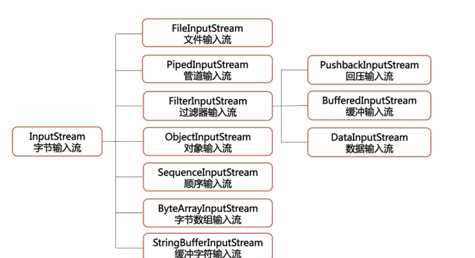
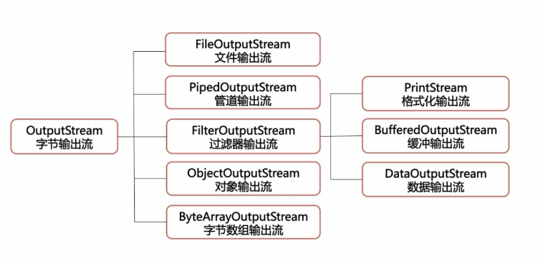
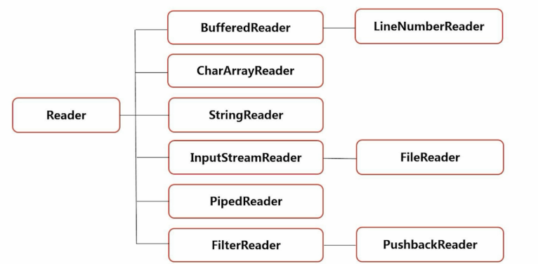
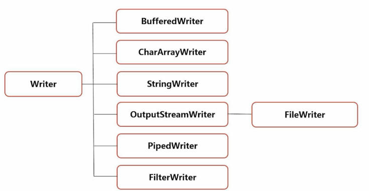

流
========

File 类的使用
------------------

File f = new File();

File f = new File("....")

File f = new File("...","...")

文件字节流
-----------------

从文件系统中的某个文件中获取输入字节流
，用于读取图片数据之类的原始字节流

FileInputStream

    - int read() 从输入流中读取一个数据字节
    - int read(byte[] b) 从输入流中最多读取b.length个字节数据到byte数组中
    - int read(byte[] b,int off,int len)
    - void close()

read -1 到达文件末尾

**file.txt**

::
    
    hello，fuwenchao
    new line

**code:**

.. code:: java

    public class FileStreamTest1 {
        public static void main(String[] args) throws IOException {
            FileInputStream fileInputStream = new FileInputStream("D:\\file.txt");
            int n = fileInputStream.read();
            System.out.println(n);
            System.out.println((char)n);
        }
    }

**output:**

::

    104
    h

**code2:**

.. code:: java

    public class FileStreamTest1 {
        public static void main(String[] args) throws IOException {
            FileInputStream fileInputStream = new FileInputStream("D:\\file.txt");
            int n = fileInputStream.read();
            while(n != -1){
                System.out.println((char)n);
                n = fileInputStream.read();
            }
            fileInputStream.close();
        }
    }

缓冲流
------------

BufferInputStream

BufferOutputStream

字节字符转换流
-----------------

InputStreamReader

OutputStreamWriter

.. code:: java

        FileInputStream fis = new FileInputStream("D:\\file.txt");
        InputStreamReader isr = new InputStreamReader(fis);
        int n = 0;
        char[] cbuf = new char[10];
        while((n=isr.read()) != -1){ // read a single character
            System.out.println((char)n);
        }

        while((n = isr.read(cbuf)) != -1){ // read to cbuf
            String str = new String(cbuf,0,n);
            System.out.println(str);
        }

字符流
--------

BufferReader

BufferWriter

示例
----------

.. code:: java

    /**
     * @Author wenchaofu
     * @DATE 17:44 2018/5/3
     * @DESC
     */
    /** desc
     * file.rst
     * a|b|c
     * 1|2|3
     * convert to 
     * a-b-c
     * 1-2-3
     */
    public class FiledSepTran {
        public static final String OLD_SEP = "\\|";
        public static final String NEW_SEP = "-";
        public static final String filename = "D:\\file.txt";
        public static final String newfilename = "D:\\file_new.txt";

        public static void main(String[] args) throws IOException {
            int n = 0;
            String line = null;
            StringBuilder sb = new StringBuilder();
            BufferedReader br = new BufferedReader(new InputStreamReader(new FileInputStream(filename)));
            BufferedWriter bw = new BufferedWriter(new OutputStreamWriter(new FileOutputStream(newfilename)));
            while (( line = br.readLine()) != null) {
                sb.append(convertLine(line)).append("\r\n");
            }
            bw.write(sb.toString());
            br.close();
            bw.close();
        }

        private static String convertLine(String line){
            StringBuilder newLine = new StringBuilder();
            String[] fields = line.split(OLD_SEP);
            for (String field : fields) {
                System.out.println(field);
                newLine.append(field).append(NEW_SEP);
            }

            return newLine.substring(0,newLine.length()-1).toString();
        }
    }

对象的序列化和反序列化
-----------------------------
