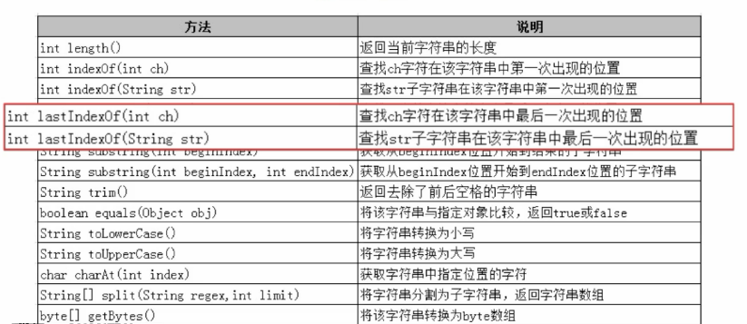
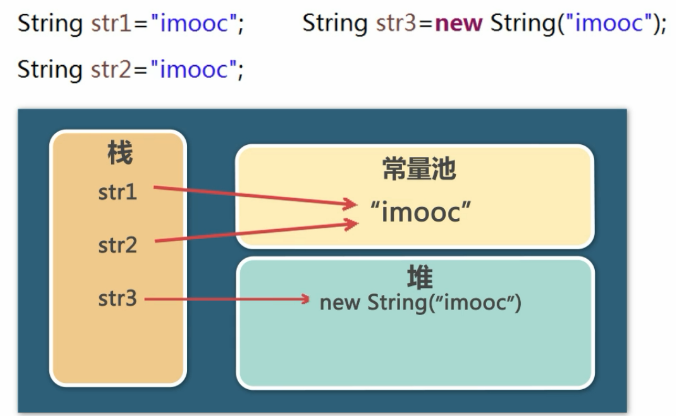
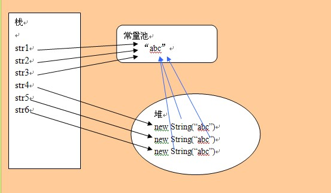
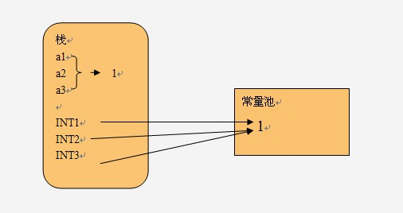

String的使用
=================

String的常用方法
----------------------

创建String对象
------------------

s1 == s2 ture

s1 == s3 false

**String str4 = new String("imooc")**

str3 == str4 false

String的不可变性
----------------------

一旦创建不可修改

所谓的修改是创建了新的对象，所指向的内存空间不变

.. image:: ./images/String_immutable.png

字节数组与字符串的转换
-----------------------

bytes[] byte = str.getBytes("GBK");

String str = new String(byte,"GBK");

== 和 equals 的区别
--------------------------

== 比较的是 地址

equals 比较的是 值

StringBuilder
---------------------

可变的

当频繁操作字符串的时候，使用StringBuilder

StringBuffer
--------------

和 StringBuild基本相似

StringBuffer 是线程安全的

StringBuilder 性能略高

**方法**
 
delete 

substring

append

insert

String,StringBuffer,StringBuilder效率与内存占用比较
-----------------------------------------------------

分别使用String，StringBuffer，StringBuilder进行10000次的字符串拼接操作，计算运行时间以及java程序运行时的内存占用。

.. code:: java

	public class StringWasteMemoryTest {
	    public static void main(String[] args) {
	        long beforeTime = System.currentTimeMillis();
	         StringTest();
	//       StringBufferTest();
	//       StringBuilderTest();
	        long afterTime = System.currentTimeMillis();
	        System.out.println("time: " + (afterTime - beforeTime));
	        long memory = Runtime.getRuntime().totalMemory()
	                - Runtime.getRuntime().freeMemory();
	        System.out.println("memory: " + memory);
	    }

	    private static void StringTest() {

	        String s = "";
	        for (int i = 0; i < 10000; i++) {
	            s += "qwertyuiopasdfghjklzxcvbnmqazwsxedcrfvtgbyhnujmiklopplokmnjiuhbvgytfcxdrzsewaq";
	        }
	    }

	    private static void StringBufferTest() {

	        StringBuffer stringBuffer = new StringBuffer("");
	        for (int i = 0; i < 10000; i++) {
	            stringBuffer = stringBuffer
	                    .append("qwertyuiopasdfghjklzxcvbnmqazwsxedcrfvtgbyhnujmiklopplokmnjiuhbvgytfcxdrzsewaq");
	        }
	    }

	    private static void StringBuilderTest() {

	        StringBuilder stringBuilder = new StringBuilder("");
	        for (int i = 0; i < 10000; i++) {
	            stringBuilder = stringBuilder
	                    .append("qwertyuiopasdfghjklzxcvbnmqazwsxedcrfvtgbyhnujmiklopplokmnjiuhbvgytfcxdrzsewaq");
	        }
	    }
	}

运行结果如下：

::

	String:
	    time: 6296
	    memory: 178993040

	StringBuffer:
	    time: 3
	    memory: 6834488

	StringBuilder:
	    time: 4
	    memory: 6834400

String的存储方式
-------------------------

对于字符串来说，其对象的引用都是存储在栈中的，如果是编译期已经创建好（用双引号定义的）就存储在常量池中，如果是运行期（new出来的对象）则存储在堆中。对于equals相等的字符串，在常量池中只有一份，而在堆中有多份，举个例子：

.. code:: java

    String str1="abc";
    String str2="abc";
    String str3="abc";
    String str4=new String("abc");
    String str5=new String("abc");

对于浅蓝色箭头，通过new操作产生一个字符串（"abc"）时，会先去常量池中查找是否有"abc"对象，如果没有则在常量池中创建一个此字符串对象，然后堆中再创建一个常量池中此"abc"对象的拷贝对象，所以，对于String str=new String("abc")，如果常量池中原来没有"abc"则产生两个对象，否则产生一个对象。

而对于基础类型的变量和常量，变量和引用存储在栈中，常量存储在常量池中。例如：

.. code:: java

    int a1 = 1,a2 = 1,a3 = 1;
    public static final int INT1 = 1;
    public static final int INT1 = 1;
    public static final int INT1 = 1;

另外，局部变量（形式参数）的数据存储在栈中，并且它随方法的消失而消失

String中的final用法和理解
----------------------------------------

.. code:: java

　　final StringBuffer a = new StringBuffer("111");

　　final StringBuffer b = new StringBuffer("222");

　　a=b;//此句编译不通过

　　final StringBuffer a = new StringBuffer("111");

　　a.append("222");// 编译通过

可见，final只对引用的"值"(即内存地址)有效，它迫使引用只能指向初始指向的那个对象，改变它的指向会导致编译期错误。至于它所指向的对象 的变化，final是不负责的。

总结
---------

栈中用来存放一些原始数据类型的局部变量数据和对象的引用(String,数组.对象等等)但不存放对象内容

堆中存放使用new关键字创建的对象.

字符串是一个特殊包装类,其引用是存放在栈里的,而对象内容必须根据创建方式不同定(常量池和堆).有的是编译期就已经创建好，存放在字符串常 量池中，而有的是运行时才被创建.使用new关键字，存放在堆中。

参考
-----

`由常量池 运行时常量池 String intern方法想到的（三）之String内存模型`_

.. _`由常量池 运行时常量池 String intern方法想到的（三）之String内存模型`: https://blog.csdn.net/fan2012huan/article/details/50911220

`由常量池 运行时常量池 String intern方法想到的（四）之深入理解intern`_

.. _`由常量池 运行时常量池 String intern方法想到的（四）之深入理解intern`: https://blog.csdn.net/fan2012huan/article/details/50915077