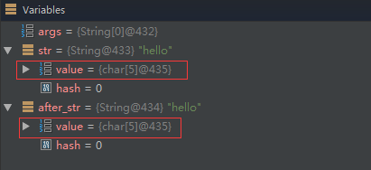
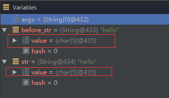

new String()究竟创建几个对象?
======================================

由来
------

遇到一个Java面试题，是关于String的，自己对String还有点研究？下面是题目的描述：

    在Java中，new String("hello")这样的创建方式，到底创建了几个String对象？

题目下答案，各说纷纭，有说1个的，有说2个的。我觉得都对，但也都不对，因为要加上一定的条件，下面来分析下！

解答
-------

分析

题目中的String创建方式，是调用String的有参构造函数，而这个有参构造函数的源码则是这样的public String(String original)，这就是说，我们可以把代码转换为下面这种：

.. code:: java

    String temp = "hello";  // 在常量池中

    String str = new String(temp); // 在堆上

这段代码就创建了2个String对象，temp指向在常量池中的，str指向堆上的，而str内部的char value[]则指向常量池中的char value[]，所以这里的答案是2个对象。(这里不再详述内部过程，之前的文章有写，参考深入浅出Java String)

那之前我为什么说答案是1个的也对呢，假如就只有这一句String str = new String("hello")代码，并且此时的常量池的没有"hello"这个String，那么答案是两个;如果此时常量池中，已经存在了"hello"，那么此时就只创建堆上str，而不会创建常量池中temp,(注意这里都是引用)，所以此时答案就是1个。

当然，光说不练假把式，下面就来用例子验证一下：

.. code:: java

    // 代码1

    public static void main(String[] args) {

        String str = new String("hello");

        String after_str = "hello";

        System.out.println(str + after_str);

    }

我们在println语句那里加个断点，debug下，如下图：

可以看到在代码1中，str和after_str不是同一个对象，这个应该没有疑问把，一个在堆上，一个常量池中
,但是我们注意到str.value和after_str.value的地址确是同一个，即是同一个char数组，所以可以理解为，当执行str那句代码时，创建了
两个String对象，一个在常量池，一个在堆上，接下来到执行after_str这句时，这种方式创建的字符串都在常量池中，但是如果常量中如果有，就直接返回了，所以这里返回的是上一句在常量池那里创建的String,所以str这句代码创建的是2个对象。

接下来再看一段代码：

.. code:: java

    // 代码2

    public static void main(String[] args) {

        String before_str = "hello";

        String str = new String("hello");

        System.out.println(str + before_str);

    }

同样在println打断点，如下图：

在代码2中，str.value和before_str.value也是用的同一个char数组，但这里的代码可不是和代码1相同的，这里我们把"hello"提到前面创建，这也就是说明当执行str那句代码时，没有再在常量池中创建"hello"了，所以str这句则是创建了1个对象。

补充
------

这里突然想到，还要补充一下上面如果常量池中没有，则创建2个对象,很多人会误解这句话的含义，这个常量池，不是你没手动的创建，常量池中就没有东西，这个理解是错误的，大家一定要修正它。在你的程序启动时，就已经装载来很多class，这里面也有字符常量的创建，只是不是你自己创建的，你只是不知道而已。

例如下面这段代码：

.. code:: java

    // 代码3，JDK >= 1.7

    public static void main(String[] args) {

        String str1 = new StringBuilder("hel").append("lo").toString();

        String str2 = new StringBuilder("ja").append("va").toString();

        System.out.println(str1.intern() == str1); // true

        System.out.println(str2.intern() == str2); // false

    }

(关于intern在不同JDK的不同表现，之前也说过了，详情请看深入浅出Java String)

代码3这里，str1的结果是很多人都能理解的，但是str2的结果为false就说明，常量池中已经有了"java"了，这里很多人不解，这个就是系统装入的字符常量，除了"java"，类似的还有"false","true"(在java.lang.String里)等等。但是这个"java"我始终没找到在那个类中，可能在native方法中把，知道的请告知下，谢谢！

为什么会出现上面的运行结果，请在往下看

String.intern()方法与常量池存入时的疑惑！
-----------------------------------------------

**JDK 1.6 之前**

String.intern()是一个Native方法，它的作用是：如果运行时常量池中已经包含一个等于此String对象内容的字符串，则返回常量池中该字符串的引用；如果没有，则在常量池中创建与此String内容相同的字符串，并返回常量池中创建的字符串的引用。

**运行时常量池位置**

运行时常量池在JDK1.6及之前版本的JVM中是方法区的一部分，而在HotSpot虚拟机中方法区放在了”永久代(Permanent Generation)”。所以运行时常量池也是在永久代的。
但是JDK1.7及之后版本的JVM已经将运行时常量池从方法区中移了出来，**在Java 堆（Heap）中开辟了一块区域存放运行时常量池。**

本文主要解惑String对象（即文本字符串）何时放入常量池，不涉及上述三类符号引用常量和其他非String常量值。而且本文只讨论主流的HotSpot虚拟机。

**String何时放入常量池**

记住一句话：直接使用双引号声明出来的String对象会直接存储在常量池中。

-----

代码一

    String a = "计算机软件";

分析：因为计算机软件五个字直接使用了双引号声明，故JVM会在运行时常量池中首先查找有没有该字符串，有则直接返回该字符串在常量池中的引用；没有则直接在常量池中创建该字符串，然后返回引用。此时，该句代码已经执行完毕，不会在java Heap（堆）中创建内容相同的字符串。该字符串只在常量池中创建了一个String对象。

----

代码二

    String a = new String("计算机软件");

分析：该行代码生成了两个String对象（Stack（栈）中的对象引用不在讨论范围内）：第一步，因为计算机软件五个字直接使用了双引号声明，故JVM会在运行时常量池中首先查找有没有该字符串，有则进入第二步；没有则直接在常量池中创建该字符串，然后进入第二步。第二步：在常量池中创建了一个String对象之后，由于使用了new，JVM会在Heap（堆）中创建一个内容相同的String对象，然后返回堆中String对象的引用。该行代码分别在常量池和堆中生成了两个内容相同的String对象。

-----

代码三

    String a = "计算机" + "软件";

分析：由于JVM存在编译期优化，对于两个直接双引号声明的String的+操作，JVM在编译期会直接优化为“计算机软件”一个字符串，故该行代码同代码一。

------

代码四

::

    String b = "计算机";
    String a = b + "软件";

分析：由于b是一个String变量，编译期无法确定b的值，故不会优化为一个字符串。即使我们知道b的值，但JVM认为它是个变量，变量的值只能在运行期才能确定，故不会优化。运行期字符串的+连接符相当于new，故该行代码在Heap中创建了一个内容为“计算机软件”的String对象，并返回该对象的引用。至此，该代码执行完毕，因为没有直接双引号声明计算机软件这5个字的字符串，故常量池中不会生成计算机软件这5个字的字符串。但是会有“计算机”和“软件”这两个String对象，因为他们都用双引号声明了。

-----

代码五

::

    String final b = "计算机";
    String a = b + "软件";

分析：该代码与代码四的唯一区别是将b声明为final类型，即为常量。故在编译期JVM能确定b的值，所以对+可以优化为“计算机软件”5个字的字符串。该代码的运行同代码三和代码一。

----

代码六

    String a = new String("计算机") + "软件";

分析：因为有new，该代码也无法编译期优化，故该行代码只是在Heap中生成了“计算机软件”字符串的String对象，在常量池中没有内容相同的对象生成。

-----

String.intern方法
------------------------

当常量池中没有该字符串时，JDK7的intern（）方法的实现不再是在常量池中创建与此String内容相同的字符串，而改为在常量池中记录Java Heap中首次出现的该字符串的引用，并返回该引用。

验证代码：

.. code:: java

    String str1 = new StringBuilder("计算机").append("软件").toString();
    System.out.println((str1.intern() == str1));
    //JDK1.6:false
    //JDK1.7:true

    //--------------------

    String b = "计算机";
    String a = b + "软件";
    System.out.println(a.intern() == a);
    //JDK1.6:false
    //JDK1.7:true  

测试代码:

请运行以下的代码看看你分析的结果和真正的运行结果是否一样，JDK1.6和1.7都要跑一遍，如果你都分析对了，那就是理解了。

.. code:: java

    //一次放开一个多行注释运行
           /* 
            String s = new String("1");
            s.intern();
            String s2 = "1";
            System.out.println(s == s2);
            String s3 = new String("1") + new String("1");
            s3.intern();
            String s4 = "11";
            System.out.println(s3 == s4);
            */
           /* 
            String s = new String("1");
            String s2 = "1";
            s.intern();
            System.out.println(s == s2);
            String s3 = new String("1") + new String("1");
            String s4 = "11";
            s3.intern();
            System.out.println(s3 == s4);
            */
      /*
     //+连接但编译器不优化
            String s1=new String("xy") + "z";  
            String s2=s1.intern();  
            System.out.println( s1==s1.intern() );  
            System.out.println( s1+" "+s2 );  
            System.out.println( s2==s1.intern() ); 
            */
          /*// 一般情况
            String s1=new String("xyz") ;  
            String s2=s1.intern();  
            System.out.println( s1==s1.intern() );  
            System.out.println( s1+" "+s2 );  
            System.out.println( s2==s1.intern() ); 
            */

           /*//编译器优化
            String s1 = "xy" + "z";
            String s2 = s1.intern();
            System.out.println( s1==s1.intern() );  
            System.out.println( s1+" "+s2 );  
            System.out.println( s2==s1.intern() ); 

            */

再补充
--------------

Java中String是一个特殊的包装类数据有两种创建形式：

.. code:: java

    String s = "abc";
    String s = new String("abc");

1.第一种先在栈中创建一个对String类的对象引用变量s，然后去查找"abc"是否被保存在字符串常量池中，如果没有则在栈中创建三个char型的值'a'、'b'、'c'，然后在堆中创建一个String对象object，它的值是刚才在栈中创建的三个char型值组成的数组{'a'、'b'、'c'}，接着这个String对象object被存放进字符串常量池，最后将s指向这个对象的地址，如果"abc"已经被保存在字符串常量池中，则在字符串常量池中找到值为"abc"的对象object，然后将s指向这个对象的地址。

第一种特点：JVM会自动根据栈中数据的实际情况来决定是否有必要创建新对象。

2.第二种可以分解成两步1、String object = "abc"；2、String s = new String(object)；第一步参考第一种创建方式，而第二步由于"abc"已经被创建并保存到字符串常量池中，因此jvm只会在堆中新创建一个String对象，它的值共享栈中已有的三个char型值。

第二种特点：一概在堆中创建新对象，而不管其字符串值是否相等，是否有必要创建新对象。

再再补充
------------

例1.字符串常量池的使用

.. code:: java

    String s0 = "abc"；
    String s1 = "abc"；
    System.out.println(s0==s1)； //true 可以看出s0和s1是指向同一个对象的。

例2.String中==和equals的区别

.. code:: java

    String s0 =new String ("abc")；
    String s1 =new String ("abc")；
    System.out.println(s0==s1)； //false 可以看出用new的方式是生成不同的对象
    System.out.println(s0.equals(s1)); //true 可以看出equals比较的是两个String对象的内容(值)

例3.编译期确定

.. code:: java

    String s0="helloworld"；
    String s1="helloworld"；
    String s2="hello" + "word"；
    System.out.println( s0==s1 )； //true 可以看出s0跟s1是同一个对象
    System.out.println( s0==s2 )； //true 可以看出s0跟s2是同一个对象

分析：因为例子中的 s0和s1中的"helloworld”都是字符串常量，它们在编译期就被确定了，所以s0==s1为true；而"hello”和"world”也都是字符串常量，当一个字符串由多个字符串常量连接而成时，它自己肯定也是字符串常量，所以s2也同样在编译期就被解析为一个字符串常量，所以s2也是常量池中"helloworld”的一个引用。所以我们得出s0==s1==s2；

例4.编译期无法确定

.. code:: java

    String s0="helloworld"；
    String s1=new String("helloworld")；
    String s2="hello" + new String("world")；
    System.out.println( s0==s1 )； //false
    System.out.println( s0==s2 )； //false
    System.out.println( s1==s2 )； //false

分析：用new String() 创建的字符串不是常量，不能在编译期就确定，所以new String() 创建的字符串不放入常量池中，它们有自己的地址空间。

s0还是常量池中"helloworld”的引用，s1因为无法在编译期确定，所以是运行时创建的新对象"helloworld”的引用，s2因为有后半部分new String(”world”)所以也无法在编译期确定，所以也是一个新创建对象"helloworld”的引用；

例5.编译期优化

.. code:: java

    String s0 = "a1"；
    String s1 = "a" + 1；
    System.out.println((s0 == s1))； //result = true
    String s2 = "atrue"；
    String s3= "a" + "true"；
    System.out.println((s2 == s3))； //result = true
    String s4 = "a3.4"；
    String s5 = "a" + 3.4；
    System.out.println((a == b))； //result = true

分析：在程序编译期，JVM就将常量字符串的"+"连接优化为连接后的值，拿"a" + 1来说，经编译器优化后在class中就已经是a1。在编译期其字符串常量的值就确定下来，故上面程序最终的结果都为true。

例6.编译期无法确定

.. code:: java

    String s0 = "ab"；
    String s1 = "b"；
    String s2 = "a" + s1；
    System.out.println((s0 == s2))； //result = false

分析：JVM对于字符串引用，由于在字符串的"+"连接中，有字符串引用存在，而引用的值在程序编译期是无法确定的，即"a" + s1无法被编译器优化，只有在程序运行期来动态分配并将连接后的新地址赋给s2。所以上面程序的结果也就为false。

例7.编译期确定

.. code:: java

    String s0 = "ab"；
    final String s1 = "b"；
    String s2 = "a" + s1；
    System.out.println((s0 == s2))； //result = true

分析：和[6]中唯一不同的是s1字符串加了final修饰，对于final修饰的变量，它在编译时被解析为常量值的一个本地拷贝存储到自己的常量 池中或嵌入到它的字节码流中。所以此时的"a" + s1和"a" + "b"效果是一样的。故上面程序的结果为true。

例8.编译期无法确定

.. code:: java

    String s0 = "ab"；
    final String s1 = getS1()；
    String s2 = "a" + s1；
    System.out.println((s0 == s2))； //result = false
    private static String getS1() { return "b"； }

分析：JVM对于字符串引用s1，它的值在编译期无法确定，只有在程序运行期调用方法后，将方法的返回值和"a"来动态连接并分配地址为s2，故上面 程序的结果为false。

--------

参考
------

https://blog.csdn.net/Sun1956/article/details/53161560

https://blog.csdn.net/u013066244/article/details/53575281