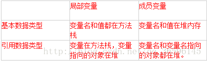

Java中基本数据类型和引用数据类型的存放位置
================================================

基本数据类型是放在栈中还是放在堆中，这取决于基本类型声明的位置。

一：在方法中声明的变量，即使变量是局部变量，每当程序调用方法时，系统都会为该方法建立一个方法栈，其所在方法中声明的变量就放在方法栈中，当方法结束系统会释放方法栈，其对应在该方法中声明的变量随着栈的销毁而结束，这就局部变量只能在方法中有效的原因。 
在方法中声明的变量可以是基本类型的变量，也可以是引用类型的变量。 

（1）当声明是基本类型的变量的时，其变量名及值（变量名及值是两个概念）是放在方法栈中 

（2）当声明的是引用变量时，所声明的变量（该变量实际上是在方法中存储的是内存地址值）是放在方法的栈中，该变量所指向的对象是放在堆类存中的。

二：在类中声明的变量是成员变量，也叫全局变量，放在堆中的（因为全局变量不会随着某个方法执行结束而销毁）。 
同样在类中声明的变量即可是基本类型的变量 也可是引用类型的变量 

（1）当声明的是基本类型的变量其变量名及其值放在堆内存中的 

（2）引用类型时，其声明的变量仍然会存储一个内存地址值，该内存地址值指向所引用的对象。引用变量名和对应的对象仍然存储在相应的堆中.

总结： 

