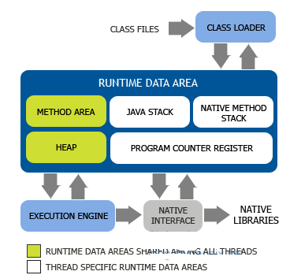
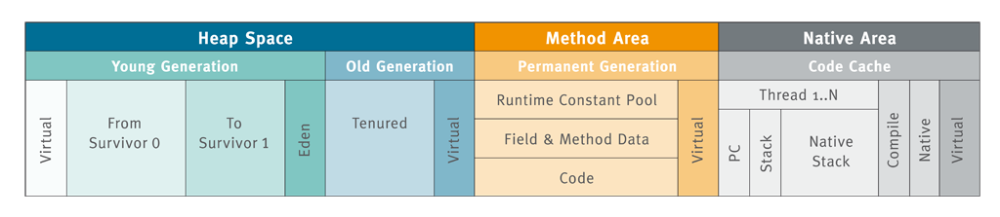
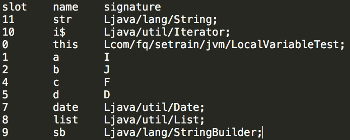
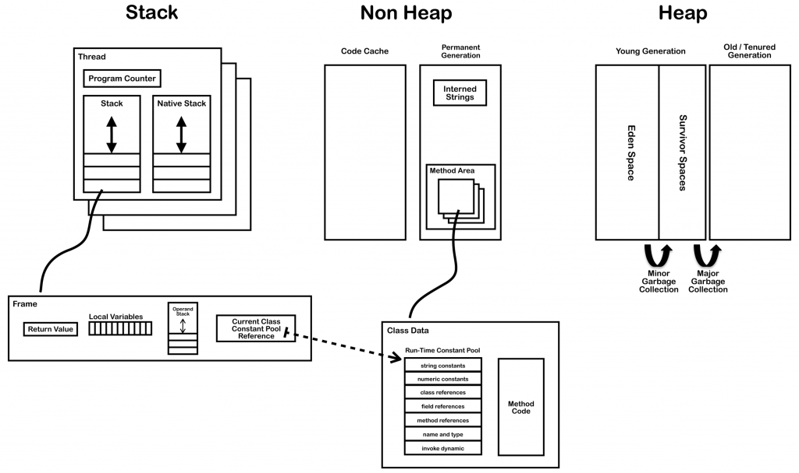

java 内存区域
=================

线程私有区域
----------------

**1. 程序计数器 Program Counter Register**

线程私有

可以看作是当前线程所执行的字节码的行号指示器

字节码解释器工作时是通过改变这个计数器的值来选取下一条需要执行的字节码指令，分支，循环，跳转，异常处理，线程等基础功能都需要依赖这个计数器来完成

java虚拟机的多线程是通过线程轮流切换并分配处理器执行时间的方式来实现的，在任何一个确定的时刻，一个处理器（对于多核处理器来说是一个内核）都只会一条线程中的指令

- 如果线程正在执行 java 方法，这个计数器记录的是正在执行的虚拟机字节码指令的地址
- 如果是native方法，这个计数器值为空（undifined）

此内存区域是唯一一个在java虚拟机规范中没有规定任何 OOM 情况的区域

**2. Java虚拟机栈  Java Stack**

线程私有

描述的是java方法执行的内存模型: 每个方法在执行的时候都会创建一个栈帧（stack frame）用来存储局部变量表，操作数栈，动态链接，方法出口等信息。

每一个方法从调用到执行完成的过程，就对应着一个栈帧在虚拟机栈中入栈到出栈的过程

VM提供了-Xss来指定线程的最大栈空间, 该参数也直接决定了函数调用的最大深度

经常有人把虚拟机内存氛围栈内存（Stack） 和 堆内存（Heap），这种方法比较粗糙。java 内存区域的划分远比这个更加复杂，这种划分方式只能说明大多数程序员最关注的，与对象内存分配关系最密切的内存区域是这两块。
这里的栈就是指的虚拟机栈

**局部变量表** (对应我们常说的‘堆栈’中的‘栈’)存放了编译期可知的各种基本数据类型(如boolean、int、double等) 、对象引用(reference : 不等同于对象本身, 可能是一个指向对象起始地址的指针, 也可能指向一个代表对象的句柄或其他与此对象相关的位置, 见下: HotSpot对象定位方式) 和 returnAddress类型(指向一条字节码指令的地址). 其中long和double（64位长度）占用2个局部变量空间(Slot), 其余只占用1个. 如下Java方法代码可以使用javap命令或javassist等字节码工具读到:

.. code:: java

    public String test(int a, long b, float c, double d, Date date, List<String> list) {
        StringBuilder sb = new StringBuilder().append(a).append(b).append(c).append(d).append(date);

        for (String str : list) {
            sb.append(str);
        }

        return sb.toString();
    }

在java虚拟机规范中，对这个区域规定了两种异常状况

- 如果线程请求的深度大于虚拟机所允许的深度，抛出 StackOverFlowError 异常
- 如果虚拟机栈可以动态扩展（当前大部分的java虚拟机都可动态扩展，只不过java虚拟机规范中与允许固定长度的虚拟机栈）
  如果扩展式无法申请到足够内存，抛出OOM

**3. 本地方法栈**

与Java Stack作用类似, 区别是Java Stack为执行Java方法服务, 而本地方法栈则为Native方法服务, 如果一个VM实现使用C-linkage模型来支持Native调用, 那么该栈将会是一个C栈(详见: JVM学习笔记-本地方法栈(Native Method Stacks)), 但HotSpot VM直接就把本地方法栈和虚拟机栈合二为一.

线程共享区域
---------------

**1. Heap - java堆**

虚拟机启动时创建

java虚拟机所管理的内存中最大的一块

被所有线程共享，几乎所有对象实例都在这里分配内存。

Java虚拟机规范中说 所有的对象实例以及数组都要在堆上分配。
但是随着JIT编译器的发展与逃逸分支技术的成熟，这句话变得不那么绝对了

垃圾收集器管理的主要区域，也被称为GC堆。

从内存回收的角度来看，现在收集器基本采用 **分代收集算法** ，java堆还可以细分为 

- 新生代
- 老年代

新生代（年轻世代）的内存区域被进一步划分成伊甸园（Eden）和两个存活区（From Survivor区和To Survivor区）

而从内存分配的角度来看, 线程共享的Java堆还还可以划分出多个线程私有的分配缓冲区(Thread Local Allocation Buffer,TLAB). 而进一步划分的目的是为了更好地回收内存和更快地分配内存.

无论如何划分，都与存放内容无关，无论哪个区域，存放的仍然是对象实例。

Java堆可以处于物理上不连续的内存空间中。只要逻辑上是连续的即可。

java heap 可以设置为固定大小，也可以是动态扩展的。不过当前主流的虚拟机都是按照可扩展来实现的（通过 -Xmx 和 -Xms 控制）

如果在堆中没有内存完成实例分配，并且堆也无法在扩展时。抛出OOM

**2. 方法区**

即我们常说的永久代(Permanent Generation),（其他虚拟机没有永久代 BEA JRockit ， IBM J9） 用于 存储被JVM加载的 *类信息*、*常量* 、*静态变量*、*即时编译器编译后的代码* 等数据.HotSpot VM把GC分代收集扩展至方法区, 即使用Java堆的永久代来实现方法区, 这样HotSpot的垃圾收集器就可以像管理Java堆一样管理这部分内存, 而不必为方法区开发专门的内存管理器(永久带的内存回收的主要目标是针对 **常量池的回收和类型的卸 载**  , 因此收益一般很小)

不过在1.7的HotSpot已经将原本放在永久代的字符串常量池移出: 

而在1.8中, 永久区已经被彻底移除, 取而代之的是元数据区Metaspace(这一点在查看GC日志和使用jstat -gcutil查看GC情况时可以观察到),与永久代不同, 如果不指定Metaspace大小, 如果方法区持续增长, VM会默认耗尽所有系统内存.

**3. 运行时常量池**

方法区的一部分. Class文件中除了有 **类的版本、字段、方法、接口等描述信息外** ,还有一项常量池(Constant Pool Table)用于存放 **编译期生成的各种字面量和符号引用** , 这部分内容会存放到方法区的运行时常量池中(如前面从test方法中读到的signature信息). 但Java语言并不要求常量一定只能在编译期产生, 即并非预置入Class文件中常量池的内容才能进入方法区运行时常量池, 运行期间也可能将新的常量放入池中, 如String的intern()方法.

直接内存
------------------

直接内存并不是JVM运行时数据区的一部分, 但也会被频繁的使用: 在JDK 1.4引入的NIO提供了基于Channel与Buffer的IO方式, 它可以使用Native函数库直接分配堆外内存, 然后使用DirectByteBuffer对象作为这块内存的引用进行操作(详见: Java I/O 扩展), 这样就避免了在Java堆和Native堆中来回复制数据, 因此在一些场景中可以显著提高性能.
显然, 本机直接内存的分配不会受到Java堆大小的限制(即不会遵守-Xms、-Xmx等设置), 但既然是内存, 则肯定还是会受到本机总内存大小及处理器寻址空间的限制, 因此动态扩展时也会出现OutOfMemoryError异常.

总结
-------

- 堆：存放所有new出来的对象；
- 栈：存放基本数据变量和对象的引用，对象（new出来的对象）本身不存在在栈中，而是存放在堆中或者常量池中（字符串对象存放在常量池中)；
- 常量池：存放基本类型常量和字符串常量。
- 对于栈和常量池中的对象可以共享，对于堆中的对象不可以共享。栈中的数据大小和生命周期是可以确定的，当没有引用指向数据时，数据就会自动消失。堆中的对象由垃圾回收器负责回收，因此大小和生命周期不需要确定，具有很大的灵活性。
- 对于字符串来说，其对象的引用都是存储在栈中的，如果是编译期已经创建好（用双引号定义的）就存储在常量池中，如果是运行期（new出来的对象）则存储在堆中。对于equals相等的字符串，在常量池中只有一份，而在堆中有多份。详见 `String的对象存储方式`_

HotSpot对象
=================

对象新建
-------------

new一个Java Object(包括数组和Class对象), 在JVM会发生如下步骤:

1. VM遇到new指令: 首先去检查该指令的参数是否能在常量池中定位到一个类的符号引用, 并检查这个符号引用代表的类是否已被加载、解析和初始化过. 如果没有, 必须先执行相应的类加载过程.

2. 类加载检查通过后: VM将为新生对象分配内存(对象所需内存的大小在类加载完成后便可完全确定), VM采用 **指针碰撞** (内存规整: Serial、ParNew等有内存压缩整理功能的收集器)或 **空闲链表** (内存不规整: CMS这种基于Mark-Sweep算法的收集器)方式将一块确定大小的内存从Java堆中划分出来.

3. 除了考虑如何划分可用空间外, 由于在VM上创建对象的行为非常频繁, 因此需要考虑内存分配的并发问题. 解决方案有两个: 
    - 对分配内存空间的动作进行同步 -采用 CAS配上失败重试 方式保证更新操作的原子性;
    - 把内存分配的动作按照线程划分在不同的空间之中进行 -每个线程在Java堆中预先分配一小块内存, 称为本地线程分配缓冲 **TLAB** (还记得java heap中的按内存分配划分场景吗), 各线程首先在TLAB上分配, 只有TLAB用完, 分配新的TLAB时才需要同步锁定(使用-XX:+/-UseTLAB参数设定).

4. 接下来将分配到的内存空间初始化为零值(不包括对象头, 且如果使用TLAB这一个工作也可以提前至TLAB分配时进行).   这一步保证了对象的实例字段可以不赋初始值就直接使用(访问到这些字段的数据类型所对应的零值).

5. 然后要对对象进行必要的设置: 如该对象所属的类实例、如何能访问到类的元数据信息、对象的哈希码、对象的GC分代年龄等, 这部分息放在对象头中(详见下).

6. 上面工作都完成之后, 在虚拟机角度一个新对象已经产生, 但在Java视角对象的创建才刚刚开始(<init>方法尚未执行, 所有字段还都为零). 所以new指令之后一般会(由字节码中是否跟随有invokespecial指令所决定-Interface一般不会有, 而Class一般会有)接着执行<init>方法, 把对象按照程序员的意愿进行初始化, 这样一个真正可用的对象才算完全产生出来.

对象存储布局
--------------------

HotSpot VM内, 对象在内存中的存储布局可以分为三块区域：对象头、实例数据和对齐填充:

**对象头包括两部分**

- 一部分用于存储对象自身的运行时数据: HashCode、GC分代年龄、锁状态标志、线程持有的锁、偏向线程ID、偏向时间戳等, 这部分数据的长度在32位和64位的VM(暂不考虑开启压缩指针)中分别为32bit和64bit, 官方称之为“Mark Word”; 其存储格式如下:

:: 

    状态              标志位     存储内容
    =======         ========   ===================
    未锁定             01      对象哈希码、对象分代年龄
    轻量级锁定         00      指向锁记录的指针
    膨胀(重量级锁定)   10      执行重量级锁定的指针
    GC标记             11      空(不需要记录信息)
    可偏向             01      偏向线程ID、偏向时间戳、对象分代年龄

- 一部分是类型指针, 即是对象指向它的类元数据的指针: VM通过该指针确定该对象属于哪个类实例. 另外, 如果对象是一个数组, 那在对象头中还必须有一块数据用于记录数组长度. 

    注意: 并非所有VM实现都必须在对象数据上保留类型指针, 也就是说查找对象的元数据并非一定要经过对象本身(详见下面句柄定位对象方式).

**实例数据部分**

实例数据部分是对象真正存储的有效信息, 也就是我们在代码里所定义的各种类型的字段内容(无论是从父类继承下来的, 还是在子类中定义的都需要记录下来). 这部分的存储顺序会受到虚拟机分配策略参数和字段在Java源码中定义顺序的影响. HotSpot默认的分配策略为longs/doubles、ints、shorts/chars、bytes/booleans、oops(Ordinary Object Pointers), 相同宽度的字段总是被分配到一起, 在满足这个前提条件下, 在父类中定义的变量会出现在子类之前. 如果CompactFields参数值为true(默认), 那子类中较窄的变量也可能会插入到父类变量的空隙中.

**对齐填充**

对齐填充部分并不是必然存在的, 仅起到占位符的作用, 原因是HotSpot自动内存管理系统要求对象起始地址必须是8字节的整数倍, 即对象的大小必须是8字节的整数倍.s

对象的访问定位
------------------------

建立对象是为了使用对象, Java程序需要通过栈上的reference来操作堆上的具体对象. 主流的有句柄和直接指针两种方式去定位和访问堆上的对象:

**句柄** 

Java堆中将会划分出一块内存来作为句柄池, reference中存储对象的句柄地址, 而句柄中包含了对象实例数据与类型数据的具体各自的地址信息: 

.. image:: ./images/reference_object1.jpg

**直接指针(HotSpot使用)**

 该方式Java堆对象的布局中就必须考虑如何放置访问类型数据的相关信息, reference中存储的直接就是对象地址: 

.. image:: ./images/reference_object2.jpg

    看对象头的类型指正

这两种对象访问方式各有优势: 使用句柄来访问的最大好处是reference中存储的是稳定句柄地址, 在对象被移动(垃圾收集时移动对象是非常普遍的行为)时只会改变句柄中的实例数据指针,而reference本身不变. 而使用直接指针最大的好处就是速度更快, 它节省了一次指针定位的时间开销,由于对象访问非常频繁, 因此这类开销积小成多也是一项非常可观的执行成本.

----

参考

`JVM初探 -JVM内存模型`_

.. _`JVM初探 -JVM内存模型`: https://blog.csdn.net/zjf280441589/article/details/53437703

.. _`String的对象存储方式`: b06_String.html

`极客学院-JVM`_

.. `极客学院-JVM`: http://www.jikexueyuan.com/course/1793_4.html?ss=1

`JAVA 堆栈 堆 方法区 静态区 final static 内存分配 详解`_

.. _`JAVA 堆栈 堆 方法区 静态区 final static 内存分配 详解`: https://blog.csdn.net/peterwin1987/article/details/7571808