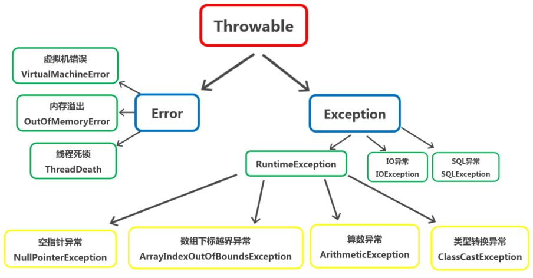
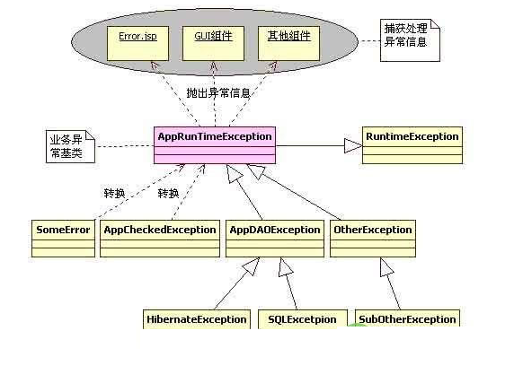

exception
=================

异常的分类
-------------

Java把异常当作对象来处理，并定义一个基类java.lang.Throwable作为所有异常的超类。
在Java API中已经定义了许多异常类，这些异常类分为两大类，错误Error和异常Exception。
Java异常体系结构呈树状

Thorwable类所有异常和错误的超类，有两个子类Error和Exception，分别表示错误和异常。
其中异常类Exception又分为运行时异常(RuntimeException)和非运行时异常，
这两种异常有很大的区别，也称之为不检查异常（Unchecked Exception）
和检查异常（Checked Exception）

::

    Throwable 

        Exception：unchecked exception: 指的是编译器不要求强制处理的异常，RuntimeException及其子类 （NullPointException,
                                        ArrayIndexOutOfBoundException,算术异常，类型转换异常，可以放任不管，编译器不显示提示信息）
                    checked exception: 编译器要求必须在代码中处理的异常，如文件操作异常（IOException),SQLException

        Error : 是程序无法处理的错误，虚拟机错误，内存错误，线程死锁。
                他们在程序的控制和处理能力之外，而且绝大多数是程序运行时不允许出现的错误
                对于设计合理的程序来说，即使发生了错误，本质上也不应该试图去处理它所引起的异常情况

Error与Exception 
-----------------------

Error是程序无法处理的错误，比如OutOfMemoryError、ThreadDeath等。这些异常发生时，
Java虚拟机（JVM）一般会选择线程终止。

Exception是程序本身可以处理的异常，这种异常分两大类运行时异常和非运行时异常。
程序中应当尽可能去处理这些异常。 

运行时异常和非运行时异常
--------------------------------

运行时异常都是RuntimeException类及其子类异常，如NullPointerException、IndexOutOfBoundsException等，
这些异常是不检查异常，程序中可以选择捕获处理，也可以不处理。这些异常一般是由程序逻辑错误引起的，
程序应该从逻辑角度尽可能避免这类异常的发生。

非运行时异常是RuntimeException以外的异常，类型上都属于Exception类及其子类。
从程序语法角度讲是必须进行处理的异常，如果不处理，程序就不能编译通过。
如IOException、SQLException等以及用户自定义的Exception异常，一般情况下不自定义检查异常。 

异常的捕获和处理 
-----------------------------

Java异常的捕获和处理是一个不容易把握的事情，如果处理不当，不但会让程序代码的可读性大大降低，
而且导致系统性能低下，甚至引发一些难以发现的错误。

Java异常处理涉及到五个关键字，分别是：try、catch、finally、throw、throws。下面将骤一介绍，
通过认识这五个关键字，掌握基本异常处理知识。 

异常的转译
---------------

所谓的异常转译就是将一种异常转换另一种新的异常，也许这种新的异常更能准确表达程序发生异常。
在Java中有个概念就是异常原因，异常原因导致当前抛出异常的那个异常对象，
几乎所有带异常原因的异常构造方法都使用Throwable类型做参数，这也就为异常的转译提供了直接的支持，
因为任何形式的异常和错误都是Throwable的子类。比如将SQLException转换为另外一个新的异常DAOException，
可以这么写： 

.. code:: java

    public class DAOException extends RuntimeException {   
    /(省略了部分代码)   
      public DAOException(String message, Throwable cause) {   
          super(message, cause);   
      }   

比如有一个SQLException类型的异常对象e，要转换为DAOException，可以这么写：

    DAOException daoEx = new DAOException ( "SQL异常", e);

异常转译是针对所有继承Throwable超类的类而言的，从编程的语法角度讲，其子类之间都可以相互转换。
但是，从合理性和系统设计角度考虑，可将异常分为三类：Error、Exception、RuntimeException

为什么要这么做呢？

笔者认为，异常的处理存在着一套哲学思想：对于一个应用系统来说，
系统所发生的任何异常或者错误对操作用户来说都是系统"运行时"异常，都是这个应用系统内部的异常。
这也是异常转译和应用系统异常框架设计的指导原则。在系统中大量处理非检查异常的负面影响很多，
最重要的一个方面就是代码可读性降低，程序编写复杂，异常处理的代码也很苍白无力。
因此，很有必要将这些检查异常Exception和错误Error转换为RuntimeException异常，
让程序员根据情况来决定是否捕获和处理所发生的异常。 

分三种情况：

①：Error到Exception：将错误转换为异常，并继续抛出。例如Spring WEB框架中，
将org.springframework.web.servlet.DispatcherServlet的doDispatch()方法中，
将捕获的错误转译为一个NestedServletException异常。这样做的目的是为了最大限度挽回因错误发生带来的负面影响。
因为一个Error常常是很严重的错误，可能会引起系统挂起。

②：Exception到RuntimeException：将检查异常转换为RuntimeException可以让程序代码变得更优雅，
让开发人员集中经理设计更合理的程序代码，反过来也增加了系统发生异常的可能性。

③：Error到RuntimeException：目的还是一样的。把所有的异常和错误转译为不检查异常，
这样可以让代码更为简洁，还有利于对错误和异常信息的统一处理。 

异常链
-------------

将异常发生的原因依次保留下来

.. code:: java

    try{
        
        throw new Exception("原因1")；
    }

    catch(Exception e){

        Exception e1 =     new Exception("原因2")；
        e1.initCause(e)
        throw e1

    }

异常处理的一般原则 
-----------------------------

1、 能处理就早处理，抛出不去还不能处理的就想法消化掉或者转换为RuntimeException处理。
因为对于一个应用系统来说，抛出大量异常是有问题的，应该从程序开发角度尽可能的控制异常发生的可能。

2、 对于检查异常，如果不能行之有效的处理，还不如转换为RuntimeException抛出。
这样也让上层的代码有选择的余地――可处理也可不处理。

3、 对于一个应用系统来说，应该有自己的一套异常处理框架，这样当异常发生时，也能得到统一的处理风格，
将优雅的异常信息反馈给用户。 

设计一个高效合理的异常处理框架 
----------------------------------

对于一个应用系统来说，发生所有异常在用户看来都是应用系统内部的异常。因此应该设计一套应用系统的异常框架，
以处理系统运行过程中的所有异常。

基于这种观点，可以设计一个应用系统的异常比如叫做AppException。并且对用户来说，
这些异常都是运行应用系统运行时发生的，因此AppException应该继承RuntimeException，
这样系统中所有的其他异常都转译为AppException，当异常发生的时候，前端接收到AppExcetpion并做统一的处理。 

在这个设计图中，AppRuntimeException是系统异常的基类，对外只抛出这个异常，
这个异常可以由前端（客户端）接收处理，当异常发生时，客户端的相关组件捕获并处理这些异常，
将"友好"的信息展示给客户。

在AppRuntimeException下层，有各种各样的异常和错误，最终都转译为AppRuntimeException，
AppRuntimeException下面还可以设计一些别的子类异常，比如AppDAOException、OtherException等，
这些都根据实际需要灵活处理。
在往下就是如何将捕获的原始异常比如SQLException、HibernateException转换为更高级一点AppDAOException。

有关异常框架设计这方面公认比较好的就是Spring，Spring中的所有异常都可以用org.springframework.core.NestedRuntimeException来表示，并且该基类继承的是RuntimeException。
Spring框架很庞大，因此设计了很多NestedRuntimeException的子类，还有异常转换的工具，
这些都是非常优秀的设计思想。
