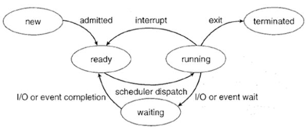
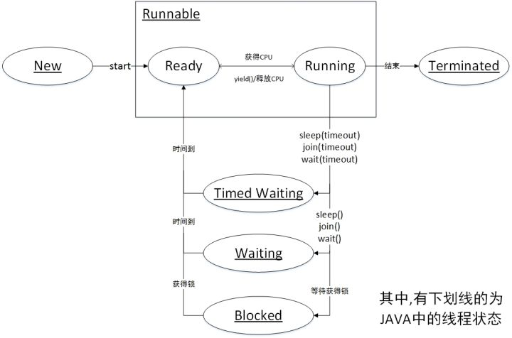

线程状态
==================

java线程运行怎么有第六种状态？

sun.misc.VM类中，有如下代码：

.. code:: java

   /* The threadStatus field is set by the VM at state transition
     * in the hotspot implementation. Its value is set according to
     * the JVM TI specification GetThreadState function.
     */
    private final static int JVMTI_THREAD_STATE_ALIVE = 0x0001;
    private final static int JVMTI_THREAD_STATE_TERMINATED = 0x0002;
    private final static int JVMTI_THREAD_STATE_RUNNABLE = 0x0004;
    private final static int JVMTI_THREAD_STATE_BLOCKED_ON_MONITOR_ENTER = 0x0400;
    private final static int JVMTI_THREAD_STATE_WAITING_INDEFINITELY = 0x0010;
    private final static int JVMTI_THREAD_STATE_WAITING_WITH_TIMEOUT = 0x0020;

可以看到代码中对线程定义了6种状态，翻译过来分别是（蹩脚）：

活着，结束，就绪，监视到阻塞，无限期等待，等待超时

然后从Thread.State枚举类中发现：

.. code:: java

    public enum State {
        NEW,
        RUNNABLE,
        BLOCKED,
        WAITING,
        TIMED_WAITING,
        TERMINATED;
    }

也有6种，只是第一种变成了NEW。

但线程不是只有：

**创建，就绪，运行，阻塞，死亡 **

5种状态吗？

是因为从不同角度解析线程状态的原因吗?

-----

                 回答 ---->

------

首先告诉你网上说的5种状态是误导（不吐槽CSDN上个各种无脑转载了。。。），java中的线程实际上有6种状态。5种状态的说法其实是早期进程的状态。

早期进程的状态：

这里所谓“进程状态”指早期的那种“单线程进程”的状态。 

对于现在普遍的“多线程进程”，显然，谈论“进程状态”已经没有意义，应该谈论“进程下某个线程的状态”或者直接说“线程状态”。不过有时还是会把“进程状态”和“线程状态”混着去说。

有些系统把线程叫成“轻量级进程”（light-weight process），所以还是在谈“进程状态”。

有时则甚至既不叫“进程”，也不叫“线程”，它们叫“task”或者“job”。

与传统的running状态的区别

有人常觉得 Java 线程状态中还少了个 running 状态，这其实是把两个不同层面的状态混淆了。对 Java 线程状态而言，不存在所谓的running 状态，它的 runnable 状态包含了 running 状态。

我们可能会问，为何 JVM 中没有去区分这两种状态呢？

现在的时分（time-sharing）多任务（multi-task）操作系统架构通常都是用所谓的“时间分片（time quantum or time slice）”方式进行抢占式（preemptive）轮转调度（round-robin式）。

这个时间分片通常是很小的，一个线程一次最多只能在 cpu 上运行比如10-20ms 的时间（此时处于 running 状态），也即大概只有0.01秒这一量级，时间片用后就要被切换下来放入调度队列的末尾等待再次调度。（也即回到 ready 状态） 

通常，Java的线程状态是服务于监控的，如果线程切换得是如此之快，那么区分 ready 与 running 就没什么太大意义了。 

现今主流的 JVM 实现都把 Java 线程一一映射到操作系统底层的线程上，把调度委托给了操作系统，我们在虚拟机层面看到的状态实质是对底层状态的映射及包装。JVM 本身没有做什么实质的调度，把底层的 ready 及 running 状态映射上来也没多大意义，因此，统一成为runnable 状态是不错的选择。 

下面是Thread.State源码中的注释中的话：

These states are virtual machine states which do not reflect any operating system thread states。

这些状态是虚拟机状态，它不反映任何操作系统的线程状态。

RUNABLE状态的注释：

A thread in the runnable state is executing in the Java virtual machine but it may be waiting for other resources from the operating system such as processor. 

处于 runnable 状态下的线程正在 Java 虚拟机中执行，但它可能正在等待来自于操作系统的其它资源，比如处理器。 

Java中的 RUNNABLE 状态 实际上是包含了 Ready与Running的状态的，所以你完全可以无视网上那些不准确的说法，这种问题的答案往往就在源码与javadoc中。

附一张正确的图片 ：

