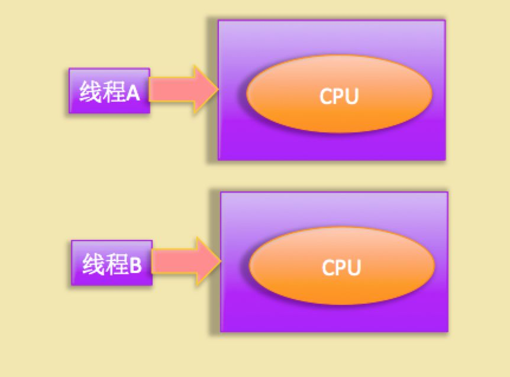

线程基础
=========

**涉及问题**

    - 什么是线程？线程和进程的关系。

    - 线程创建与运行。创建一个线程有那几种方式？有何区别？

    - 线程通知与等待，多线程同步的基础设施。

    - 线程的虚假唤醒，以及如何避免。

    - 等待线程执行终止的 join 方法。想让主线程在子线程执行完毕后在做一点事情？

    - 让线程睡眠的 sleep 方法，sleep 的线程会释放持有的锁？

    - 线程中断。中断一个线程，被中断的线程会自己终止？

    - 理解线程上下文切换。线程多了一定好？

    - 线程死锁，以及如何避免。

    - 守护线程与用户线程。当 main 函数执行完毕，但是还有用户线程存在的时候，JVM 进程会退出？

什么是线程
----------

在讨论什么是线程前有必要先说下什么是进程，因为线程是进程中的一个实体，线程本身是不会独立存在的。

进程是代码在数据集合上的一次运行活动，是系统进行资源分配和调度的基本单位，线程则是进程的一个执行路径，一个进程至少有一个线程，进程中的多个线程是共享进程的资源的。

操作系统在分配资源时候是把资源分配给进程的，但是 CPU 资源就比较特殊，它是分派到线程的，因为真正要占用 CPU 运行的是线程，所以也说线程是 CPU 分配的基本单位。

Java 中当我们启动 main 函数时候其实就启动了一个 JVM 的进程，而 main 函数所在线程就是这个进程中的一个线程，也叫做主线程。

其实程序计数器就是为了记录该线程让出 CPU 时候的执行地址，待再次分配到时间片时候就可以从自己私有的计数器指定地址继续执行了。

另外每个线程有自己的栈资源，用于存储该线程的局部变量，这些局部变量是该线程私有的，其它线程是访问不了的，另外栈还用来存放线程的调用栈帧。

堆是一个进程中最大的一块内存，堆是被进程中的所有线程共享的，是进程创建时候分配的，堆里面主要存放使用 new 操作创建的对象实例。

方法区则是用来存放进程中的代码片段的，是线程共享的。

线程创建与运行
---------------

**三种方式**

1. Thread

2. Runnable

3. FutureTask

**Thread**

略

**Runnable**

略

**FutureTask**

但是上面两种方法都有一个缺点就是任务没有返回值，下面看最后一种是使用 FutureTask

.. code:: java

    /**
     * @Author wenchaofu
     * @DATE 11:21 2018/6/20
     * @DESC
     */
    @Slf4j
    public class FutureTaskTest {
        public static void main(String[] args) throws InterruptedException, ExecutionException {
            FutureTask<String> stringFutureTask = new FutureTask<>(new Callable<String>() {
                @Override
                public String call() throws Exception {
                    log.info("do something");
                    Thread.sleep(1000);
                    log.info("do something is done");
                    return "all thing is done";
                }
            });
            new Thread(stringFutureTask).start();
            log.info(" i am in main");
            Thread.sleep(1000);
            String s = stringFutureTask.get(); // 阻塞等待线程执行结束接着往下执行
            log.info("result is {}", s);

        }
    }

代码路径 me.wenchao.javapro.concurrency.JUC.FutureTaskTest

线程通知与等待
-----------------

Java 中 Object 类是所有类的父类，鉴于继承机制，Java 把所有类都需要的方法放到了 Object 类里面，其中就包含本节要讲的通知等待系列函数,这些通知等待函数是组成并发包中线程同步组件的基础。

下面讲解下 Object 中关于线程同步的通知等待函数。

**void wait() 方法**

首先谈下什么是共享资源，所谓共享资源是说该资源被多个线程共享，多个线程都可以去访问或者修改的资源。另外本文当讲到的共享对象就是共享资源。

当一个线程调用一个共享对象的 wait() 方法时候，调用线程会被阻塞挂起，直到下面几个事情之一发生才返回：

::

    其它线程调用了该共享对象的 notify() 或者 notifyAll() 方法；

    其它线程调用了该线程的 interrupt() 方法设置了该线程的中断标志，该线程会抛出 InterruptedException 异常返回。

另外需要注意的是如果调用 wait() 方法的线程没有事先获取到该对象的监视器锁，则调用 wait() 方法时候调用线程会抛出 IllegalMonitorStateException 异常。

那么一个线程如何获取到一个共享变量的监视器那？

（1）执行使用 synchronized 同步代码块时候，使用该共享变量作为参数：

.. code:: java

    synchronized（共享变量）{       //doSomething
       }

（2）调用该共享变量的方法，并且该方法使用了 synchronized 修饰：

.. code:: java

    synchronized void add(int a,int b){       //doSomething}

另外需要注意的是一个线程可以从挂起状态变为可以运行状态（也就是被唤醒）即使该线程没有被其它线程调用 notify()，notifyAll() 进行通知，或者被中断，或者等待超时，这就是所谓的虚假唤醒。

虽然虚假唤醒在应用实践中很少发生，但是还是需要防范于未然的，做法就是不停的去测试该线程被唤醒的条件是否满足，不满足则继续等待，也就是说在一个循环中去调用 wait() 方法进行防范，退出循环的条件是条件满足了唤醒该线程。

查看代码 me.wenchao.javabasic.thread.ThreadNotify （生产者消费者等待唤醒示例）

**void notify() 方法**

一个线程调用共享对象的 notify() 方法后，会唤醒一个在该共享变量上调用 wait 系列方法后被挂起的线程，一个共享变量上可能会有多个线程在等待，具体唤醒哪一个等待的线程是随机的。

另外被唤醒的线程不能马上从 wait 返回继续执行，它必须获取了共享对象的监视器后才可以返回,也就是唤醒它的线程释放了共享变量上面的监视器锁后，被唤醒它的线程也不一定会获取到共享对象的监视器，这是因为该线程还需要和其它线程一块竞争该锁，只有该线程竞争到了该共享变量的监视器后才可以继续执行。

类似 wait 系列方法，只有当前线程已经获取到了该共享变量的监视器锁后，才可以调用该共享变量的 notify() 方法，否者会抛出 IllegalMonitorStateException 异常。

**void notifyAll() 方法**

不同于 nofity() 方法在共享变量上调用一次就会唤醒在该共享变量上调用 wait 系列方法被挂起的一个线程，notifyAll() 则会唤醒所有在该共享变量上由于调用 wait 系列方法而被挂起的线程。

**等待线程执行终止的 join 方法**

在项目实践时候经常会遇到一个场景，就是需要等待某几件事情完成后才能继续往下执行。

比如多个线程去加载资源，当多个线程全部加载完毕后在汇总处理，Thread 类中有个静态的 join 方法就可以做这个事情，前面介绍的等待通知方法是属于 Object 类的，而 join 方法则是直接在 Thread 类里面提供的，join 是无参，返回值为 void 的方法。下面看一个简单的例子来介绍 join 的使用：

多线程并发与并行
-----------------

首先要澄清并发和并行的概念，并发是指同一个时间段内多个任务同时都在执行，并且都没有执行结束；而并行是说在单位时间内多个任务同时在执行；

并发任务强调在一个时间段内同时执行，而一个时间段有多个单位时间累积而成，所以说并发的多个任务在单位时间内不一定同时在执行。

在单个 CPU 的时代多个任务同时运行都是并发，这是因为 CPU 同时只能执行一个任务，单个 CPU 时代多任务是共享一个 CPU 的，当一个任务占用 CPU 运行时候，其它任务就会被挂起，当占用 CPU 的任务时间片用完后，会把 CPU 让给其它任务来使用。

所以在单 CPU 时代多线程编程的意义不大，并且线程间频繁的上下文切换还会带来开销。

如下图单个 CPU 上运行两个线程，可知线程 A 和 B 是轮流使用 CPU 进行任务处理的，也就是同时 CPU 只在执行一个线程上面的任务，当前线程 A 的时间片用完后会进行线程上下文切换，也就是保存当前线程的执行线程，然后切换线程 B 占用 CPU 运行任务。

如下图双 CPU 时候，线程 A 和线程 B 在自己的 CPU 上执行任务，实现了真正的并行运行。

而在多线程编程实践中线程的个数往往多于 CPU 的个数，所以平时都是称多线程并发编程而不是多线程并行编程。

线程安全问题
-------------

谈到线程安全问题不得不先说说什么是共享资源，所谓共享资源是说多个线程都可以去访问的资源。

线程安全问题是指当多个线程同时读写一个共享资源并且没有任何同步措施的时候，导致脏数据或者其它不可预见的结果的问题。

如上图，线程 A 和线程 B 可以同时去操作主内存中的共享变量，是不是说多个线程共享了资源，都会产生线程安全问题呢？

答案是否定的，如果多个线程都是只读取共享资源，而不去修改，那么就不会存在线程安全问题。

只有当至少一个线程修改共享资源时候才会存在线程安全问题。最典型的就是计数器类的实现，计数 count 本身是一个共享变量，多个线程可以对其进行增加一，如果不使用同步的话，由于递增操作是获取 -> 加1 -> 保存三步操作，所以可能导致导致计数不准确，如下表：

假如当前 count=0，t1 时刻线程 A 读取了 count 值到本地变量 countA。

然后 t2 时刻递增 countA 值为1，同时线程 B 读取 count 的值0放到本地变量 countB 值为0（因为 countA 还没有写入主内存）。

t3 时刻线程 A 才把 countA 为1的值写入主内存，至此线程 A 一次计数完毕，同时线程 B 递增 CountB 值为1。

t4 时刻线程 B 把 countB 值1写入内存，至此线程 B 一次计数完毕。

先不考虑内存可见性问题，明明是两次计数哇，为啥最后结果还是1而不是2呢？其实这就是共享变量的线程安全问题。

那么如何解决？这就需要在线程访问共享变量时候进行适当的同步，Java 中首屈一指的是使用关键字 Synchronized 进行同步，这个下面会有具体介绍。

共享变量的内存可见性问题
---------------------------

要谈内存可见性首先需要介绍下 Java 中多线程下处理共享变量时候的内存模型。

如上图，Java 内存模型规定了所有的变量都存放在主内存中，当线程使用变量时候都是把主内存里面的变量拷贝到了自己的工作空间或者叫做工作内存。

Java 内存模型是个抽象的概念，那么在实际实现中什么是线程的工作内存呢？

如上图是双核 CPU 系统架构，每核有自己的控制器和运算器，其中控制器包含一组寄存器和操作控制器，运算器执行算术逻辑运算，并且有自己的一级缓存，并且有些架构里面双核还有个共享的二级缓存。

那么 对应 Java 内存模型里面的工作内存，在实现上这里是指 L1 或者 L2 缓存或者 CPU 的寄存器。

假如线程 A 和 B 同时去处理一个共享变量，会出现什么情况呢？

使用上图 CPU 架构，假设线程  A和 B 使用不同 CPU 进行去修改共享变量 X，假设 X 的初始化为0，并且当前两级 Cache 都为空的情况，具体看下面分析:

::

    假设线程 A 首先获取共享变量 X 的值，由于两级 Cache 都没有命中，所以到主内存加载了 X=0，然后会把 X=0 的值缓存到两级缓存，假设线程 A 修改 X 的值为1，然后写入到两级 Cache，并且刷新到主内存（注：如果没刷新会主内存也会存在内存不可见问题）。

    这时候线程 A 所在的 CPU 的两级 Cache 内和主内存里面 X 的值都是1；

    然后假设线程 B 这时候获取 X 的值，首先一级缓存没有命中，然后看二级缓存，二级缓存命中了，所以返回 X=1；然后线程 B 修改 X 的值为2；然后存放到线程2所在的一级 Cache 和共享二级 Cache，最后更新主内存值为2；

    然后假设线程 A 这次又需要修改 X 的值，获取时候一级缓存命中获取 X=1，到这里问题就出现了，明明线程 B 已经把 X 的值修改为了2，为啥线程 A 获取的还是1呢？

    这就是共享变量的内存不可见问题，也就是线程 B 写入的值对线程 A 不可见。

那么对于共享变量内存不可见问题如何解决呢？

Java 中首屈一指的 Synchronized 和 Volatile 关键字就可以解决这个问题，下面会有讲解。

**Java 中 Synchronized 关键字**

Synchronized 块是 Java 提供的一种原子性内置锁，Java 中每个对象都可以当做一个同步锁的功能来使用，这些 Java 内置的使用者看不到的锁被称为内部锁，也叫做监视器锁。

线程在进入 Synchronized 代码块前会自动尝试获取内部锁，如果这时候内部锁没有被其他线程占有，则当前线程就获取到了内部锁，这时候其它企图访问该代码块的线程会被阻塞挂起。

拿到内部锁的线程会在正常退出同步代码块或者异常抛出后或者同步块内调用了该内置锁资源的 wait 系列方法时候释放该内置锁；

内置锁是排它锁，也就是当一个线程获取这个锁后，其它线程必须等待该线程释放锁才能获取该锁。

上一节讲了多线程并发修改共享变量时候会存在内存不可见的问题，究其原因是因为 Java 内存模型中线程操作共享变量时候会从自己的工作内存中获取而不是从主内存获取或者线程写入到本地内存的变量没有被刷新会主内存。

下面讲解下 Synchronized 的一个内存语义，这个内存语义就可以解决共享变量内存不可见性问题。

线程进入 Synchronized 块的语义是会把在 Synchronized 块内使用到的变量从线程的工作内存中清除，在 Synchronized 块内使用该变量时候就不会从线程的工作内存中获取了，而是直接从主内存中获取；

退出 Synchronized 块的内存语义是会把 Synchronized 块内对共享变量的修改刷新到主内存。

对应上面一节讲解的假如线程在 Synchronized 块内获取变量 X 的值，那么线程首先会清空所在的 CPU 的缓存，然后从主内存获取变量 X 的值；

当线程修改了变量的值后会把修改的值刷新回主内存。

其实这也是加锁和释放锁的语义，当获取锁后会清空本地内存中后面将会用到的共享变量，在使用这些共享变量的时候会从主内存进行加载；

在释放锁时候会刷新本地内存中修改的共享变量到主内存。

除了可以解决共享变量内存可见性问题外，Synchronized 经常被用来实现原子性操作，另外注意，Synchronized 关键字会引起线程上下文切换和线程调度的开销。

**Java 中 Volatile 关键字**

上面介绍了使用锁的方式可以解决共享变量内存可见性问题，但是使用锁太重，因为它会引起线程上下文的切换开销，对于解决内存可见性问题，Java 还提供了一种弱形式的同步，也就是使用了 volatile 关键字。

一旦一个变量被 volatile 修饰了，当线程获取这个变量值的时候会首先清空线程工作内存中该变量的值，然后从主内存获取该变量的值；

当线程写入被 volatile 修饰的变量的值的时候，首先会把修改后的值写入工作内存，然后会刷新到主内存。这就保证了对一个变量的更新对其它线程马上可见。

下面看一个使用 volatile 关键字解决内存不可见性的一个例子，如下代码的共享变量 value 是线程不安全的，因为它没有进行适当同步措施。

.. code:: java

    class ThreadNotSafeInteger {
        private int value;

        public int get() {
            return value;
        }

        public void set(int value) {
            this.value = value;
        }
    }

首先看下使用 synchronized 关键字进行同步方式如下：

.. code:: java

    class ThreadSafeInteger {
        private int value;

        public synchronized int get() {
            return value;
        }

        public synchronized void set(int value) {
            this.value = value;
        }
    }

然后看下使用 volatile 进行同步如下：

.. code:: java

    class ThreadSafeInteger {
        private volatile int value;

        public int get() {
            return value;
        }

        public void set(int value) {
            this.value = value;
        }
    }

这里使用 synchronized 和使用 volatile 是等价的，都解决了共享变量 value 的内存不可见性问题；但是前者是独占锁，同时只能有一个线程调用 get() 方法，其它调用线程会被阻塞；

并且会存在线程上下文切换和线程重新调度的开销；而后者是非阻塞算法，不会造成线程上下文切换的开销。

这里使用 synchronized 和使用 volatile 是等价的，但是并不是所有情况下都是等价的，这是因为 volatile 虽然提供了可见性保证，但是并没有保证操作的原子性。

那么一般什么时候才使用 volatile 关键字修饰变量呢？