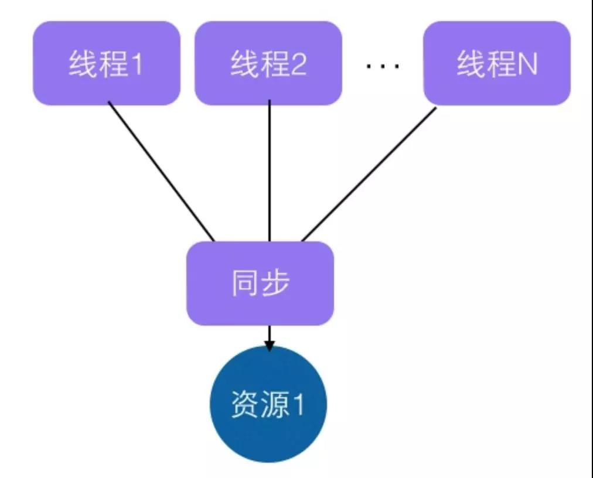
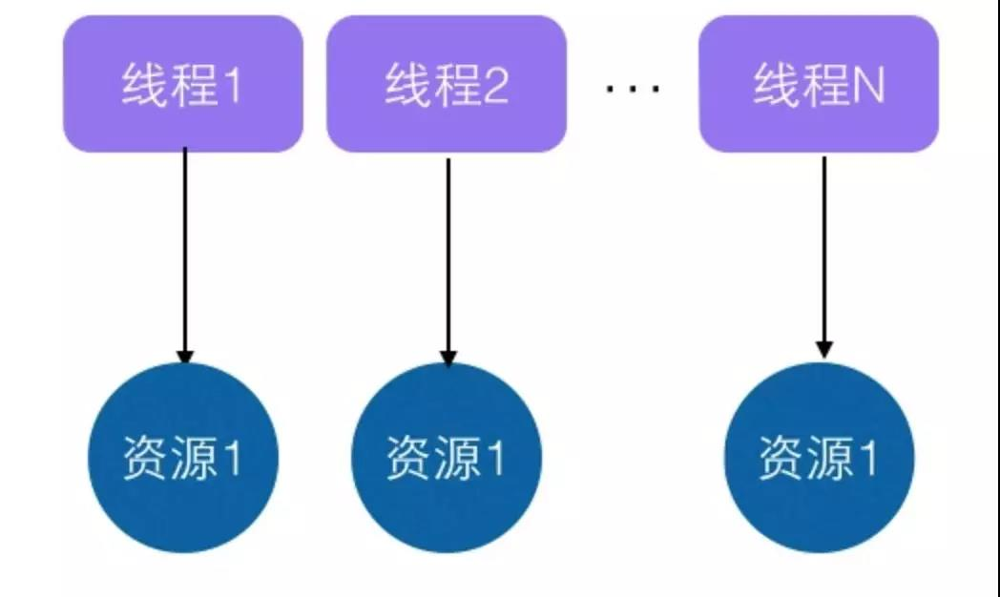
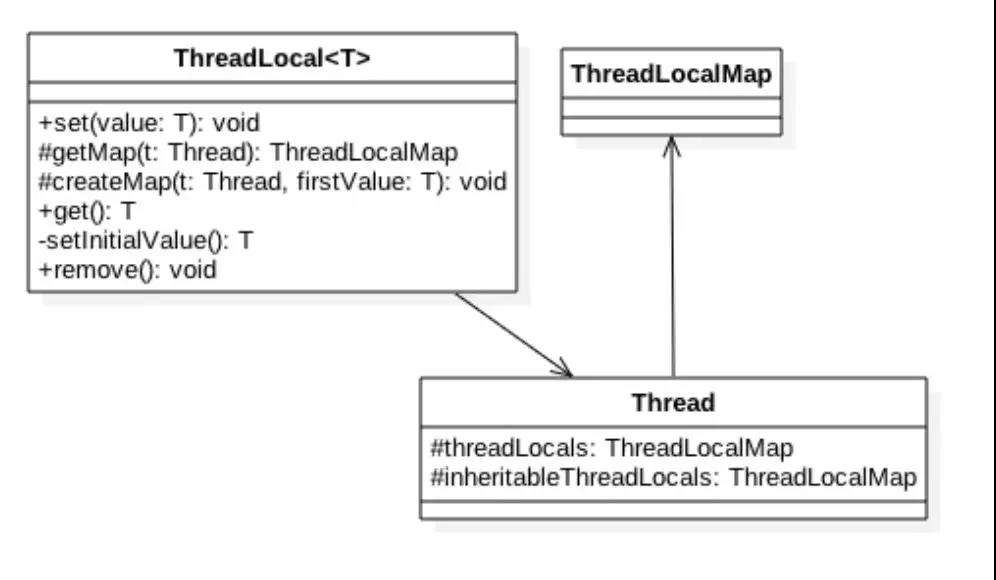
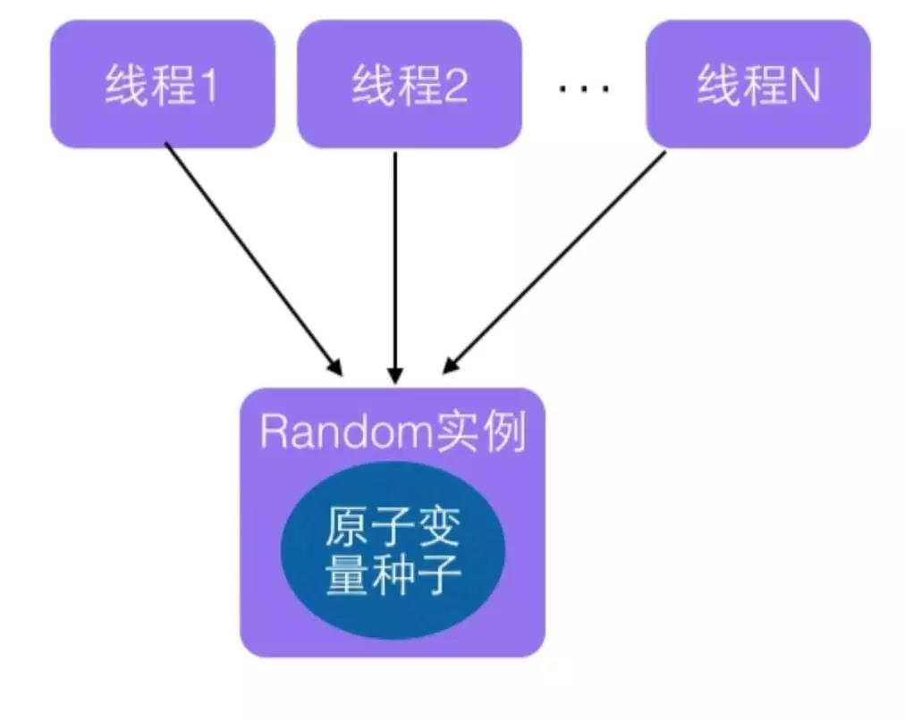
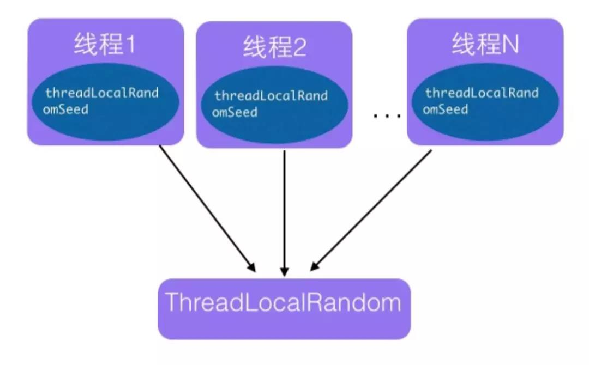
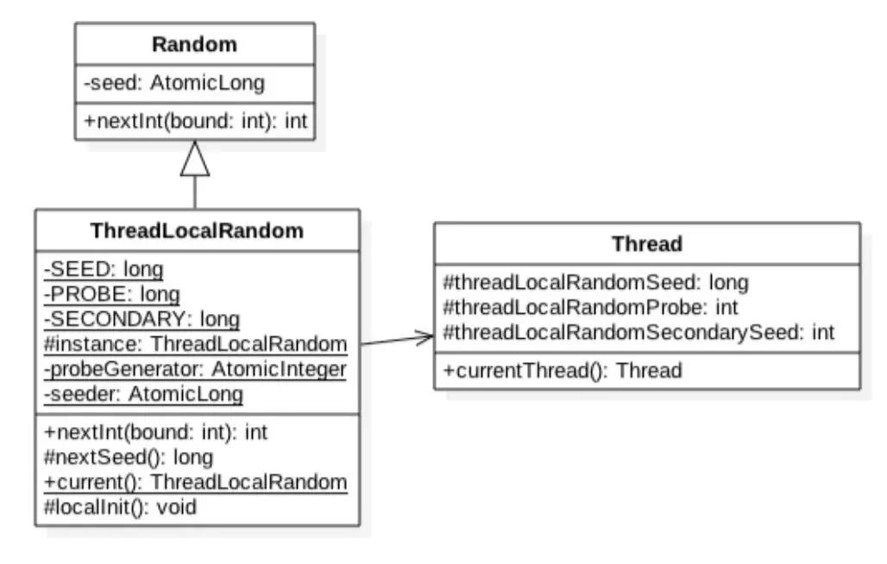

并发类详解
==============

ThreadLocal
--------------------

ThreadLocal 的实现原理，ThreadLocal 作为变量的线程隔离方式，其内部是如何做的？

InheritableThreadLocal 的实现原理，InheritableThreadLocal 是如何弥补 ThreadLocal 不支持继承的特性？

**ThreadLocal 的实现原理**

多线程访问同一个共享变量特别容易出现并发问题，特别是多个线程需要对一个共享变量进行写入时候，为了保证线程安全，一般需要使用者在访问共享变量的时候进行适当的同步，如下图：

同步的措施一般是加锁，这就需要使用者对锁也要有一定了解，这显然加重了使用者的负担。

那么有没有一个方式当创建一个变量时候，每个线程对其进行访问的时候访问的是自己线程的变量呢？其实 ThreadLocal 就可以做这个事情，虽然 ThreadLocal 的出现并不是为了解决上面的问题而出现的。

ThreadLocal 是在 JDK 包里面提供的，它提供了线程本地变量，也就是如果你创建了一个 ThreadLocal 变量，那么访问这个变量的每个线程都会有这个变量的一个本地拷贝，多个线程操作这个变量的时候，实际是操作的自己本地内存里面的变量，从而避免了线程安全问题，创建一个 ThreadLocal 变量后每个线程会拷贝一个变量到自己本地内存，如下图：

**ThreadLocal 简单使用**

本节来看下 ThreadLocal 如何使用，从而加深理解，本例子开启了两个线程，每个线程内部设置了本地变量的值，然后调用 print 函数打印当前本地变量的值，如果打印后调用了本地变量的 remove 方法则会删除本地内存中的该变量，代码如下：

.. code:: java

    /**
     * @Author wenchaofu
     * @DATE 16:07 2018/6/22
     * @DESC
     */
    public class ThreadLocalTest {
        private static void print(String string) {
            System.out.println(string + "  -- " + localValue.get());
            // localValue.remove();
        }
        private static final ThreadLocal<String> localValue = new ThreadLocal<>();
        public static void main(String[] args) throws InterruptedException {
            // 声明两个线程
            Thread threadOne = new Thread(new Runnable() {
                @Override
                public void run() {
                    localValue.set("Thread One");
                    print("threadone");
                    System.out.println(localValue.get());

                }
            });
            Thread threadTwo = new Thread(new Runnable() {
                @Override
                public void run() {
                    localValue.set("Thread Two");
                    print("threadtwo");
                    System.out.println(localValue.get());

                }
            });
            threadOne.start();
            threadTwo.start();
            threadOne.join();
            threadTwo.join();
            System.out.println("game over");
        }
    }

结果：

::

    threadone  -- Thread One
    Thread One
    threadtwo  -- Thread Two
    Thread Two
    game over

线程 one 中代码 3.1 通过 set 方法设置了 localVariable 的值，这个设置的其实是线程 one 本地内存中的一个拷贝，这个拷贝线程 two 是访问不了的。然后代码 3.2 调用了 print 函数，代码 1.1 通过 get 函数获取了当前线程（线程 one）本地内存中 localVariable 的值；

线程 two 执行类似线程 one。

解开代码 // localValue.remove(); 的注释后，再次运行，运行结果为：

::

    threadone  -- Thread One
    threadtwo  -- Thread Two
    null
    null
    game over

**ThreadLocal 实现原理**

首先看下 ThreadLocal 相关的类的类图结构。

如上类图可知 Thread 类中有一个 threadLocals 和 inheritableThreadLocals 都是 ThreadLocalMap 类型的变量，而 ThreadLocalMap 是一个定制化的 Hashmap，默认每个线程中这个两个变量都为 null，只有当前线程第一次调用了 ThreadLocal 的 set 或者 get 方法时候才会进行创建。

其实每个线程的本地变量不是存放到 ThreadLocal 实例里面的，而是存放到调用线程的 threadLocals 变量里面。也就是说 ThreadLocal 类型的本地变量是存放到具体的线程内存空间的。

ThreadLocal 就是一个工具壳，它通过 set 方法把 value 值放入调用线程的 threadLocals 里面存放起来，当调用线程调用它的 get 方法时候再从当前线程的 threadLocals变 量里面拿出来使用。

如果调用线程一直不终止，那么这个本地变量会一直存放到调用线程的 threadLocals 变量里面，所以当不需要使用本地变量时候可以通过调用 ThreadLocal 变量的 remove 方法，从当前线程的 threadLocals 里面删除该本地变量。

另外 Thread 里面的 threadLocals 为何设计为 map 结构呢？很明显是因为每个线程里面可以关联多个 ThreadLocal 变量。

下面简单分析下 ThreadLocal 的 set，get，remove 方法的实现逻辑：

**void set(T value)**

.. code:: java

    public void set(T value) {
        // 获取当前线程
        Thread t = Thread.currentThread();
        // 当前线程作为key，去查找对应的线程变量，找到则设置
        ThreadLocalMap map = getMap(t);
        if (map != null)
            map.set(this, value);
        else
            // 第一次调用则创建当前线程对应的HashMap
            createMap(t, value);
    }

可知 getMap(t) 所做的就是获取线程自己的变量 threadLocals，threadlocal 变量是绑定到了线程的成员变量里面。

如果 getMap(t) 返回不为空，则把 value 值设置进入到 threadLocals，也就是把当前变量值放入了当前线程的内存变量 threadLocals，threadLocals 是个 HashMap 结构，其中 key 就是当前 ThreadLocal 的实例对象引用，value 是通过 set 方法传递的值。

如果 getMap(t) 返回空那说明是第一次调用 set 方法，则创建当前线程的 threadLocals 变量，下面看 createMap(t, value) 里面做了啥呢？

.. code:: java

    void createMap(Thread t, T firstValue) {
        t.threadLocals = new ThreadLocalMap(this, firstValue);
    }

可知就是创建当前线程的 threadLocals 变量。

**T get()**

.. code:: java

    /**
     * Returns the value in the current thread's copy of this
     * thread-local variable.  If the variable has no value for the
     * current thread, it is first initialized to the value returned
     * by an invocation of the {@link #initialValue} method.
     *
     * @return the current thread's value of this thread-local
     */
    public T get() {

        // 获取当前线程
        Thread t = Thread.currentThread();
        // 获取当前线程的 ThreadLocalMap
        ThreadLocalMap map = getMap(t);
        // 如果map不为空，则返回对应本地变量值
        if (map != null) {
            ThreadLocalMap.Entry e = map.getEntry(this);
            if (e != null) {
                @SuppressWarnings("unchecked")
                T result = (T)e.value;
                return result;
            }
        }
        // threadLocals为空则初始化当前线程的threadLocals成员变量
        return setInitialValue();
    }

注：每个线程内部都有一个名字为 threadLocals 的成员变量，该变量类型为 HashMap，其中 key 为我们定义的 ThreadLocal 变量的 this 引用，value 则为我们 set 时候的值，每个线程的本地变量是存到线程自己的内存变量 threadLocals 里面的，如果当前线程一直不消失那么这些本地变量会一直存到，所以可能会造成内存泄露，所以使用完毕后要记得调用 ThreadLocal 的 remove 方法删除对应线程的 threadLocals 中的本地变量。

**子线程中获取不到父线程中设置的 ThreadLocal 变量的值**

.. code:: java

    package me.wenchao.javapro.concurrency.threadlocal;

    /**
     * @Author wenchaofu
     * @DATE 14:52 2018/6/26
     * @DESC
     */

    public class ThreadLocalTest2 {

        //(1) 创建线程变量
        public static ThreadLocal<String> threadLocal = new ThreadLocal<String>();

        public static void main(String[] args) {

            //(2)  设置线程变量
            threadLocal.set("hello world");
            //(3) 启动子线程
            Thread thread = new Thread(new Runnable() {
                public void run() {
                    //(4)子线程输出线程变量的值
                    System.out.println("thread:" + threadLocal.get());
                }
            });
            thread.start();
            //(5)主线程输出线程变量值
            System.out.println("main:" + threadLocal.get());

        }
    }

结果为：

    main:hello world
    thread:null

也就是说同一个 ThreadLocal 变量在父线程中设置值后，在子线程中是获取不到的。

根据上节的介绍，这个应该是正常现象，因为子线程调用 get 方法时候当前线程为子线程，而调用 set 方法设置线程变量是 main 线程，两者是不同的线程，自然子线程访问时候返回 null，那么有办法让子线程访问到父线程中的值吗？

答案是有。

InheritableThreadLocal 原理
-----------------------------------------

为了解决上节的问题 InheritableThreadLocal 应运而生，InheritableThreadLocal 继承自 ThreadLocal，提供了一个特性，就是子线程可以访问到父线程中设置的本地变量。

下面看下 InheritableThreadLocal 的代码：

.. code:: java

    public class InheritableThreadLocal<T> extends ThreadLocal<T> {    

        // (1)
        protected T childValue(T parentValue) {
            return parentValue;
        }    

        // (2)

        ThreadLocalMap getMap(Thread t) {
            return t.inheritableThreadLocals;
        }    

        // (3)

        void createMap(Thread t, T firstValue) {
            t.inheritableThreadLocals = new ThreadLocalMap(this, firstValue);
        }
    }

如上代码可知 InheritableThreadLocal 继承了 ThreadLocal，并重写了三个方法。

::

    代码（3）可知 InheritableThreadLocal 重写了 createMap 方法，那么可知现在当第一次调用 set 方法时候创建的是当前线程的 inheritableThreadLocals 变量的实例而不再是 threadLocals。

    代码（2）可知当调用 get 方法获取当前线程的内部 map 变量时候，获取的是 inheritableThreadLocals 而不再是 threadLocals。

    综上可知在 InheritableThreadLocal 的世界里，线程中的变量 inheritableThreadLocals 替代了 threadLocals。

下面我们看下重写的代码（1）是何时被执行，以及如何实现的子线程可以访问父线程本地变量的。

这个要从 Thread 创建的代码看起，Thread 的默认构造函数及 Thread.java 类的构造函数如下：

.. code:: java

    public Thread(Runnable target) {
        init(null, target, "Thread-" + nextThreadNum(), 0);
    }

**init**

.. code:: java

   /**
     * Initializes a Thread.
     *
     * @param g the Thread group
     * @param target the object whose run() method gets called
     * @param name the name of the new Thread
     * @param stackSize the desired stack size for the new thread, or
     *        zero to indicate that this parameter is to be ignored.
     * @param acc the AccessControlContext to inherit, or
     *            AccessController.getContext() if null
     * @param inheritThreadLocals if {@code true}, inherit initial values for
     *            inheritable thread-locals from the constructing thread
     */
    private void init(ThreadGroup g, Runnable target, String name,
                      long stackSize, AccessControlContext acc,
                      boolean inheritThreadLocals) {
        if (name == null) {
            throw new NullPointerException("name cannot be null");
        }

        this.name = name;

        Thread parent = currentThread();
        SecurityManager security = System.getSecurityManager();
        if (g == null) {
            /* Determine if it's an applet or not */

            /* If there is a security manager, ask the security manager
               what to do. */
            if (security != null) {
                g = security.getThreadGroup();
            }

            /* If the security doesn't have a strong opinion of the matter
               use the parent thread group. */
            if (g == null) {
                g = parent.getThreadGroup();
            }
        }
       /* checkAccess regardless of whether or not threadgroup is
           explicitly passed in. */
        g.checkAccess();

        /*
         * Do we have the required permissions?
         */
        if (security != null) {
            if (isCCLOverridden(getClass())) {
                security.checkPermission(SUBCLASS_IMPLEMENTATION_PERMISSION);
            }
        }

        g.addUnstarted();

        this.group = g;
        this.daemon = parent.isDaemon();
        this.priority = parent.getPriority();
        if (security == null || isCCLOverridden(parent.getClass()))
            this.contextClassLoader = parent.getContextClassLoader();
        else
            this.contextClassLoader = parent.contextClassLoader;
        this.inheritedAccessControlContext =
                acc != null ? acc : AccessController.getContext();
        this.target = target;
        setPriority(priority);
        // 设置子线程中的 inheritThreadLocals变量
        if (inheritThreadLocals && parent.inheritableThreadLocals != null)
            this.inheritableThreadLocals =
                ThreadLocal.createInheritedMap(parent.inheritableThreadLocals);
        /* Stash the specified stack size in case the VM cares */
        this.stackSize = stackSize;

        /* Set thread ID */
        tid = nextThreadID();
    }

创建线程时候在构造函数里面会调用 init 方法，前面讲到了 inheritableThreadLocal 类 get，set 方法操作的是变量 inheritableThreadLocals，所以这里 inheritableThreadLocal 变量就不为 null，所以会执行代码（6），下面看下 createInheritedMap 代码：

.. code:: java

    static ThreadLocalMap createInheritedMap(ThreadLocalMap parentMap) {        
        return new ThreadLocalMap(parentMap);
    }

可知 createInheritedMap 内部使用父线程的 inheritableThreadLocals 变量作为构造函数创建了一个新的 ThreadLocalMap 变量。

然后赋值给了子线程的 inheritableThreadLocals 变量，那么下面看看 ThreadLocalMap 的构造函数里面做了什么：

.....

JDK 并发包中 ThreadLocalRandom 类原理剖析
-------------------------------------------

ThreadLocalRandom 类是 JDK7 在 JUC 包下新增的随机数生成器，它解决了 Random 类在多线程下的不足。本节就来讲解下 JUC 下为何新增该类，以及该类的实现原理。

**Random 类及其局限性**

在 JDK7 之前包括现在，java.util.Random 应该是使用比较广泛的随机数生成工具类，另外 java.lang.Math 中的随机数生成也是使用的 java.util.Random 的实例。下面先看看 java.util.Random 的使用：

.. code:: java

    /**
     * @Author wenchaofu
     * @DATE 16:33 2018/6/22
     * @DESC
     */
    public class RandomTest {
        private static Random random = new Random();

        public static void main(String[] args) {
            int i = random.nextInt(10);
            System.out.println(i);
        }
    }

这里提下随机数的生成需要一个默认的种子，这个种子其实是一个 long 类型的数字，这个种子要么在 Random 的时候通过构造函数指定，那么默认构造函数内部会生成一个默认的值，有了默认的种子后，如何生成随机数呢？

.. code:: java

    public int nextInt(int bound) {
        if (bound <= 0)
            throw new IllegalArgumentException(BadBound);

        // 根据老的种子生成新的种子
        int r = next(31);

        // 根据新的种子计算随机数
        int m = bound - 1;
        if ((bound & m) == 0)  // i.e., bound is a power of 2
            r = (int)((bound * (long)r) >> 31);
        else {
            for (int u = r;
                 u - (r = u % bound) + m < 0;
                 u = next(31))
                ;
        }
        return r;
    }

如上代码可知新的随机数的生成需要两个步骤：

::

    首先需要根据老的种子生成新的种子。

    然后根据新的种子来计算新的随机数。

其中步骤（4）我们可以抽象为 seed=f(seed)，其中 f 是一个固定的函数，比如 seed= f(seed)=a*seed+b;，步骤（5）也可以抽象为 g(seed,bound)，其中 g 是一个固定的函数，比如 g(seed,bound)=(int)((bound * (long)seed) >> 31);。

在单线程情况下每次调用 nextInt 都是根据老的种子计算出来新的种子，这是可以保证随机数产生的随机性的。

但是在多线程下多个线程可能都拿同一个老的种子去执行步骤（4）计算新的种子，这会导致多个线程产生的新种子是一样的，由于步骤（5）算法是固定的，所以会导致多个线程产生相同的随机值，这并不是我们想要的。

所以需要保证步骤（4）的原子性，也就是说多个线程在根据同一个老种子计算新种子时候，第一个线程的新种子计算出来后，第二个线程要丢弃自己老的种子，要使用第一个线程的新种子来计算自己的新种子，依次类推，只有保证了这个，才能保证多线程下产生的随机数是随机的。

Random 函数使用一个原子变量达到了这个效果，在创建 Random 对象时候初始化的种子就保存到了种子原子变量里面，下面看下 next() 代码：

.. code:: java

    protected int next(int bits) {
        long oldseed, nextseed;
        AtomicLong seed = this.seed;
        do {

            // 6
            oldseed = seed.get();
            // 7
            nextseed = (oldseed * multiplier + addend) & mask;
            // 8
        } while (!seed.compareAndSet(oldseed, nextseed));
        // 9 
        return (int)(nextseed >>> (48 - bits));
    }

代码（6）获取当前原子变量种子的值；

代码（7）根据当前种子值计算新的种子；

代码（8）使用 CAS 操作，使用新的种子去更新老的种子，多线程下可能多个线程都同时执行到了代码（6），那么可能多个线程都拿到的当前种子的值是同一个，然后执行步骤（7）计算的新种子也都是一样的，但是步骤（8）的 CAS 操作会保证只有一个线程可以更新老的种子为新的，失败的线程会通过循环重新获取更新后的种子作为当前种子去计算老的种子，可见这里解决了上面提到的问题，也就保证了随机数的随机性。

代码（9）则使用固定算法根据新的种子计算随机数。

总结：每个 Random 实例里面有一个原子性的种子变量用来记录当前的种子的值，当要生成新的随机数时候要根据当前种子计算新的种子并更新回原子变量。

多线程下使用单个 Random 实例生成随机数时候，多个线程同时计算新的种子时候会竞争同一个原子变量的更新操作，由于原子变量的更新是 CAS 操作，同时只有一个线程会成功，所以会造成大量线程进行自旋重试，这是会降低并发性能的，所以 ThreadLocalRandom 应运而生。

**ThreadLocalRandom 类**

为了解决多线程高并发下 Random 的缺陷，JUC 包下新增了 ThreadLocalRandom 类，下面首先看下它如何使用：

.. code:: java

    /**
     * @Author wenchaofu
     * @DATE 16:33 2018/6/22
     * @DESC
     */
    public class ThreadLocalRandomTest {

        // 创建一个默认种子的随机数生成器
        private static ThreadLocalRandom random = ThreadLocalRandom.current();

        public static void main(String[] args) {
            int i = random.nextInt(10);
            System.out.println(i);
        }
    }

下面来分析下 ThreadLocalRandom 的实现原理。从名字看会让我们联想到《Java 并发编程之美：基础篇》 中讲解的 ThreadLocal，ThreadLocal 的出现就是为了解决多线程下变量的隔离问题，让每一个线程拷贝一份变量，每个线程对变量进行操作时候实际是操作自己本地内存里面的拷贝。

实际上 ThreadLocalRandom 的实现也是这个原理，Random 的缺点是多个线程会使用原子性种子变量，会导致对原子变量更新的竞争，如下图：

那么如果每个线程维护自己的一个种子变量，每个线程生成随机数时候根据自己老的种子计算新的种子，并使用新种子更新老的种子，然后根据新种子计算随机数，就不会存在竞争问题，这会大大提高并发性能，如下图 ThreadLocalRandom 原理：

源码分析

首先看下 ThreadLocalRandom 的类图结构：

可知 ThreadLocalRandom 继承了 Random 并重写了 nextInt 方法，ThreadLocalRandom 中并没有使用继承自 Random 的原子性种子变量。

ThreadLocalRandom 中并没有具体存放种子，具体的种子是存放到具体的调用线程的 threadLocalRandomSeed 变量里面的，ThreadLocalRandom 类似于 ThreadLocal类 就是个工具类。

当线程调用 ThreadLocalRandom 的 current 方法时候 ThreadLocalRandom 负责初始化调用线程的 threadLocalRandomSeed 变量，也就是初始化种子。

当调用 ThreadLocalRandom 的 nextInt 方法时候，实际上是获取当前线程的 threadLocalRandomSeed 变量作为当前种子来计算新的种子，然后更新新的种子到当前线程的 threadLocalRandomSeed 变量，然后在根据新种子和具体算法计算随机数。

这里需要注意的是 threadLocalRandomSeed 变量就是 Thread 类里面的一个普通 long 变量，并不是原子性变量，其实道理很简单，因为这个变量是线程级别的，根本不需要使用原子性变量，如果还是不理解可以思考下 ThreadLocal 的原理。

其中变量 seeder 和 probeGenerator 是两个原子性变量，在初始化调用线程的种子和探针变量时候用到，每个线程只会使用一次。

另外变量 instance 是个 ThreadLocalRandom 的一个实例，该变量是 static 的，当多线程通过 ThreadLocalRandom 的 current 方法获取 ThreadLocalRandom 的实例时候其实获取的是同一个，但是由于具体的种子是存放到线程里面的，所以 ThreadLocalRandom 的实例里面只是与线程无关的通用算法，所以是线程安全的。

下面看看 ThreadLocalRandom 的主要代码实现逻辑。

.. code:: java

    // Unsafe mechanics
    private static final sun.misc.Unsafe UNSAFE;
    private static final long SEED;
    private static final long PROBE;
    private static final long SECONDARY;
    static {
        try {
            // 获取unsafe实例，自己的代码需使用反射调用，否则会抛出安全异常
            UNSAFE = sun.misc.Unsafe.getUnsafe();
            Class<?> tk = Thread.class;
            //获取Thread类里面threadLocalRandomSeed变量在Thread实例里面偏移量
            SEED = UNSAFE.objectFieldOffset
                (tk.getDeclaredField("threadLocalRandomSeed"));

            //获取Thread类里面threadLocalRandomProbe变量在Thread实例里面偏移量
            PROBE = UNSAFE.objectFieldOffset
                (tk.getDeclaredField("threadLocalRandomProbe"));

            //获取Thread类里面threadLocalRandomProbe变量在Thread实例里面偏移量，这个值在后面讲解的LongAdder里面会用到
            SECONDARY = UNSAFE.objectFieldOffset
                (tk.getDeclaredField("threadLocalRandomSecondarySeed"));
        } catch (Exception e) {
            throw new Error(e);
        }
    }

ThreadLocalRandom current() 方法：该方法获取 ThreadLocalRandom 实例，并初始化调用线程中 threadLocalRandomSeed 和 threadLocalRandomProbe 变量。

.. code:: java

    /** The common ThreadLocalRandom */
    static final ThreadLocalRandom instance = new ThreadLocalRandom();

    ...

    public static ThreadLocalRandom current() {
        if (UNSAFE.getInt(Thread.currentThread(), PROBE) == 0)
            localInit();
        return instance;
    }

   /**
     * Initialize Thread fields for the current thread.  Called only
     * when Thread.threadLocalRandomProbe is zero, indicating that a
     * thread local seed value needs to be generated. Note that even
     * though the initialization is purely thread-local, we need to
     * rely on (static) atomic generators to initialize the values.
     */
    static final void localInit() {
        int p = probeGenerator.addAndGet(PROBE_INCREMENT);
        int probe = (p == 0) ? 1 : p; // skip 0
        long seed = mix64(seeder.getAndAdd(SEEDER_INCREMENT));
        Thread t = Thread.currentThread();
        UNSAFE.putLong(t, SEED, seed);
        UNSAFE.putInt(t, PROBE, probe);
    }