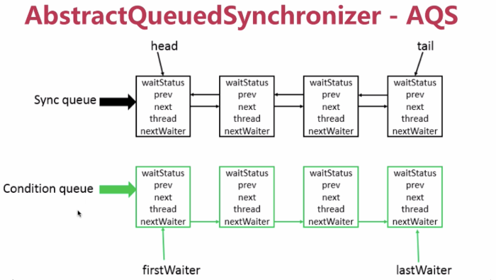
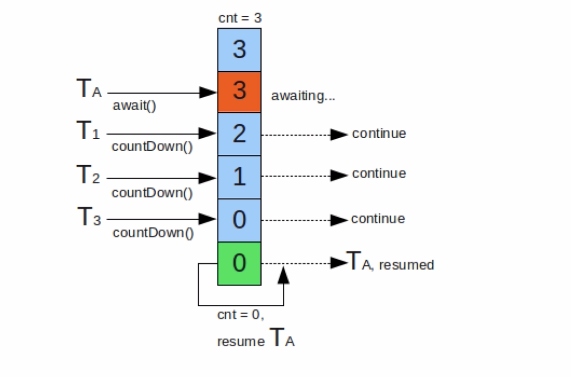

AQS介绍
===========

AbstractQueuedSynchronizer  -- AQS

提供了 FIFO 队列

AQS类底层的数据结构

双向链表

- 使用Node实现了FIFO队列，可以用于构建锁或者其他同步装置的基础框架
- 利用率了一个int类型表示状态
- 使用方法是继承 子类通过继承并实现他的方法管理其状态（acquire 和 release）的方法操纵状态
- 可以同时实现排他锁和共享锁模式（独占，共享）

- CountDownLatch
- semaphore
- CyclicBarrier
- ReentrantLock
- Condition
- FutureTask

CountDownLatch
------------------------

同步阻塞类，可以完成阻塞线程的功能

一个线程或者多个线程持续等待，直到其他线程执行的操作完成

原子操作

使用场景：在某些业务场景中，程序执行需要等待某个条件完成后才能继续执行后续的操作
。比如说并行计算

Semaphore
--------------

控制并发访问的线程个数

如果没有获取到许可的话，其余线程丢弃

.. code:: java

        if (semaphore.tryAcquire()) { // 尝试获取一个许可可以传入数字代表一次性获取多个许可。
                                      //如果传入两个参数，获取许可的等待时间
                                      // 三个参数
                        test(threadNum);
                        semaphore.release(); // 释放一个许可
                    }

CyclicBarrier
----------------

同步辅助类，一组现场相互等待，直到到达某个公共的屏障点。多个线程相互等待，只有当每个线程都准备就绪后，才能各自往下执行后续的操作。

.. image:: ./images/cyclicbarrier.png 

countdownlatch 的计数器只能使用一次。 一个或者多个线程需要等待其他线程完成某项操作之后才能继续往下执行。

cyclicbarrier 的计数器可以重用多次 reset重置计数器。 多个线程相互等待，直到所有线程都满足了条件之后才能继续执行后续操作，描述的是各个线程内部相互等待的关系。能够处理更复杂的场景，比如说计算发生错误了，可以重置计数器，重新执行一次。getNumberWaiting方法

ReentrantLock 锁
----------------------

java 两种锁 

1. synchronized 提供的锁
2. JUC里面提供的核心的锁，也就是这个 ReentrantLock 

- 可重入锁 都是
- 所得实现 synchronized JVM提供，不好查看源码 ，ReentrantLock jdk实现的
- 性能 synchronized 优化以前，性能极差。优化后性能差不多。官方推荐 synchronized ,更容易。
- 功能方面 syn 方面简洁，Reen手工加锁释放锁。

**独有功能**

- ReentrantLock 可以指定是公平锁（先等待的线程先获得锁）还是非公平锁。sync只有非公平锁。
- ReentrantLock 提供了一个condition类，可以分组唤醒需要唤醒的线程，sync要么一个，要么全部线程（唤醒）
- ReentrantLock 提供了中断等待锁的线程的机制 lock.lockInterruptibly()

sync能做的ReentrantLock都能做，反之否，看独有功能。

另一个区别，看代码

me.wenchao.javapro.concurrency.sync.diff.MainApp

解释：

::

    Lock(显示锁) 对象级别的锁，更简单的说吧Lock定义为多线程类的私有属性是不起作用的，Lock应该定义为所有线程的共享变量。

    Sync(内部锁) 类级别的锁

    **重要** 注意，代码块是类级别的(this 是对象级别，常量是类级别)，方法是对象级别的

比如：

.. code:: java

        // 对象级别
        synchronized (this){
            doStuff();
        }

        // 对象级别
        public synchronized void doStuff() {
            super.doStuff();
        }

        // 类级别
        synchronized ("A"){
            doStuff();
        }

Lock支持更细粒度的锁控制（读锁和写锁分离）；是无阻塞锁；公平锁；代码级别

sync 阻塞锁（获取不到锁的时候线程处于等待状态（Lock），而Sync处于阻塞状态）；非公平锁；JVM级别

ReentrantReadWriteLock 有任何读操作时都不能获取写锁，悲观读

StampedLock 控制锁有三种模式

- 写
- 读
- 乐观读 

一个stampedlock的状态有 版本 和 模式 两部分组成

锁获取的方法返回的数字作为票据(stamp)

由相关的锁状态表示并控制相关的访问

乐观读：

