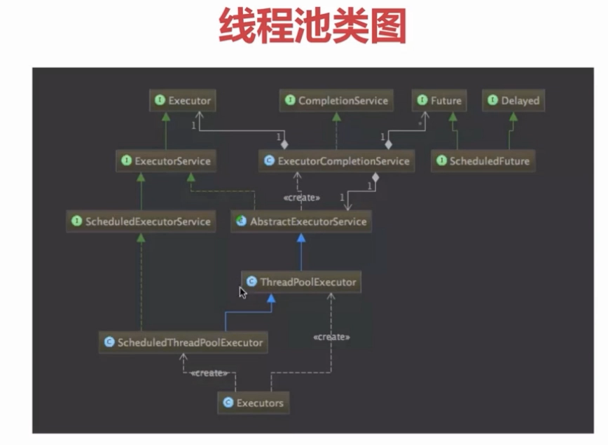

线程池
==========

为什么需要线程池
-----------------

一方面当执行大量异步任务时候线程池能够提供较好的性能，，这是因为使用线程池可以使每个任务的调用开销减少（因为线程池线程是可以复用的）。

另一方面线程池提供了一种资源限制和管理的手段，比如当执行一系列任务时候对线程的管理，每个ThreadPoolExecutor也保留了一些基本的统计数据，比如当前线程池完成的任务数目。

另外，线程池提供许多可调参数和可扩展性钩子。程序员可以使用更方便

类图
----

**Java通过Executors提供四种线程池**

- newCachedThreadPool 创建一个可缓存线程池，如果线程池长度超过处理需要，可灵活回收空闲线程，若无可回收，则新建线程。

- newFixedThreadPool 创建一个定长线程池，可控制线程最大并发数，超出的线程会在队列中等待。

- newSingleThreadExecutor 创建一个单线程化的线程池，它只会用唯一的工作线程来执行任务，保证所有任务按照指定顺序(FIFO, LIFO, 优先级)执行。

- newScheduledThreadPool 创建一个定长线程池，支持定时及周期性任务执行。

线程池状态
--------------

- RUNNING：接受新任务并且处理阻塞队列里的任务
- SHUTDOWN：拒绝新任务但是处理阻塞队列里的任务
- STOP：拒绝新任务并且抛弃阻塞队列里的任务同时会中断正在处理的任务
- TIDYING：所有任务都执行完（包含阻塞队列里面任务）当前线程池活动线程为0，将要调用terminated方法
- TERMINATED：终止状态。terminated方法调用完成以后的状态

- RUNNING -> SHUTDOWN

显式调用shutdown()方法，或者隐式调用了finalize(),它里面调用了shutdown（）方法。

- RUNNING or SHUTDOWN)-> STOP

显式 shutdownNow()方法

- SHUTDOWN -> TIDYING

当线程池和任务队列都为空的时候

- STOP -> TIDYING

当线程池为空的时候

- TIDYING -> TERMINATED

当 terminated() hook 方法执行完成时候

线程池参数
------------------------- 

corePoolSize 核心线程数量
 
maximumPoolSize 线程最大线程数

workQueue 阻塞队列，存储等待执行的任务，很重要，会对线程池运行过程产生重大影响

比如基于数组的有界ArrayBlockingQueue、，基于链表的无界LinkedBlockingQueue，最多只有一个元素的同步队列SynchronousQueue，优先级队列PriorityBlockingQueue，具体可参考 https://www.atatech.org/articles/81568

keepAliveTime 线程没有任务执行时最多保持多久时间终止

ThreadFactory 线程工厂，用来创建线程

rejectHandler 当拒绝处理任务时的策略

    RejectedExecutionHandler：饱和策略，当队列满了并且线程个数达到maximunPoolSize后采取的策略，比如AbortPolicy(抛出异常)，CallerRunsPolicy(使用调用者所在线程来运行任务)，DiscardOldestPolicy(调用poll丢弃一个任务，执行当前任务)，DiscardPolicy(默默丢弃,不抛出异常)

TimeUnit 存活时间的时间单位

**方法**

execute() 提交任务交给线程池运行

submit() 提交任务，能够返回执行结果 execute + future

shutdown() 关闭线程池，等待任务执行完成

shutdownNow() 关闭线程池，不等待线程执行完成

getTaskCount() 线程池已经执行和未执行的线程总数

getCompletedTaskCount() 已完成的任务数量

getPoolSize() 线程池当前的线程数量

getActiveCount() 当前线程池中正在执行任务的线程数量

