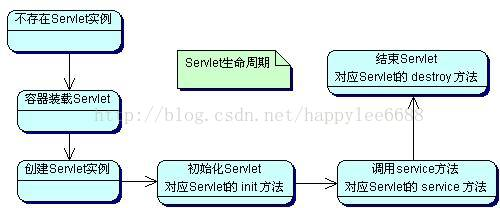

serlet
=========

servlet运行原理及其生命周期
--------------------------------

**架构**

.. image:: ./images/servlet-arch.jpg

Servlet 有以下几点优势：

- 性能明显更好。
- Servlet 在 Web 服务器的地址空间内执行。这样它就没有必要再创建一个单独的进程来处理每个客户端请求。
- Servlet 是独立于平台的，因为它们是用 Java 编写的。
- 服务器上的 Java 安全管理器执行了一系列限制，以保护服务器计算机上的资源。因此，Servlet 是可信的。
- Java 类库的全部功能对 Servlet 来说都是可用的。它可以通过 sockets 和 RMI 机制与 applets、数据库或其他软件进行交互。

**包**

Java Servlet 是运行在带有支持 Java Servlet 规范的解释器的 web 服务器上的 Java 类。

Servlet 可以使用 javax.servlet 和 javax.servlet.http 包创建，它是 Java 企业版的标准组成部分，Java 企业版是支持大型开发项目的 Java 类库的扩展版本。

这些类实现 Java Servlet 和 JSP 规范。在写本教程的时候，二者相应的版本分别是 Java Servlet 2.5 和 JSP 2.1。

Java Servlet 就像任何其他的 Java 类一样已经被创建和编译。在您安装 Servlet 包并把它们添加到您的计算机上的 Classpath 类路径中之后，您就可以通过 JDK 的 Java 编译器或任何其他编译器来编译 Servlet。

**简单案例**

https://blog.csdn.net/u013468915/article/details/51992745

**运行原理**

.. image:: ./images/life.jpg

Servlet生命周期定义了一个Servlet如何被加载、初始化，
以及它怎样接收请求、响应请求，提供服务。在讨论Servlet生命周期之前，先让我们来看一下这几个方法：

1. init()方法

::

      在Servlet的生命周期中，仅执行一次init()方法，
      它是在服务器装入Servlet时执行的，可以配置服务器，
      以在启动服务器或客户机首次访问Servlet时装入Servlet。
      无论有多少客户机访问Servlet，都不会重复执行init()；

2. service()方法

::

      它是Servlet的核心，每当一个客户请求一个HttpServlet对象，
      该对象的Service()方法就要调用，而且传递给这个方法一个“请求”（ServletRequest）对象
      和一个“响应”（ServletResponse）对象作为参数。
      在HttpServlet中已存在Service()方法。默认的服务功能是调用与HTTP请求的方法相应的do功能。

3. destroy()方法

::

  仅执行一次，在服务器端停止且卸载Servlet时执行该方法，
  有点类似于C++的delete方法。一个Servlet在运行service()方法时可能会产生其他的线程，
  因此需要确认在调用destroy()方法时，这些线程已经终止或完成。

  下面来谈谈Servlet的生命周期，Servlet的生命周期是由Servlet容器来控制的，
  它始于装入Web服务器的内存时，并在终止或重新装入Servlet时结束。这项操作一般是动态执行的。
  然而，Server通常会提供一个管理的选项，用于在Server启动时强制装载和初始化特定的Servlet。

在代码中，Servlet生命周期由接口javax.servlet.Servlet定义。
所有的Java Servlet 必须直接或间接地实现javax.servlet.Servlet接口，
这样才能在Servlet Engine上运行。
javax.servlet.Servlet接口定义了一些方法，在Servlet 的生命周期中，
这些方法会在特定时间按照一定的顺序被调用。

**Servlet生命周期**

加载和实例化Servlet

我们来看一下Tomcat是如何加载的：

::

     1. 如果已配置自动装入选项，则在启动时自动载入。

     2. 在服务器启动时，客户机首次向Servlet发出请求。

     3. 重新装入Servlet时。

当启动Servlet容器时，容器首先查找一个配置文件web.xml，
这个文件中记录了可以提供服务的Servlet。每个Servlet被指定一个Servlet名，
也就是这个Servlet实际对应的Java的完整class文件名。
Servlet容器会为每个自动装入选项的Servlet创建一个实例。

所以，每个Servlet类必须有一个公共的无参数的构造器。

初始化

::

      当Servlet被实例化后，Servlet容器将调用每个Servlet的init方法来实例化每个实例，
      执行完init方法之后，
      Servlet处于“已初始化”状态。
      所以说，一旦Servlet被实例化，那么必将调用init方法。

      通过Servlet在启动后不立即初始化，
      而是收到请求后进行。
      在web.xml文件中用
      <load-on-statup> ...... </load-on-statup> -- 大于0 表示初始化顺序，小于0表示延迟初始化
      对Servlet进行预先初始化。

      初始化失败后，执行init()方法抛出ServletException异常，
      Servlet对象将会被垃圾回收器回收，
      当客户端第一次访问服务器时加载Servlet实现类，
      创建对象并执行初始化方法。

请求处理

::

      Servlet 被初始化以后，就处于能响应请求的就绪状态。

      每个对Servlet 的请求由一个Servlet Request 对象代表。
      Servlet 给客户端的响应由一个Servlet Response对象代表。

      对于到达客户机的请求，服务器创建特定于请求的一个“请求”对象和一个“响应”对象。

      调用service方法，这个方法可以调用其他方法来处理请求。

      Service方法会在服务器被访问时调用，
      Servlet对象的生命周期中service方法可能被多次调用，
      由于web-server启动后，服务器中公开的部分资源将处于网络中，

      当网络中的不同主机（客户端）并发访问服务器中的同一资源，服务器将开设多个线程处理不同的请求，
      多线程同时处理同一对象时，有可能出现数据并发访问的错误。

      另外注意，多线程难免同时处理同一变量时（如：对同一文件进行写操作），
      且有读写操作时，必须考虑是否加上同步，同步添加时，不要添加范围过大，
      有可能使程序变为纯粹的单线程，大大削弱了系统性能；

      只需要做到多个线程安全的访问相同的对象就可以了。

卸载Servlet

::

      当服务器不再需要Servlet实例或重新装入时，会调用destroy方法，
      使用这个方法，Servlet可以释放掉所有在init方法申请的资源。
      一个Servlet实例一旦终止，就不允许再次被调用，只能等待被卸载。

      Servlet一旦终止，Servlet实例即可被垃圾回收，处于“卸载”状态，
      如果Servlet容器被关闭，Servlet也会被卸载，一个Servlet实例只能初始化一次，
      但可以创建多个相同的Servlet实例。

      如相同的Servlet可以在根据不同的配置参数连接不同的数据库时创建多个实例。

load-on-startup解释

::

  1)load-on-startup元素标记容器是否在启动的时候就加载这个servlet(实例化并调用其init()方法)。

  2)它的值必须是一个整数，表示servlet应该被载入的顺序

  2)当值为0或者大于0时，表示容器在应用启动时就加载并初始化这个servlet；

  3)当值小于0或者没有指定时，则表示容器在该servlet被选择时才会去加载。

  4)正数的值越小，该servlet的优先级越高，应用启动时就越先加载。

  5)当值相同时，容器就会自己选择顺序来加载。

  所以，<load-on-startup>x</load-on-startup>，中x的取值1，2，3，4，5代表的是优先级，而非启动延迟时间。

ServletConfig类
-------------------

在对Servlet配置的web.xml文件中，经常会使用一些初始化的参数来配置Servlet，
总的功能来说就是不在Servlet程序中将某个变量写死，而是通过外界(如web.xml文件)进行传递，同时便于修改。
这个是使用<servlet>标签下的<init-param>标签，
使用<init-param>标签的<param-name>和<param-value>来封装一个键值对，可以使用多个<init-param>标签进行多个初始化参数的设定，我们可以看看Tomcat的web.xml中的默认Servlet：

可以看到在这个默认Servlet中有两个初始化参数，分别是“debug=0”和“listings=false”。

当Servlet在web.xml文件中配置了<init-param>标签后，web容器会在创建Servlet实例对象时，
自动将这些初始化参数封装到ServletConfig对象中，并在调用Servlet的初始化init方法时，
将ServletConfig对象传递给Servlet。

我们从Servlet接口的初始化方法：

  init(ServletConfig config)，

可以知道，当服务器创建Servlet对象就将ServletConfig对象传递，
而在ServletConfig对象中包含着<init-param>标签所配置的参数和值。

刚开始学Servlet时，就已经谈到过Servlet接口的非生命周期方法就有一个方法是getServletConfig()方法，
返回ServletConfig对象。所以当我们在开发的Servlet的web.xml文件中配置一些信息：

而在Servlet中的程序获取这个配置的参数：

.. code:: java

  public void doGet(HttpServletRequest request, HttpServletResponse response)
              throws ServletException, IOException {

          ServletConfig config = this.getServletConfig();
          String initValue = config.getInitParameter("love");
          System.out.println(initValue);
      }

ServletConfig类中，getInitParameter(String name)方法是传入特定参数名来获取对应参数的值，
getInitParameterNames()方法则是将所有的参数名装进一个Enumeration对象返回，

当我们有多个参数键值对时：

.. code:: java

  public void doGet(HttpServletRequest request, HttpServletResponse response)
              throws ServletException, IOException {

          ServletConfig config = this.getServletConfig();
          Enumeration initParams = config.getInitParameterNames();
          while(initParams.hasMoreElements()) {
              String paramName = (String)initParams.nextElement();
              String paramValue = config.getInitParameter(paramName);
              System.out.println(paramName+" = "+paramValue );
          }
      }

最后，ServletConfig对象的作用通常用于获得编码表类型，获得数据库连接信息，获得配置文件(如Struts的web.xml文件中)等等。

ServletContext类
--------------------

Web容器在启动时会为每个web应用创建一个ServletContext对象，
而这个ServletContext对象就代表当前这个web应用。
因为一个ServletContext对象代表一个web应用，
所以该web应用中所有的Servlet和其他资源都共享一个ServletContext对象，

这时，我们就可以通过ServletContext对象进行Servlet对象之间的通讯。
而ServletContext对象也称之为Context域对象。 

我们先来看看ServletContext对象的获取的两种方式：

.. code:: java

  public void doGet(HttpServletRequest request, HttpServletResponse response)
              throws ServletException, IOException {

          //两种获取ServletContext对象的方法：
          ServletContext context1 = this.getServletConfig().getServletContext();
          ServletContext context2 = this.getServletContext();
          
          //System.out.println(context1 == context2);   //ture
      }

可以通过先获取ServletConfig对象来获取，或者直接通过父类的方法来获取，这两种方式获取到的是同一对象（相同地址）。

既然说ServletContext代表这个web应用，我们可以用它来进行Servlet直接的通讯，
那么我们就创建一个工程来进行两个Servlet之间的数据传输。

在一个web工程下创建两个Servlet：ServletDemo1和ServletDemo2，

ServletDemo1在ServletContext中设置参数键值对，代码为：

.. code:: java

  public void doGet(HttpServletRequest request, HttpServletResponse response)
              throws ServletException, IOException {

          ServletContext context = this.getServletContext();
          context.setAttribute("lover", "LRR");
      }

ServletDemo2从ServletContext中获取键值对，代码为：

.. code:: java

  public void doGet(HttpServletRequest request, HttpServletResponse response)
              throws ServletException, IOException {

          ServletContext context = this.getServletContext();    
          System.out.println(context.getAttribute("lover"));
      }

在浏览器先访问ServletDemo1后（先执行ServletDemo1才能使ServletContext设置参数），
再访问ServletDemo2后，MyEclipse的控制台就输出了ServletContext中设置的参数，
这就达到了从一个Servlet传递数据给另一个Servlet。

当然这只是ServletContext的一个小小应用。

在ServletContext类中还有

::

  getInitParameter(String name)
  getInitParameterNames()

这两个方法获取的是web应用所配置的参数(毕竟ServletContext代表web应用)，
就像ServletConfig中类似的方法获取的是某个Servlet中的<init-param>标签配置的参数。

而对于配置web应用的参数是在web.xml文件中使用<context-param>标签，
正如在该文件中为Servlet配置参数而使用<init-param>标签一样。
这种配置<context-param>标签的好处在于属于全局性的配置，而每个Servlet的配置参数仅局限于在Servlet的范围内，
举个例子，对于整个web应用配置数据库连接，这样在web应用中的每个Servlet都可以使用，
而无需再在每个Servlet中都单独设置一次，提高了效率。

例：在web工程下建立了名为ServletDemo3的Servlet，
并在该web工程下的web.xml文件中添加<context-param>标签作为该web应用的配置参数：

在ServletDemo3中的代码如下：

.. code:: java

  public void doGet(HttpServletRequest request, HttpServletResponse response)
              throws ServletException, IOException {
          
          ServletContext context = this.getServletContext();
          String username = context.getInitParameter("username");
          String password = context.getInitParameter("password");
          
          System.out.println(username +":"+ password);
  }

ServletContext类中的getMimeType(String  file)方法用于返回该文件的MIME类型：

**ServletContext中的转发方法（重要）**

在ServletContext对象中还有这么两个方法

::

  getNameDispatcher(String name)（不常用）
  getRequestDispatcher(String path)，

返回的是RequestDispatcher对象。转发有什么作用呢，举个例子，
比如一个Servlet中的数据交个另一个Servlet来处理，或者Servlet将某个实时数据交给JSP来显示，
虽然我们在浏览器中访问的是最开始的Servlet，但是进行转发后看到的其他web资源，而浏览器的地址栏不会改变。

注：在请求对象request对象中也有这么一个getRequestDispatcher(String path)方法，功能与ServletContext对象的这个方法一样，也可以实现转发，因此用哪个对象都行，没有区别。

例：在web工程下创建一个名为ServletDemo1的Servlet和一个show.jsp，

在ServletDemo1中将数据转发给show.jsp，代码为：

.. code:: java

  public void doGet(HttpServletRequest request, HttpServletResponse response)
              throws ServletException, IOException {

      String data = "Ding love LRR";
      this.getServletContext().setAttribute("data", data);  //将数据存至web应用的配置中
      ServletContext context = this.getServletContext();        
      RequestDispatcher dispathcer = context.getRequestDispatcher("/show.jsp");  //通过要转发的目的地来获取转发对象
      dispathcer.forward(request, response);      //通过forward方法将请求对象和响应对象转发给别人处理
      }

而在show.jsp中接收这个数据，并封装在HTML中：

::

  
          ${data }
  

接着我们去浏览器里访问ServletDemo1，就会看到： 

虽然我们请求的ServletDemo1资源，但是由于在ServletDemo1中将请求进行了转发，
所以其实服务器返回的是show.jsp的资源，但是我们浏览器地址依然会是ServletDemo1，
这也是转发和重定向的区别之一。

（补充：其实使用ServletContext对象将数据转发至JSP并不合理，可能在多线程中，一个Servlet利用ServletContext在转发给JSP过程中，而另一个线程中的Servlet使用ServletContext将这个转发的数据给覆盖，这样导致原先该转发给JSP的数据并不是我们期待的，所以使用ServletContext的getRequestDispatcher方法不如使用request请求对象的getRequestDispatcher适用于实际开发场景）。

