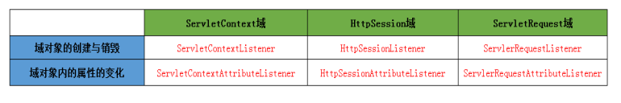
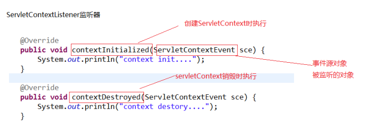

监听器
==================

说明：web.xml的加载顺序是：【Context-Param】->【Listener】->【Filter】->【Servlet】，而同个类型之间的实际程序调用的时候的顺序是根据对应的Mapping的顺序进行调用。

servlet规范包括三个技术点：

  - servlet 
  - listener 
  - filter

监听器就是监听某个对象的的状态变化的组件。监听器的相关概念事件源：

- 被监听的对象（三个域对象 request，session，servletContext）
- 监听器：监听事件源对象， 事件源对象的状态的变化都会触发监听器 。
- 注册监听器：将监听器与事件源进行绑定。
- 响应行为：监听器监听到事件源的状态变化时，所涉及的功能代码（程序员编写代码）

按照被监听的对象划分：

- ServletRequest域 ；
- HttpSession域 ；
- ServletContext域。

按照监听的内容分：

- 监听域对象的创建与销毁的；
- 监听域对象的属性变化的。

监听器的编写步骤：

- 编写一个监听器类去实现监听器接口
- 覆盖监听器的方法
- 需要在web.xml中进行配置（注册）

ServletContextListener监听器
-------------------------------------

在 Servlet API 中有一个 ServletContextListener 接口，
它能够监听 ServletContext 对象的生命周期，
实际上就是监听 Web 应用的生命周期。

当Servlet 容器启动或终止Web 应用时，会触发ServletContextEvent 事件，
该事件由ServletContextListener 来处理。
在 ServletContextListener 接口中定义了处理ServletContextEvent 事件的两个方法。

.. code:: java

  /**
  * 当Servlet 容器启动Web 应用时调用该方法。在调用完该方法之后，容器再对Filter 初始化，
  * 并且对那些在Web 应用启动时就需要被初始化的Servlet 进行初始化。
  */
  contextInitialized(ServletContextEvent sce) 

  /**
  * 当Servlet 容器终止Web 应用时调用该方法。在调用该方法之前，容器会先销毁所有的Servlet 和Filter 过滤器。
  */
  contextDestroyed(ServletContextEvent sce)

ServletContextListener监听器的主要作用：

- 初始化的工作：初始化对象；初始化数据。比如加载数据库驱动，对连接池的初始化。
- 加载一些初始化的配置文件；比如spring的配置文件。
- 任务调度（定时器Timer/TimerTask）

下面通过两个具体的例子来介绍 ServletContextListener 的用法。

**例一**

在服务启动时，将数据库中的数据加载进内存，
并将其赋值给一个属性名，
其它的 Servlet 就可以通过 getAttribute 进行属性值的访问。

有如下两个步骤： 

::

  1、ServletContext 对象是一个为整个 web 应用提供共享的内存，任何请求都可以访问里面的内容

  2、如何实现在服务启动的时候就动态的加入到里面的内容：我们需要做的有：  

    1 ） 实现 servletContextListerner 接口 并将要共享的通过 setAttribute （ name,data ）方法提交到内存中去   ；

    2 ）应用项目通过 getAttribute(name) 将数据取到 。

.. code:: java

  public class ServletContextLTest implements ServletContextListener{ 

      // 实现其中的销毁函数
      
      public void contextDestroyed(ServletContextEvent sce) { 

          System.out.println("this is last destroyeed");    

      } 

      // 实现其中的初始化函数，当有事件发生时即触发

      public void contextInitialized(ServletContextEvent sce) { 

          ServletContext sct=sce.getServletContext(); 

          Map<Integer,String> depts=new HashMap<Integer,String>(); 

          Connection connection=null; 

          PreparedStatement pstm=null; 

          ResultSet rs=null; 

           

          try{ 

              connection=ConnectTool.getConnection(); 

              String sql="select deptNo,dname from dept"; 

              pstm=connection.prepareStatement(sql); 

              rs=pstm.executeQuery(); 

              while(rs.next()){ 

                  depts.put(rs.getInt(1), rs.getString(2)); 

              } 

              // 将所取到的值存放到一个属性键值对中

              sct.setAttribute("dept", depts); 

              System.out.println("======listener test is beginning========="); 

          }catch(Exception e){ 

              e.printStackTrace(); 

          }finally{ 

              ConnectTool.releasersc(rs, pstm, connection); 

          } 

      } 

  }

在完成上述编码后，仍需在 web.xml 中进行如下配置，以使得该监听器可以起作用。

::

  <listener> 

     <listener-class>ServletContextTest.ServletContextLTest</listener-class> 

  </listener> 

在完成上述配置后， web 服务器在启动时，会直接加载该监听器，通过以下的应用程序就可以进行数据的访问。

.. code:: java

  public class CreateEmployee extends HttpServlet{ 

      @Override 

      protected void service(HttpServletRequest request, HttpServletResponse response) 

              throws ServletException, IOException { 

          ServletContext sct=getServletConfig().getServletContext(); 

          // 从上下文环境中通过属性名获取属性值

          Map<Integer,String> dept=(Map<Integer,String>)sct.getAttribute("dept"); 

          Set<Integer> key=dept.keySet(); 

          response.setContentType("text/html;charset=utf-8"); 

          PrintWriter out=response.getWriter(); 

          out.println("<html>"); 

          out.println("<body>"); 

            ...

          out.println("<select name='dept'"); 

          for(Integer i:key){ 

              out.println("<option value='"+i+"'>"+dept.get(i)+"</option>"); 

          } 

          out.flush(); 

      } 

  }

**例二**

书写一个类用于统计当Web 应用启动后，网页被客户端访问的次数。如果重新启动Web 应用，计数器不会重新从1 开始统计访问次数，而是从上次统计的结果上进行累加。

在实际应用中，往往需要统计自Web 应用被发布后网页被客户端访问的次数，这就要求当Web 应用被终止时，计数器的数值被永久存储在一个文件中或者数据库中，等到Web 应用重新启动时，先从文件或数据库中读取计数器的初始值，然后在此基础上继续计数。

 

向文件中写入或读取计数器的数值的功能可以由自定义的 MyServletContextListener 类来完成，它具有以下功能：

 

1 、在 Web 应用启动时从文件中读取计数器的数值，并把表示计数器的 Counter 对象存放到 Web应用范围内。存放计数器的文件的路径为helloapp/count/count.txt 。

2 、在Web 应用终止时把Web 应用范围内的计数器的数值保存到count.txt 文件中。

.. code:: java

  public class MyServletContextListener implements ServletContextListener{

    public void contextInitialized(ServletContextEvent sce){

      System.out.println("helloapp application is Initialized.");

      // 获取 ServletContext 对象

      ServletContext context=sce.getServletContext();

      try{

         // 从文件中读取计数器的数值

         BufferedReader reader=new BufferedReader(

             new InputStreamReader(context.

             getResourceAsStream("/count/count.txt")));

         int count=Integer.parseInt(reader.readLine());

         reader.close();

         // 创建计数器对象

         Counter counter=new Counter(count);

         // 把计数器对象保存到 Web 应用范围

         context.setAttribute("counter",counter);

         } catch(IOException e) {

            e.printStackTrace();

         }

     }

     public void contextDestroyed(ServletContextEvent sce){

         System.out.println("helloapp application is Destroyed.");

         // 获取 ServletContext 对象

         ServletContext context=sce.getServletContext();

         // 从 Web 应用范围获得计数器对象

         Counter counter=(Counter)context.getAttribute("counter");

         if(counter!=null){

         try{

            // 把计数器的数值写到 count.txt 文件中

            String filepath=context.getRealPath("/count");

            filepath=filepath+"/count.txt";

            PrintWriter pw=new PrintWriter(filepath);

            pw.println(counter.getCount());

            pw.close();

           } catch(IOException e) {

               e.printStackTrace();

           }

       }

     }

  }

将用户自定义的 MyServletContextListener 监听器在 Servlet 容器进行注册， Servlet 容器会在启动或终止 Web 应用时，会调用该监听器的相关方法。在 web.xml 文件中， <listener> 元素用于向容器注册监听器：

::

  <listener>
      <listenerclass>
          ServletContextTest.MyServletContextListener
      <listener-class/>
  </listener> 

通过上述两个例子，即可以非常清楚的了解到 ServletContextListener 接口的使用方法及技巧。

通过上述两个例子，即可以非常清楚的了解到 ServletContextListener 接口的使用方法及技巧。

 

在Container 加载Web 应用程序时（例如启动 Container 之后），会呼叫contextInitialized() ，而当容器移除Web 应用程序时，会呼叫contextDestroyed () 方法。

 

通过 Tomcat 控制台的打印结果的先后顺序，会发现当 Web 应用启动时，Servlet 容器先调用contextInitialized() 方法，再调用lifeInit 的init() 方法；

当Web 应用终止时，Servlet 容器先调用lifeInit 的destroy() 方法，再调用contextDestroyed() 方法。

 

由此可见，在Web 应用的生命周期中，ServletContext 对象最早被创建，最晚被销毁。

**例三**

启动线程

.. code:: java

  public class DSAction extends Thread implements ServletContextListener {

      public void contextInitialized(ServletContextEvent arg0) {
          
          super.start();// 启动一个线程
      }
      public void zdfs() throws IOException {

          Huoquzhuye u = new Huoquzhuye();// 爬虫方法类
          Htmlneirong h = new Htmlneirong();// 存入数据库类
          List<String> list = u.seturl("http://xxxxxxx");
          for (int i = 0; i < list.size(); i++) {
              String txt = list.get(i).substring(0, 22);
              String start = list.get(i).substring(4, 14);
              String end = list.get(i).substring(22, list.get(i).length());
              try {
                  h.seturl(txt, start, end);
              } catch (ClassNotFoundException e) {
                  // TODO Auto-generated catch block
                  e.printStackTrace();
              } catch (SQLException e) {

                  e.printStackTrace();
              }
          }

      }

      @Override
      public void run() {
          while (true) {
              try {
                  this.zdfs();
                  super.sleep(1000 * 60 * 10);
              } catch (IOException e) {
                  // TODO Auto-generated catch block
                  e.printStackTrace();
              } catch (InterruptedException e) {
                  // TODO Auto-generated catch block
                  e.printStackTrace();
              }
          }
      }

      /*
       * (non-Javadoc)
       * 
       * @see javax.servlet.ServletContextListener#contextDestroyed(javax.servlet.
       * ServletContextEvent)
       */

      /*
       * (non-Javadoc)
       * 
       * @see
       * javax.servlet.ServletContextListener#contextInitialized(javax.servlet
       * .ServletContextEvent)
       */

      public void contextDestroyed(ServletContextEvent arg0) {
          super.stop();// 停止线程

      }
  }

web.xml 

::

  <listener>
    <listener-class>bj.hbj.dingshi.DSAction</listener-class>
  </listener>

**例子4**

.. code:: java

  package com.itheima.create;

  import java.text.ParseException;
  import java.text.SimpleDateFormat;
  import java.util.Date;
  import java.util.Timer;
  import java.util.TimerTask;

  import javax.servlet.ServletContext;
  import javax.servlet.ServletContextEvent;
  import javax.servlet.ServletContextListener;

  public class MyServletContextListener implements ServletContextListener{

      @Override
      //监听context域对象的创建
      public void contextInitialized(ServletContextEvent sce) {
          //就是被监听的对象---ServletContext
          //ServletContext servletContext = sce.getServletContext();
          //getSource就是被监听的对象  是通用的方法
          //ServletContext source = (ServletContext) sce.getSource();
          //System.out.println("context创建了....");
          
          //开启一个计息任务调度----每天晚上12点 计息一次
          //Timer timer = new Timer();
          //task:任务  firstTime：第一次执行时间  period：间隔执行时间
          //timer.scheduleAtFixedRate(task, firstTime, period);
          /*timer.scheduleAtFixedRate(new TimerTask() {
              @Override
              public void run() {
                  System.out.println("银行计息了.....");
              }
          } , new Date(), 5000);*/
          
          
          
          
          //修改成银行真实计息业务
          //1、起始时间： 定义成晚上12点
          //2、间隔时间：24小时
          /*SimpleDateFormat format = new SimpleDateFormat("yyyy-MM-dd hh:mm:ss");
          //String currentTime = "2016-08-19 00:00:00";
          String currentTime = "2016-08-18 09:34:00";
          Date parse = null;
          try {
              parse = format.parse(currentTime);
          } catch (ParseException e) {
              e.printStackTrace();
          }
          
          timer.scheduleAtFixedRate(new TimerTask() {
              @Override
              public void run() {
                  System.out.println("银行计息了.....");
              }
          } , parse, 24*60*60*1000);*/
          
      }

      //监听context域对象的销毁
      @Override
      public void contextDestroyed(ServletContextEvent sce) {
          System.out.println("context销毁了....");
          
      }

  }

HttpSessionListener
----------------------------

监听Httpsession域的创建与销毁的监听器。

HttpSession对象的生命周期：

- 第一次调用request.getSession时创建；
- 销毁有以下几种情况（服务器关闭、session过期、 手动销毁）

**HttpSessionListener的方法**

.. code:: java

  package listener;

  import javax.servlet.http.HttpSessionEvent;
  import javax.servlet.http.HttpSessionListener;

  /**
   * Created by yang on 2017/7/27.
   */
  public class listenerDemo implements HttpSessionListener {
      @Override
      public void sessionCreated(HttpSessionEvent httpSessionEvent) {
          System.out.println("session创建"+httpSessionEvent.getSession().getId());
      }

      @Override
      public void sessionDestroyed(HttpSessionEvent httpSessionEvent) {
          System.out.println("session销毁");
      }
  }

**web.xml**

::

    <listener>
        <listener-class>listener.listenerDemo</listener-class>
    </listener>

**创建session代码**

.. code:: java

  package session;

  import cn.dsna.util.images.ValidateCode;

  import javax.servlet.ServletException;
  import javax.servlet.http.HttpServlet;
  import javax.servlet.http.HttpServletRequest;
  import javax.servlet.http.HttpServletResponse;
  import java.io.IOException;

  /**
   * Created by yang on 2017/7/24.
   */
  public class SessionDemo extends HttpServlet {
      @Override
      protected void doGet(HttpServletRequest req, HttpServletResponse resp) throws ServletException, IOException {
          doPost(req, resp);
      }

      @Override
      protected void doPost(HttpServletRequest request, HttpServletResponse resp) throws ServletException, IOException {
  //1 生成验证码
          ValidateCode code = new ValidateCode(200, 80, 4, 100);
  //2 将验证码保存到session中
          System.out.println(code.getCode());
          request.getSession().setAttribute("code", code.getCode());
  //3 将验证码图片输出到 浏览器
          resp.setContentType("image/jpeg");
          code.write(resp.getOutputStream());
      }
  }

当创建session时，监听器中的代码将执行。

ServletRequestListener
----------------------------

监听ServletRequest域创建与销毁的监听器。

ServletRequest的生命周期：

- 每一次请求都会创建request，
- 请求结束则销毁。

**ServletRequestListener的方法**

.. code:: java

  package listener;

  import javax.servlet.ServletRequestEvent;
  import javax.servlet.ServletRequestListener;

  /**
   * Created by yang on 2017/7/27.
   */
  public class RequestListenerDemo implements ServletRequestListener {
      @Override
      public void requestDestroyed(ServletRequestEvent servletRequestEvent) {
          System.out.println("request被销毁了");
      }

      @Override
      public void requestInitialized(ServletRequestEvent servletRequestEvent) {
          System.out.println("request被创建了");
      }
  }

**web.xml**

::

  <listener>
          <listener-class>listener.RequestListenerDemo</listener-class>
  </listener>

只要客户端发起请求，监听器中的代码就会被执行。

监听三大域对象的属性变化的
------------------------------

域对象的通用的方法

- setAttribute(name,value)

::

  触发添加属性的监听器的方法
  触发修改属性的监听器的方法

- getAttribute(name)

- removeAttribute(name)：触发删除属性的监听器的方法

ServletContextAttibuteListener监听器
^^^^^^^^^^^^^^^^^^^^^^^^^^^^^^^^^^^^^^^^^

.. code:: java

  package listener;

  import javax.servlet.ServletContextAttributeEvent;
  import javax.servlet.ServletContextAttributeListener;

  /**
   * Created by yang on 2017/7/27.
   */
  public class ServletContextAttrDemo implements ServletContextAttributeListener {
      @Override
      public void attributeAdded(ServletContextAttributeEvent scab) {
          //放到域中的属性
          System.out.println(scab.getName());//放到域中的name
          System.out.println(scab.getValue());//放到域中的value
      }

      @Override
      public void attributeRemoved(ServletContextAttributeEvent scab) {
          System.out.println(scab.getName());//删除的域中的name
          System.out.println(scab.getValue());//删除的域中的value
      }

      @Override
      public void attributeReplaced(ServletContextAttributeEvent scab) {
          System.out.println(scab.getName());//获得修改前的name
          System.out.println(scab.getValue());//获得修改前的value
      }
  }

**web.xml**

::

    <listener>
        <listener-class>listener.ServletContextAttrDemo</listener-class>
    </listener>

**测试代码**

.. code:: java

  package listener;

  import javax.servlet.ServletContext;
  import javax.servlet.ServletException;
  import javax.servlet.http.HttpServlet;
  import javax.servlet.http.HttpServletRequest;
  import javax.servlet.http.HttpServletResponse;
  import java.io.IOException;

  /**
   * Created by yang on 2017/7/27.
   */
  public class ListenerTest extends HttpServlet{
      @Override
      protected void doGet(HttpServletRequest req, HttpServletResponse resp) throws ServletException, IOException {
          ServletContext context=getServletContext();
          context.setAttribute("aaa","bbb");
          context.setAttribute("aaa","ccc");
          context.removeAttribute("aaa");
          doPost(req, resp);
      }

      @Override
      protected void doPost(HttpServletRequest req, HttpServletResponse resp) throws ServletException, IOException {

      }
  }

HttpSessionAttributeListener监听器（同上）

ServletRequestAriibuteListenr监听器（同上）

与session中的绑定的对象相关的监听器（对象感知监听器）
------------------------------------------------------

将要被绑定到session中的对象有几种状态

- 绑定状态：就一个对象被放到session域中
- 解绑状态：就是这个对象从session域中移除了
- 钝化状态：是将session内存中的对象持久化（序列化）到磁盘
- 活化状态：就是将磁盘上的对象再次恢复到session内存中

对象感知监听器不用在web.xml中配置。

面试题：当用户很对时，怎样对服务器进行优化？

**绑定与解绑的监听器HttpSessionBindingListener**

.. code:: java

  package listener;

  import javax.servlet.http.HttpSessionBindingEvent;
  import javax.servlet.http.HttpSessionBindingListener;

  public class Person implements HttpSessionBindingListener{

      private String id;
      private String name;
      public String getId() {
          return id;
      }
      public void setId(String id) {
          this.id = id;
      }
      public String getName() {
          return name;
      }
      public void setName(String name) {
          this.name = name;
      }
          
      @Override
      //绑定的方法
      public void valueBound(HttpSessionBindingEvent event) {
          System.out.println("person被绑定了");
      }
      @Override
      //解绑方法
      public void valueUnbound(HttpSessionBindingEvent event) {
          System.out.println("person被解绑了");
      }
  }

**测试类**

.. code:: java

  package listener;

  import java.io.IOException;
  import javax.servlet.ServletException;
  import javax.servlet.http.HttpServlet;
  import javax.servlet.http.HttpServletRequest;
  import javax.servlet.http.HttpServletResponse;
  import javax.servlet.http.HttpSession;

  public class TestPersonBindingServlet extends HttpServlet {

      protected void doGet(HttpServletRequest request, HttpServletResponse response)
              throws ServletException, IOException {

          HttpSession session = request.getSession();

          //将person对象绑到session中
          Person p = new Person();
          p.setId("100");
          p.setName("zhangsanfeng");
          session.setAttribute("person", p);
          //将person对象从session中解绑
          session.removeAttribute("person");
      }

      protected void doPost(HttpServletRequest request, HttpServletResponse response)
              throws ServletException, IOException {
          doGet(request, response);
      }
  }

**钝化与活化的监听器HttpSessionActivationListener**

.. code:: java

  package listener;

  import java.io.Serializable;

  import javax.servlet.http.HttpSessionActivationListener;
  import javax.servlet.http.HttpSessionEvent;

  public class Customer implements HttpSessionActivationListener,Serializable{

      private String id;
      private String name;
      
      public String getId() {
          return id;
      }
      public void setId(String id) {
          this.id = id;
      }
      public String getName() {
          return name;
      }
      public void setName(String name) {
          this.name = name;
      }
      
      
      @Override
      //钝化
      public void sessionWillPassivate(HttpSessionEvent se) {
          System.out.println("customer被钝化了");
      }
      @Override
      //活化
      public void sessionDidActivate(HttpSessionEvent se) {
          System.out.println("customer被活化了");
      }
          
  }

**测试钝化类**

.. code:: java

  package listener;

  import java.io.IOException;
  import javax.servlet.ServletException;
  import javax.servlet.http.HttpServlet;
  import javax.servlet.http.HttpServletRequest;
  import javax.servlet.http.HttpServletResponse;
  import javax.servlet.http.HttpSession;

  public class TestCustomerActiveServlet extends HttpServlet {

      protected void doGet(HttpServletRequest request, HttpServletResponse response)
              throws ServletException, IOException {
          
          HttpSession session = request.getSession();
      
          //将customer放到session中
          Customer customer =new Customer();
          customer.setId("200");
          customer.setName("lucy");
          session.setAttribute("customer", customer);
          System.out.println("customer被放到session域中了");
          
          
      }

      protected void doPost(HttpServletRequest request, HttpServletResponse response)
              throws ServletException, IOException {
          doGet(request, response);
      }
  }

当访问TestCustomerActiveServlet 之后，停止服务器，就会被钝化，钝化的文件存在tomcat的work文件加下。

**测试活化类**

.. code:: java

  package listener;

  import java.io.IOException;
  import javax.servlet.ServletException;
  import javax.servlet.http.HttpServlet;
  import javax.servlet.http.HttpServletRequest;
  import javax.servlet.http.HttpServletResponse;
  import javax.servlet.http.HttpSession;

  public class TestCustomerActiveServlet2 extends HttpServlet {

      protected void doGet(HttpServletRequest request, HttpServletResponse response)
              throws ServletException, IOException {
          
          //从session域中获得customer
          HttpSession session = request.getSession();
          Customer customer = (Customer) session.getAttribute("customer");
          
          System.out.println(customer.getName());
          
      }

      protected void doPost(HttpServletRequest request, HttpServletResponse response)
              throws ServletException, IOException {
          doGet(request, response);
      }
  }

服务器再次启动，访问TestCustomerActiveServlet2之后，就会被活化。可以通过配置文件，指定对象钝化时间（对象多长时间不用被钝化）》

没懂

在META-INF下创建一个context.xml

::

  <?xml version="1.0" encoding="UTF-8"?>
  <Context>
      <!-- maxIdleSwap:session中的对象多长时间（分钟）不使用就钝化 -->
      <!-- directory:钝化后的对象的文件写到磁盘的哪个目录下 配置钝化的对象文件在 work/catalina/localhost/钝化文件 -->
      <Manager className="org.apache.catalina.session.PersistentManager" maxIdleSwap="1">
          <Store className="org.apache.catalina.session.FileStore" directory="itheima32" />
      </Manager>
  </Context>

附
----

Servlet API提供以下事件对象：

::

  javax.servlet.AsyncEvent - 在ServletRequest（通过调用ServletRequest#startAsync或ServletRequest#startAsync(ServletRequest,ServletResponse)）启动的异步操作已完成，超时或产生错误时触发的事件。
  javax.servlet.http.HttpSessionBindingEvent - 将此类型的事件发送到实现HttpSessionBindingListener的对象，当该对象从会话绑定或解除绑定时，或者发送到在web.xml中配置的HttpSessionAttributeListener，当绑定任何属性时，在会话中取消绑定或替换。会话通过对HttpSession.setAttribute的调用来绑定对象，并通过调用HttpSession.removeAttribute解除对象的绑定。当对象从会话中删除时，我们可以使用此事件进行清理活动。
  javax.servlet.http.HttpSessionEvent - 这是表示Web应用程序中会话更改的事件通知的类。
  javax.servlet.ServletContextAttributeEvent - 关于对Web应用程序的ServletContext的属性进行更改的通知的事件类。
  javax.servlet.ServletContextEvent - 这是关于Web应用程序的servlet上下文更改的通知的事件类。
  javax.servlet.ServletRequestEvent - 此类事件表示ServletRequest的生命周期事件。事件的源代码是这个Web应用程序的ServletContext。
  javax.servlet.ServletRequestAttributeEvent - 这是事件类，用于对应用程序中servlet请求的属性进行更改的通知。

Servlet API提供了以下监听器接口：

::

  javax.servlet.AsyncListener - 如果在添加了侦听器的ServletRequest上启动的异步操作已完成，超时或导致错误，将会通知侦听器。
  javax.servlet.ServletContextListener - 用于接收关于ServletContext生命周期更改的通知事件的接口。
  javax.servlet.ServletContextAttributeListener - 接收关于ServletContext属性更改的通知事件的接口。
  javax.servlet.ServletRequestListener - 用于接收关于进入和超出Web应用程序范围的请求的通知事件的接口。
  javax.servlet.ServletRequestAttributeListener - 接收关于ServletRequest属性更改的通知事件的接口。
  javax.servlet.http.HttpSessionListener - 接收关于HttpSession生命周期更改的通知事件的接口。
  javax.servlet.http.HttpSessionBindingListener - 使对象从会话绑定到绑定或从其绑定时被通知。
  javax.servlet.http.HttpSessionAttributeListener - 用于接收关于HttpSession属性更改的通知事件的接口。
  javax.servlet.http.HttpSessionActivationListener - 绑定到会话的对象可能会侦听容器事件，通知他们会话将被钝化，该会话将被激活。需要在VM或持久化会话之间迁移会话的容器来通知绑定到实现HttpSessionActivationListener的会话的所有属性。

参考
------

https://www.cnblogs.com/ginb/p/7247955.html