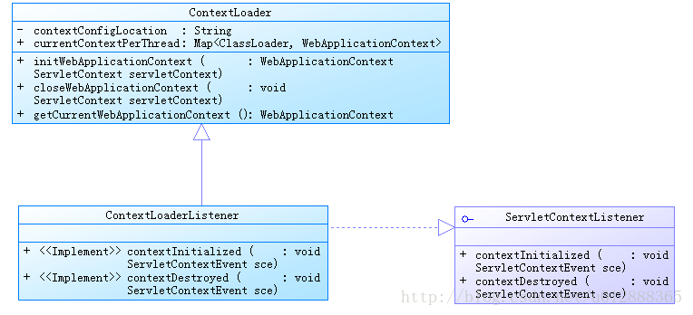

获取Spring容器的几种方式
===========================

WebApplicationContext的几种获取方式：

因为WebApplicationContext是ApplicationContext的子类，所以获取到WebApplicationContext其实就是获取到了ApplicationContext。

正常情况下，都会配置ContextLoaderListener，因为我们知道Spring IOC的两种实现

基础的就是BeanFactory，高级的就是ApplicationContext，除非在资源非常有限的情况下，才使用BeanFactory

否则都使用ApplicationContext，而WebApplicationContext就是其中的一种高级实现，它能提供很多有用的方法

SpringMVC -> 单例模式获取
-----------------------------

::

  public class WebApplicationContextUtil {
    private static WebApplicationContext wac = null;
    /**
     * 获取Spring容器
     * @return
     */
    public static WebApplicationContext getContext(){
      if(wac==null){
        wac = MvcDispatcherServlet.getInstance().getWebApplicationContext();
      }
      return wac;
    }
    /**
     * 获取当前web的bean类
     * @param beanId
     * @return
     */
    public static Object getBean(String beanId){
      return getContext().getBean(beanId) ;
    }

    public static Object getMessage(String property){
      return getContext().getMessage(property, null, Locale.CHINESE);
    }
    
  }

使用方式

  WebApplicationContextUtil.getBean("serviceName")

配置Listener方式
--------------------

Listener

::

  public class IFMListener implements ServletContextListener {
      @Override
      public void contextInitialized(ServletContextEvent event) {
          System.out.println("IFMListener initialized.");
          WebApplicationContext context = WebApplicationContextUtils.getWebApplicationContext(event.getServletContext());
          new Thread(new GetMsgThread(context)).start();
      }

      @Override
      public void contextDestroyed(ServletContextEvent event) {
          System.out.println("IFMListener destroyed.");
      }
  }

传入一个ServletContext对象。
然后用WebApplicationContextUtils的getWebApplicationContext获取一个WebApplicationContext，
WebApplicationContext是ApplicationContext的子类，他比ApplicationContext类多了一个获取ServletContext的方法。

其实上述方法能获取到WebApplicationContext时因为web项目在启动的时候，在启动spring容器的时候，
把WebApplicationContext作为一个属性放入了ServletContext中，
所以我们才可以采用spring提供的这个方法来获取到WebApplicationContext。

web.xml中配置

::

    <context-param>
      <param-name>contextConfigLocation</param-name>
      <param-value>classpath*:/applicationContext-mar.xml</param-value>
    </context-param>
    <listener>
      <listener-class>com.bocd.ifm.listener.IFMListener</listener-class>
    </listener>

使用方式

  LcTzzsfxxdjDao lcTzzsfxxdjDao = (LcTzzsfxxdjDao)context.getBean("lcTzzsfxxdjDao");

注

classpath*: 和 classpath: 的区别

::

  classpath：只会到你的class路径中查找找文件。

  classpath*：不仅包含class路径，还包括jar文件中（class路径）进行查找。

  在多个classpath中存在同名资源，都需要加载时，那么用classpath:只会加载第一个，这种情况下也需要用classpath*:前缀。

  注意： 用classpath*:需要遍历所有的classpath，所以加载速度是很慢的；因此，在规划的时候，应该尽可能规划好资源文件所在的路径，尽量避免使用classpath*。

"**/"表示的是任意目录；"**/applicationContext-*.xml"表示任意目录下的以"applicationContext-"开头的XML文件。  

ContextLoader方式
--------------------

因为 ContextLoaderListener 本质上是创建了一个 WebApplicationContext ，所以你的项目里面，如果不使用 WebApplicationContext 就可以不配置该节点。

contextConfigLocation：即在web.xml里面指定的配置文件所在目录，如果不指定，Spring 会加载WEB_INF目录下，符合 *Context.xml 或 spring*.xml 规则的文件

::

  WebApplicationContext wac = ContextLoader.getCurrentWebApplicationContext();
  BaseService xService = (BaseService)wac.getBean("cbdHaUwTreatmentService");

在web.xml文件中加入下面代码

::

  <listener>
   <listener-class>org.springframework.web.context.ContextLoaderListener</listener-class>
  </listener>

如果applicationContext.xml文件没有在/WEB-INF/下，或文件名不一致，或存在多个Spring配置文件，在web.xml文件中根据下面代码修改

::

  <context-param>
    <param-name>contextConfigLocation</param-name>
    <param-value>
      classpath*:applicationContext-*.xml,/WEB-INF/applicationContext.xml,/WEB-INF/classes/applicationContext-*.xml
    </param-value>
  </context-param>

直接加载文件方式
---------------------

：:

  ApplicationContext context = new ClassPathXmlApplicationContext("classpath:goframe/edms/spring/emds.config.xml");
  BaseService xService = (BaseService)context.getBean("cbdHaUwTreatmentService");

经验证是可行的，但是有个问题，就是执行这句代码的时候很耗时。本人猜测这句代码会重新new一个容器对象，相当于重新载入了一次applicationContext.xml里面配置的类，重新去create一个ApplicationContext，而不是去拿在项目启动之初生成的那个ApplicationContext。

基于ServletContext上下文获取的方式
---------------------------------------

::

  ServletContext sc = request.getSession().getServletContext();  
  ApplicationContext ac1 = WebApplicationContextUtils.getRequiredWebApplicationContext(sc);  
  ApplicationContext ac2 = WebApplicationContextUtils.getWebApplicationContext(sc);  
  WebApplicationContext wac1 = (WebApplicationContext) sc.getAttributeWebApplicationContext.ROOT_WEB_APPLICATION_CONTEXT_ATTRIBUTE);  

还有一些更合适的，基于Spring提供的抽象类或者接口，在初始化Bean时注入ApplicationContext

继承自抽象类ApplicationObjectSupport
------------------------------------------

说明：抽象类ApplicationObjectSupport提供getApplicationContext()方法，可以方便的获取到ApplicationContext。
Spring初始化时，会通过该抽象类的setApplicationContext(ApplicationContext context)方法将ApplicationContext 对象注入。

继承自抽象类WebApplicationObjectSupport
--------------------------------------------

说明：类似上面方法，调用getWebApplicationContext()获取WebApplicationContext

实现接口ApplicationContextAware
-----------------------------------

说明：实现该接口的setApplicationContext(ApplicationContext context)方法，并保存ApplicationContext 对象。
Spring初始化时，会通过该方法将ApplicationContext对象注入。

::

  package com.wenchaofu.util;

  import org.springframework.beans.BeansException; 
  import org.springframework.context.ApplicationContext; 
  import org.springframework.context.ApplicationContextAware;

  public class MySpringContext implements ApplicationContextAware { 
  private static ApplicationContext context;//声明一个静态变量用于保存spring容器上下文
    @Override
    public void setApplicationContext(ApplicationContext context)
            throws BeansException {
        this.context=context;
    }
    public static ApplicationContext getContext(){
        return context;
    }
  }

1.可见该工具类实现了ApplicationContextAware接口，
实现该接口的类会接收到spring容器传过来的ApplicationContext对象，
从而可以实现操纵spring容器中的所有bean的效果。但是这里我们并不在这个工具类里面去获取bean，
我们暂且把获取来的ApplicationContext对象存放起来，放在哪里呢，就是放在该类的一个静态变量中context中，
然后我们再给它一个静态的get方法，供其他的类去调用。

2.有了这个工具类还没用，spring容器不会无缘无故去执行setApplicationContext方法把ApplicationContext 对象传入给它，所以必须在ApplicationContext.xml文件里面去配置，如下所示。

  <bean id="MySpringContext" class="com.wenchaofu.util.MySpringContext" lazy-init="false"/>

这样，当项目启动时，就会加载这个工具类，并把ApplicationContext 传入。当然你也可以采用注解的方式，即在该类上加上@Component注解。

3.在其他类调用，只需要这样一行代码就可以了。

ApplicationContext context =MySpringContext.getContext(); 
　　经验证，采用这种方式获取的ApplicationContext的速度明显比前面那种快很多。

参考代码

::

  package com.fubo.utils.spring;
  import javax.servlet.http.HttpServletRequest;
  import javax.servlet.http.HttpServletResponse;
   
  import org.springframework.context.ApplicationContext;
  import org.springframework.context.ApplicationContextAware;
  import org.springframework.context.support.ClassPathXmlApplicationContext;
  import org.springframework.web.context.support.WebApplicationContextUtils;
  /**
   * 实现对spring context 的管理
   * @author FB
   * @2017年3月29日
   * @上午9:07:27
   * @
   */
  public class SpringContextHolder implements ApplicationContextAware {
   
      private static ApplicationContext applicationContext;
   
      /**
       * 实现ApplicationContextAware接口的context注入函数, 将其存入静态变量.
       */
      public void setApplicationContext(ApplicationContext applicationContext) {
    SpringContextHolder.applicationContext = applicationContext; // NOSONAR
      }
   
      /**
       * 取得存储在静态变量中的ApplicationContext.
       */
      public static ApplicationContext getApplicationContext() {
    checkApplicationContext();
    return applicationContext;
      }
   
      /**
       * 从静态变量ApplicationContext中取得Bean, 自动转型为所赋值对象的类型.
       */
      @SuppressWarnings("unchecked")
      public static <T> T getBean(String name) {
    checkApplicationContext();
    return (T) applicationContext.getBean(name);
      }
   
      /**
       * 从静态变量ApplicationContext中取得Bean, 自动转型为所赋值对象的类型.
       */
      @SuppressWarnings("unchecked")
      public static <T> T getBean(Class<T> clazz) {
    checkApplicationContext();
    return (T) applicationContext.getBeansOfType(clazz);
      }
   
      /**
       * 清除applicationContext静态变量.
       */
      public static void cleanApplicationContext() {
    applicationContext = null;
      }
   
      private static void checkApplicationContext() {
    if (applicationContext == null) {
        throw new IllegalStateException(
          "applicaitonContext未注入,请在applicationContext.xml中定义SpringContextHolder");
    }
      }
      
      
      public static void setHttpRequestResponseHolder(HttpServletRequest request, HttpServletResponse response){
          responseThreadLocal.set(response);
          ApplicationContext ap = WebApplicationContextUtils.getWebApplicationContext(null);
      }
      public static HttpServletResponse getHttpResponse(){
         return responseThreadLocal.get();
      }
   
      public static void clean(){
          responseThreadLocal.remove();
      }
   
      private static final ThreadLocal<HttpServletResponse> responseThreadLocal = new ThreadLocal();
   
      
     }
