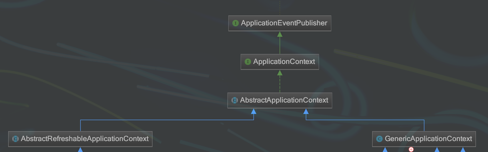
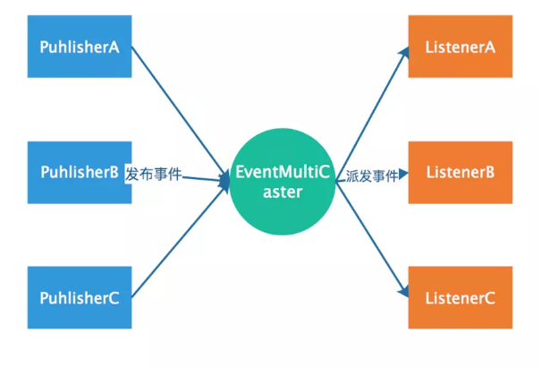
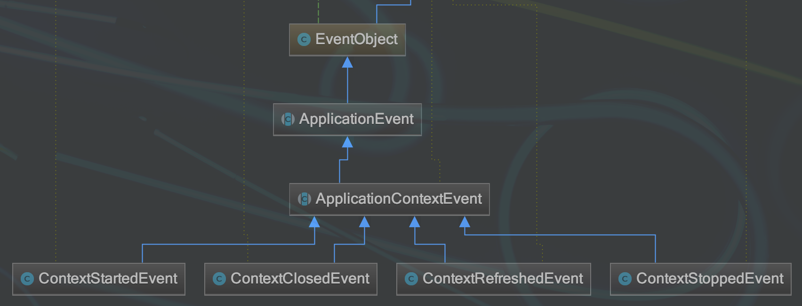

spring事件机制
=======================

事件发布者，事件监听者。

从以下三个问题开始着手看spring的事件机制

1. 发布者发布事件，事件的类型有哪些？怎么定义一个发布者？
#. 监听者监听事件，监听哪些？怎么定义一个监听者？
#. 发布者怎么把相应的事件给到相应的监听者？
#. 如何自定义一个事件？

**解答一：**

通过实现 ApplicationEventPublisherAware 类成为发布者

.. code:: java

    需要实现ApplicationEventPublisherAware这个Aware接口，广播事件需要利用applicationEventPublisher
    @Component
    public class SaySomethingPublisher implements ApplicationEventPublisherAware{
        private ApplicationEventPublisher applicationEventPublisher;

        public void setApplicationEventPublisher(ApplicationEventPublisher applicationEventPublisher) {
            this.applicationEventPublisher = applicationEventPublisher;
        }

        public void saySomething(String msg){
            applicationEventPublisher.publishEvent(msg);
        }
    }

用户发布的事件类型可以是：

1. 用户可以继承ApplicationEvent从而自定义Event类型
2. 也可以使用任意Object类型，但是如果event真实类型不是ApplicationEvent的话，那么event会被封装成PayloadApplicationEvent。如上是一个String。

**解答二：**

.. code:: java

    //事件监听者需要实现ApplicationListener接口
    //因为发布事件的类型是String，所以需要封装成PayloadApplicationEvent
    @Component
    public class ListenerA implements ApplicationListener<PayloadApplicationEvent<String>> {
        // 由于监听的是String类型的事件会被封装成PayloadApplicationEvent，所以此处类型是PayloadApplicationEvent
        public void onApplicationEvent(PayloadApplicationEvent event) {
            // getSource返回真实的事件
            Object msg = event.getSource();
            System.out.println("ListenerA receive:" + msg);
        }
    }

**解答三：**

**关于发布出去的事件，那些监听者会监听到？**

发布的事件类型是ApplicationEvent的实现类A
那么所有监听者的onApplicationEvent的参数类型是A或者A的子类都会收到事件。

发布的事件类型是不是ApplicationEvent类型，类型是B
这种情况下，最终事件会被包装成PayloadApplicationEvent<B>, 那么所有监听者方法onApplicationEvent的参数是PayloadApplicationEvent<B>的监听者会收到。
假设有C是B的父类，且有一个监听者X监听PayloadApplicationEvent<C>,那X是收不到PayloadApplicationEvent<B>类型的事件的

Spring事件原理
-------------------

Spring事件机制是观察者模式的一种实现，但是除了发布者和监听者者两个角色之外，还有一个EventMultiCaster的角色负责把事件转发给监听者，工作流程如下：

也就是说上面代码中发布者调用applicationEventPublisher.publishEvent(msg); 是会将事件发送给了EventMultiCaster， 而后由EventMultiCaster注册着所有的Listener，然后根据事件类型决定转发给那个Listener。

**EventMultiCaster**

ApplicationContext完成bean的装配和初始化后(非lazy-init的singleton bean会加载后就初始化)，会尝试创建一个eventMultiCaster，创建代码如下：

.. code:: java

    /**
     * Initialize the ApplicationEventMulticaster.
     * Uses SimpleApplicationEventMulticaster if none defined in the context.
     * @see org.springframework.context.event.SimpleApplicationEventMulticaster
     */
    protected void initApplicationEventMulticaster() {
        ConfigurableListableBeanFactory beanFactory = getBeanFactory();
        if (beanFactory.containsLocalBean(APPLICATION_EVENT_MULTICASTER_BEAN_NAME)) {
            this.applicationEventMulticaster =
                    beanFactory.getBean(APPLICATION_EVENT_MULTICASTER_BEAN_NAME, ApplicationEventMulticaster.class);
            if (logger.isDebugEnabled()) {
                logger.debug("Using ApplicationEventMulticaster [" + this.applicationEventMulticaster + "]");
            }
        }
        else { // 没有这样一个bean，那就会创建一个默认的
            this.applicationEventMulticaster = new SimpleApplicationEventMulticaster(beanFactory);
            beanFactory.registerSingleton(APPLICATION_EVENT_MULTICASTER_BEAN_NAME, this.applicationEventMulticaster);
            if (logger.isDebugEnabled()) {
                logger.debug("Unable to locate ApplicationEventMulticaster with name '" +
                        APPLICATION_EVENT_MULTICASTER_BEAN_NAME +
                        "': using default [" + this.applicationEventMulticaster + "]");
            }
        }
    }

直接看一下SimpleApplicationEventMulticaster用来广播event的代码：

.. code:: java

    public void multicastEvent(final ApplicationEvent event, ResolvableType eventType) {
            // 这个是用来根据event的类型找到合适的listener的
            ResolvableType type = (eventType != null ? eventType : resolveDefaultEventType(event));
            for (final ApplicationListener<?> listener : getApplicationListeners(event, type)) {
                            
                Executor executor = getTaskExecutor();
                // executor不是空的时候会在executor中激活listener
                if (executor != null) {
                    executor.execute(new Runnable() {
                        @Override
                        public void run() {
                            invokeListener(listener, event);
                        }
                    });
                }
                // 否则就直接在当前调用线程中激活listener 
                else {
                    invokeListener(listener, event);
                }
            }
    }

下面的例子为默认的SimpleApplicationEventMulticaster添加了executor，以使事件发布者和监听者不用在同一个线程中调用：

::

    // 使用线程池运行listener
    <bean id="executorService" class="java.util.concurrent.Executors" factory-method="newCachedThreadPool">
     </bean>
     // 名字的是这个名字 applicationEventMulticaster 
    <bean id="applicationEventMulticaster" class="org.springframework.context.event.SimpleApplicationEventMulticaster">
           <property name="taskExecutor" ref="executorService">
           </property>
    </bean>

Spring启动完成之后(已经完成bean解析，non-lazy-init的singleton实例化和初始化，完成listener的注册)，默认会发布一个ContextRefreshedEvent事件，该事件包装的消息是一个ApplicationContext对象。

**解答四：**

spring也对事件驱动模型提供了支持，该模型主要由三部分组成：

事件（ApplicationEvent）：继承了jdk的EventObject，在spring项目中可以继承ApplicationEvent，来自定义自己的事件。

spring容器内部对ApplicationEvent有着下面几个实现，通过名字可以很清楚事件所描述的行为。

