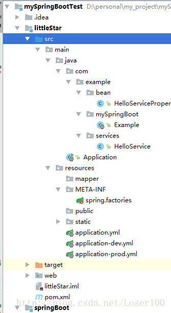

SpringBoot配置Bean的两种方式--注解以及配置文件
==================================================

注解方式
-------------

编写实体类：

.. code:: java

    package com.example.bean;

    import org.springframework.boot.context.properties.ConfigurationProperties;

    /**
     * Created by Loser100 on 2017/10/9.
     */
    @Component
    @ConfigurationProperties(prefix = "hello")
    public class HelloServiceProperties {

        private static final String MSG = "hello";

        private String msg = MSG;

        public String getMsg() {
            return msg;
        }

        public void setMsg(String msg) {
            this.msg = msg;
        }
    }

其中Component注解为自动装载，注解ConfigurationProperties的prefix = “hello”可以在application.yml或application.properties中进行赋值，如：

    hello.msg = Loser100。

若不赋值则默认为”hello”!

配置文件方式 
----------------

.. code:: java

    public class HelloService {
        private String msg;

        public String sayHello(){
            return "HELLO" + msg;
        }

        public String getMsg() {
            return msg;
        }

        public void setMsg(String msg) {
            this.msg = msg;
        }
    }

rce.META-INF下新建spring.factories文件，内容为：

    org.springframework.boot.autoconfigure.EnableAutoConfiguration=main.java.com.example.services.HelloService

使用 
-------------

使用时直接使用@Autowired标签即可，如：

.. code:: java

        @Autowired
        private HelloService helloServiceProperties;
        String sayHello(){
           return helloServiceProperties.sayHello();
        }

工程图

