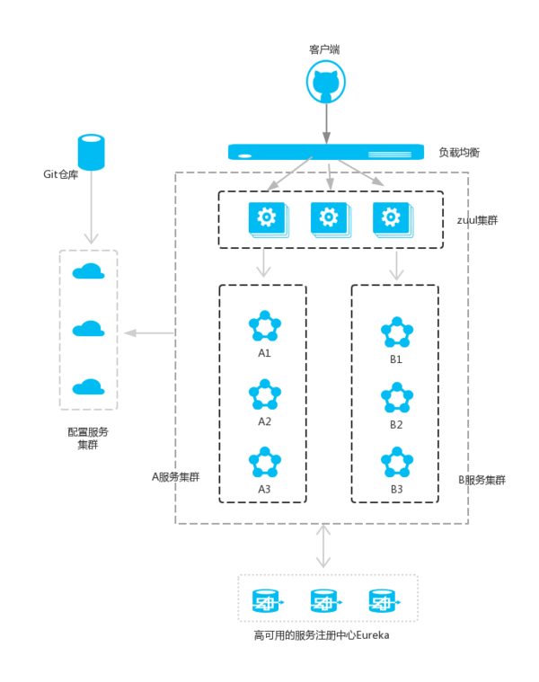

路由网关服务
=============

简介
--------

前面的文章我们介绍了，Eureka用于服务的注册于发现，Feign支持服务的调用以及均衡负载，Hystrix处理服务的熔断防止故障扩散，Spring Cloud Config服务集群配置中心，似乎一个微服务框架已经完成了。

我们还是少考虑了一个问题，外部的应用如何来访问内部各种各样的微服务呢？在微服务架构中，后端服务往往不直接开放给调用端，而是通过一个API网关根据请求的url，路由到相应的服务。当添加API网关后，在第三方调用端和服务提供方之间就创建了一面墙，这面墙直接与调用方通信进行权限控制，后将请求均衡分发给后台服务端。

在Spring Cloud微服务系统中，一种常见的负载均衡方式是，客户端的
请求首先经过负载均衡（zuul、Ngnix），再到达服务网关（zuul集群），
然后再到具体的服。，服务统一注册到高可用的服务注册中心集群，
服务的所有的配置文件由配置服务管理 config_ ，配置服务
的配置文件放在git仓库，方便开发人员随时改配置。

Zuul的主要功能是路由转发和过滤器。路由功能是微服务的一部分，
比如／api/user转发到到user服务，/api/shop转发到到shop服务。
zuul默认和Ribbon结合实现了负载均衡的功能。

 | 在Spring Cloud体系中， Spring Cloud Zuul就是提供负载均衡、反向代理、权限认证的一个API gateway。

为什么需要API Gateway
------------------------

1. 简化客户端调用复杂度
************************

微服务架构模式下后端服务的实例数一般是动态的，对于客户端而言很难发现动态改变的服务实例的访问地址信息。因此在基于微服务的项目中为了简化前端的调用逻辑，通常会引入API Gateway作为轻量级网关，同时API Gateway中也会实现相关的认证逻辑从而简化内部服务之间相互调用的复杂度。

2. 数据裁剪以及聚合
********************

通常而言不同的客户端对于显示时对于数据的需求是不一致的，比如手机端或者Web端又或者在低延迟的网络环境或者高延迟的网络环境。

因此为了优化客户端的使用体验，API Gateway可以对通用性的响应数据进行裁剪以适应不同客户端的使用需求。同时还可以将多个API调用逻辑进行聚合，从而减少客户端的请求数，优化客户端用户体验

3. 多渠道支持
*********************

当然我们还可以针对不同的渠道和客户端提供不同的API Gateway,对于该模式的使用由另外一个大家熟知的方式叫Backend for front-end, 在Backend for front-end模式当中，我们可以针对不同的客户端分别创建其BFF

4. 遗留系统的微服务化改造
**********************************

对于系统而言进行微服务改造通常是由于原有的系统存在或多或少的问题，比如技术债务，代码质量，可维护性，可扩展性等等。API Gateway的模式同样适用于这一类遗留系统的改造，通过微服务化的改造逐步实现对原有系统中的问题的修复，从而提升对于原有业务响应力的提升。通过引入抽象层，逐步使用新的实现替换旧的实现。

架构图
------------

**注意：A服务和B服务是可以相互调用的，作图的时候忘记了。并且配置服务也是注册到服务注册中心的。**

搭建步骤
----------

- 新建项目 zuul-service
- pom.xml 文件中增加 zuul-server依赖
- 主入口中增加注解开启路由服务
    - @EnableZuulProxy
    - @EnableEurekaClient
- 配置application.yml
    .. code:: java

        server:
          port: 30000
        spring:
          application:
            name: zuul-service
        eureka:
          client:
            serviceUrl:
              defaultZone: http://localhost:8889/eureka
        zuul:
          routes:
            api-a:
              path: /api-a/**
              serviceId: ribbon-service
            api-b:
              path: /api-b/**
              serviceId: ribbon-service

- 此时访问 localhost:30000/api-a/hello/sayhello?name=wenchaofu 可以访问到服务

过滤功能
------------

zuul 的filter 实现 ZuulFilter ，不仅能够路由，还能过滤，做一些安全验证

详见 代码_

服务化
-------------

也就是上面的例子

非服务化类似于这样

application.properties类似于

.. code:: java

  spring.application.name=gateway-service-zuul
  server.port=8888

  #这里的配置表示，访问/it/** 直接重定向到http://www.ityouknow.com/**
  zuul.routes.baidu.path=/it/**
  zuul.routes.baidu.url=http://www.ityouknow.com/

访问

在浏览器中访问：http://localhost:8888/it/spring-cloud，看到页面返回了：http://www.ityouknow.com/spring-cloud 页面的信息

----

.. _代码: https://github.com/fuwenchao/myspringclouddemo

.. _config: config.html
