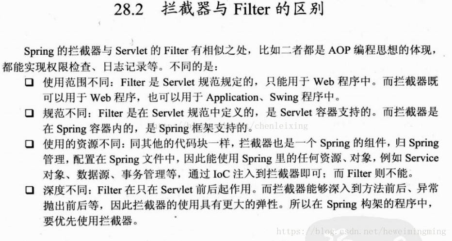
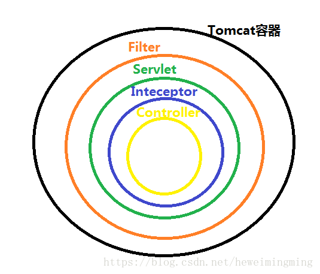
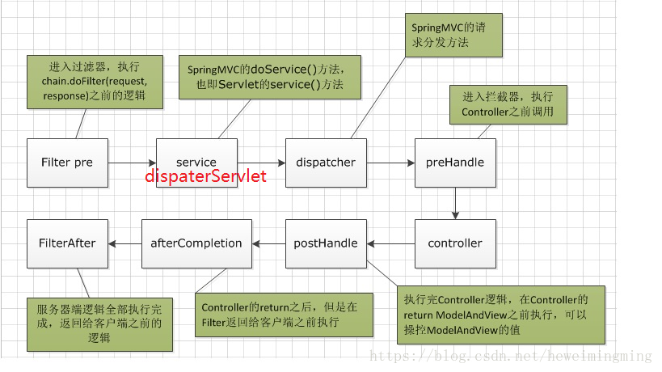

拦截器(inteceptor)和过滤器(filter)
=========================================

区别
------

1、过滤器和拦截器触发时机不一样，过滤器是在请求进入容器后，但请求进入servlet之前进行预处理的。请求结束返回也是，是在servlet处理完后，返回给前端之前。 
如下图： 

2、拦截器可以获取IOC容器中的各个bean，而过滤器就不行，因为拦截器是spring提供并管理的，spring的功能可以被拦截器使用，在拦截器里注入一个service，可以调用业务逻辑。而过滤器是JavaEE标准，只需依赖servlet api ，不需要依赖spring。

过滤器拦截器运行先后步骤：

其中第2步，SpringMVC的机制是由DispaterServlet来分发请求给不同的Controller，其实这一步是在Servlet的service()方法中执行的.

3、过滤器的实现基于回调函数。而拦截器（代理模式）的实现基于反射，代理分静态代理和动态代理，动态代理是拦截器的简单实现。

何时使用拦截器？何时使用过滤器？

如果是非spring项目，那么拦截器不能用，只能使用过滤器。
如果是处理controller前后，既可以使用拦截器也可以使用过滤器。
如果是处理dispaterServlet前后，只能使用过滤器。

spring boot 使用过滤器
-------------------------------

两种方式： 
1、使用spring boot提供的FilterRegistrationBean注册Filter 
2、使用原生servlet注解定义Filter 
两种方式的本质都是一样的，都是去FilterRegistrationBean注册自定义Filter

**方式一: **

①、先定义Filter：

.. code:: java

    package com.hwm.filter;

    import javax.servlet.*;
    import java.io.IOException;

    public class MyFilter implements Filter {
        @Override
        public void init(FilterConfig filterConfig) throws ServletException {

        }
        @Override
        public void doFilter(ServletRequest servletRequest, ServletResponse servletResponse, FilterChain filterChain) throws IOException, ServletException {
            // do something 处理request 或response
            System.out.println("filter1");
            // 调用filter链中的下一个filter
            filterChain.doFilter(servletRequest,servletResponse);
        }
        @Override
        public void destroy() {

        }
    }

②、注册自定义Filter

.. code::　java

    @Configuration
    public class FilterConfig {

        @Bean
        public FilterRegistrationBean registrationBean() {
            FilterRegistrationBean filterRegistrationBean = new FilterRegistrationBean(new MyFilter());
            filterRegistrationBean.addUrlPatterns("/*");
            return filterRegistrationBean;
        }
    }

**方式二：**

.. code:: java

// 注入spring容器
@Component
// 定义filterName 和过滤的url
@WebFilter(filterName = "my2Filter" ,urlPatterns = "/*")
public class My2Filter implements Filter {
    @Override
    public void init(FilterConfig filterConfig) throws ServletException {

    }
    @Override
    public void doFilter(ServletRequest servletRequest, ServletResponse servletResponse, FilterChain filterChain) throws IOException, ServletException {
        System.out.println("filter2");
    }
    @Override
    public void destroy() {

    }
}

Spring boot拦截器的使用
--------------------------

①、定义拦截器：

.. code:: java

    public class MyInterceptor implements HandlerInterceptor {

        @Override
        public boolean preHandle(HttpServletRequest request, HttpServletResponse response, Object handler) throws Exception {
            System.out.println("preHandle");
            return true;
        }

        @Override
        public void postHandle(HttpServletRequest request, HttpServletResponse response, Object handler, @Nullable ModelAndView modelAndView) throws Exception {
            System.out.println("postHandle");
        }

        @Override
        public void afterCompletion(HttpServletRequest request, HttpServletResponse response, Object handler, @Nullable Exception ex) throws Exception {
            System.out.println("afterCompletion");
        }
    }

②、配置拦截器：

.. code:: java

    @Configuration
    public class InterceptorConfig implements WebMvcConfigurer {

        @Override
        public void addInterceptors(InterceptorRegistry registry) {
            registry.addInterceptor(new MyInterceptor());
        }
    }

③Controller演示：

.. code:: java

    @RestController
    public class UController {

        @GetMapping("/home")
        public String home(){
            System.out.println("home");
            return "myhome";
        }## 标题 ##
    }
