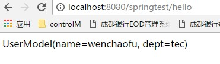

参数解析器
=============

HandlerMethodArgumentResolver = HandlerMethod + Argument(参数) + Resolver(解析器), 其实就是HandlerMethod方法的解析器, 将 HttpServletRequest(header + body 中的内容)解析为HandlerMethod方法的参数, 主要的策略接口如下:

自定义的HandlerMethodArgumentResolver
-----------------------------------------

.. code:: java

  package com.bocd.commom.handler;

  import com.bocd.anno.CurrentOp;
  import com.bocd.model.UserModel;
  import org.springframework.core.MethodParameter;
  import org.springframework.web.bind.support.WebDataBinderFactory;
  import org.springframework.web.context.request.NativeWebRequest;
  import org.springframework.web.method.support.HandlerMethodArgumentResolver;
  import org.springframework.web.method.support.ModelAndViewContainer;

  /**
   * @author wenchaofu
   * @version 1.0, 2019/9/19
   * @desc
   */
  public class UserModelMethodArgumentResolver implements HandlerMethodArgumentResolver {

      public static final String id = "123221";

      @Override
      public boolean supportsParameter(MethodParameter methodParameter) { //支持的参数类型
          return methodParameter.getParameterType().isAssignableFrom(UserModel.class) &&
                  methodParameter.hasParameterAnnotation(CurrentOp.class);
      }

      @Override
      public Object resolveArgument(MethodParameter methodParameter, ModelAndViewContainer modelAndViewContainer, NativeWebRequest nativeWebRequest, WebDataBinderFactory webDataBinderFactory) throws Exception {
          UserModel userModel = new UserModel();
          userModel.setDept("tec");
          userModel.setName("wenchaofu");
          return userModel;
      }
  }

controller方法

.. code:: java

    @RequestMapping(method = RequestMethod.GET,value = "/hello")
    private String sayHello(@CurrentOp UserModel userModel) {
        System.out.println("hello controller begin");
        return userModel.toString();
    }

spring.xml 增加配置

::

    <mvc:annotation-driven>
        <mvc:message-converters>
            <bean id="jsonConverter" class="com.alibaba.fastjson.support.spring.FastJsonHttpMessageConverter">
                <property name="features">
                    <array>
                        <value>PrettyFormat</value>
                        <value>DisableCircularReferenceDetect</value>
                        <value>WriteDateUseDateFormat</value>
                    </array>
                </property>
                <property name="supportedMediaTypes">
                    <list>
                        <value>text/json</value>
                        <value>application/json</value>
                    </list>
                </property>
            </bean>
        </mvc:message-converters>
        <mvc:argument-resolvers>
            <bean class="com.bocd.commom.handler.UserModelMethodArgumentResolver"></bean>
            <bean class="com.bocd.commom.handler.UserModelMethodArgumentResolver2"></bean>
        </mvc:argument-resolvers>
    </mvc:annotation-driven>

返回

系统自带
----------

- @RequestParam 解析 RequestParamMethodArgumentResolver (基础类型的默认解析器)
- @PathVariable 解析 PathVariableMethodArgumentResolver
- @RequestBody 解析 RequestResponseBodyMethodProcessor
- @CookieValue 解析 ServletCookieValueMethodArgumentResolver ...

使用场景
-------------

这个接口主要的使用场景就是来实现自定义的参数注入。例如在很多前后端分离的项目中，我们不会去使用Session，而是自己维护一个token来实现状态管理，

这种时候，如果需要取得用户数据，正常操作，我们可能需要手动去取得token，然后去查询用户数据

例如以下这个例子，我们从Header中取得token数据，然后从Redis中查询到用户标识，接着从数据库查询到用户基本信息

.. code:: java

  @PostMapping("get-user-info")
  public UserInfo getUserInfo(@RequestHeader String token) {
      // 伪代码
      Long userId = redisClient.get(token);
      UserInfo useInfo = userDao.getById(userId);
      return userInfo;
  }

这样写没什么问题，不过在实际的项目中，我们可能很多地方都需要用到用户的一些基本信息，每次都这样去手动编码去取，就显得得很繁琐了

我们使用HandlerMethodArgumentResolver接口来实现

// 1. 实现HandlerMethodArgumentResolver接口

.. code:: java

  public class UserInfoArgumentResolver implements HandlerMethodArgumentResolver{
      private final RedisClient redisClient;
      private final UserDao userDao;
      public UserInfoArgumentResolver(RedisClient redisClient, UserDao userDao) {
          this.redisClient = redisClient;
          this.userDao = userDao;
      }
      @Override
      public boolean supportsParameter(MethodParameter parameter) {
          return UserInfo.class.isAssignableFrom(parameter.getParameterType());
      }

      @Override
      public Object resolveArgument(MethodParameter parameter, ModelAndViewContainer mavContainer,
              NativeWebRequest webRequest, WebDataBinderFactory binderFactory) throws Exception {
          HttpServletRequest nativeRequest = (HttpServletRequest) webRequest.getNativeRequest();
          String token = nativeRequest.getHeader("token");
          Long userId = redisClient.get(token);
          UserInfo useInfo = userDao.getById(userId);
          return userInfo;
      }

  }

// 2. 添加到配置中

.. code:: java

  @Configuration
  @EnableWebMvc
  public class FastMvcConfiguration implements WebMvcConfigurer {

    @Autowrite
    UserDao userDao;
    @Autowrite
    RedisClient redisClient;

    @Override
    public void addArgumentResolvers(List<HandlerMethodArgumentResolve> resolvers) {
        resolvers.add(new UserInfoArgumentResolver(redisClient, userDao));
    }

  }

// 3. 在Controller中使用

.. code:: java

  @RestController
  public class UserInfoController {

    @PostMapping("get-user-info")
    public UserInfo getUserInfo(UserInfo userInfo) {
      return userInfo;
    }

    @PostMapping("say-hello")
    public String sayHello(UserInfo userInfo) {
        return "hello " + userInfo.getNickName();
    }

  }

添加了 UserInfoArgumentResolver 解释器以后，当我们需要使用UserInfo时，只需要使用指定的类型就可以取得，不需要做其他任何操作

我在项目中使用这个接口主要用来获取用户信息和对外接口的通用签名校验。 这个接口比较基础，也很通用。 在项目中用得好可以减少很多的工作量。