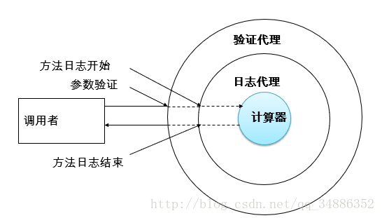
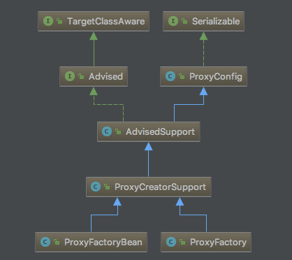

Spring AOP
===============

问题
----

1、代码混乱：越来越多的非业务需求（日志和验证等）加入后，原有的业务方法急剧膨胀。每个方法在处理核心逻辑的同时还必须兼顾其他多个关注点

2、代码分散：以日志需求为例，只是为了满足这个单一需求，就不得不在多个模块方法（方法）里多次重复相同的日志代码。如果日志需求发生变化，必修修改所有的模块。

使用动态代理解决上述问题
----------------------------

代理设计模式的原理：使用一个代理将对象包装起来，然后用该代理对象取代原始对象，任何对原始对象调用都要通过代理，代理对象决定是否以及何时将方法调用转到原始对象上

代码详见 springtest工程 com.bocd.dp.proxy.jdk.Main

使用AOP解决上述问题
-----------------------

1. 什么是AOP

2. AOP术语

- 切面 aspect
- 通知 advice
- 目标 target
- 代理 proxy
- 连接点 Joinpoint
- 切点 pointcut

3. AspectJ样式AOP

AspectJ是java社区里最完整最流行的AOP框架;
在网上一搜一大片所谓AspectJ的用法，其实都是AspectJ的“切面语法”，只是AspectJ框架的冰山一角，AspectJ是完全独立于Spring存在的一个Eclipse发起的项目，官方关于AspectJ的描述是：

在Spring2.0以上版本中，可以使用基于AspectJ注解或基于Xml配置的AOP

再次强调一下这里讲的AspectJ样式的aop只是使用了AspectJ的一些语法特性，底层依旧是SpringAop实现的
首先 使用aspectJ样式的aop需要一些额外配置

- springboot

如果你使用的是springboot，可以通过在主类使用@EnableAspectJAutoProxy注解来开启，另外如果你使用了@EnableAutoConfiguration会默认开启。如果想关闭aop可以配置设置spring.aop.auto = false，spring.aop.proxy-target-class可以指定使用jdk代理还是cglib代理,默认是jdk（false:jdk,true:cglib）

- spring

普通的spring框架可以通过设置<aop:aspectj-autoproxy proxy-target-class="false"/>来开启，设置为true使用cglib

.. code:: java

        // pom.xml

        <dependency>
            <groupId>org.springframework</groupId>
            <artifactId>spring-aspects</artifactId>
            <version>4.1.1.RELEASE</version>
        </dependency>

        // spring.xml

        <aop:aspectj-autoproxy proxy-target-class="false"/>

具体使用方法详见 springtest工程 com.bocd.spring.aspectj

4. spring aop

spring aop相关的内容基本都在org.springframework.aop.framework包下，spring aop是通过代理工厂实现的，主要涉及的类图如下：

下面看一个使用proxyFactory实现aop的例子

.. code:: java

    @Test
    public void proxy() {
        PushServiceImpl pushService = new PushServiceImpl();
        //创建工厂
        ProxyFactory proxyFactory = new ProxyFactory(pushService);
        //添加advice
        proxyFactory.addAdvice(new SmsPushBeforeAdvice());
        proxyFactory.addAdvice(new SmsPushAfterAdvice());
        //获取代理
        SmsPushInterface proxy = (SmsPushInterface) proxyFactory.getProxy();
        proxy.pushSms("10086", "EL PSY CONGROO");
    }

具体使用方法详见 springtest工程  com.bocd.spring.aop.SpringAopTest#proxy

参考
------

https://segmentfault.com/a/1190000015262333