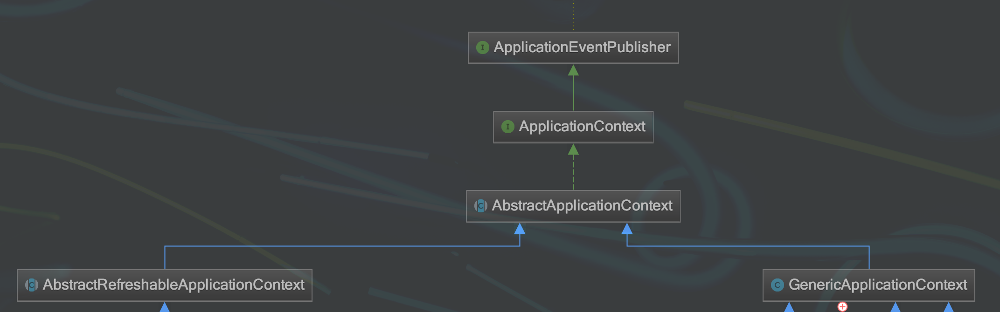
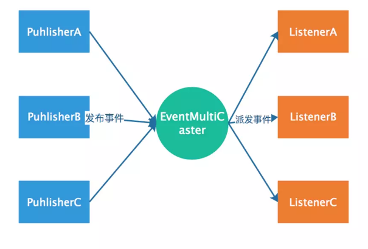
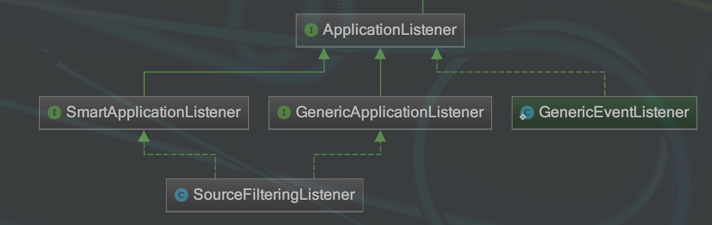
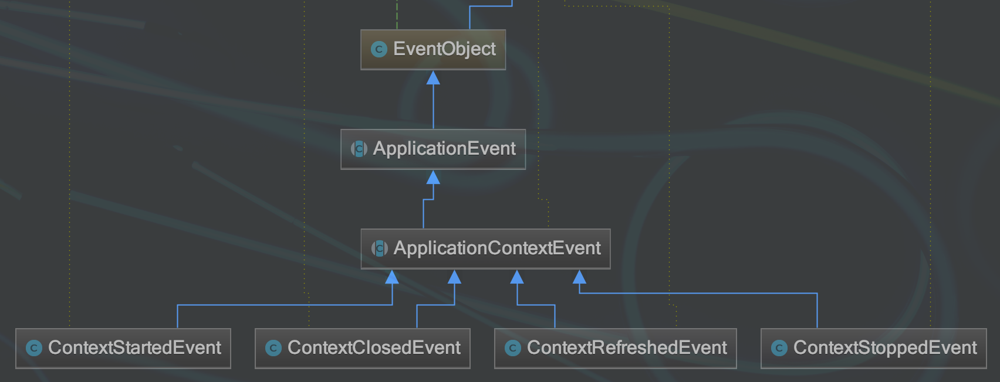

spring事件机制
=======================

事件发布者，事件监听者。

从以下三个问题开始着手看spring的事件机制

1. 发布者发布事件，事件的类型有哪些？怎么定义一个发布者？
#. 监听者监听事件，监听哪些？怎么定义一个监听者？
#. 发布者怎么把相应的事件给到相应的监听者？
#. 如何自定义一个事件？

**解答一：**

1. 发布者发布事件，事件的类型有哪些？怎么定义一个发布者？

通过实现 ApplicationEventPublisherAware 类成为发布者

.. code:: java

    需要实现ApplicationEventPublisherAware这个Aware接口，广播事件需要利用applicationEventPublisher
    @Component
    public class SaySomethingPublisher implements ApplicationEventPublisherAware{
        private ApplicationEventPublisher applicationEventPublisher;

        public void setApplicationEventPublisher(ApplicationEventPublisher applicationEventPublisher) {
            this.applicationEventPublisher = applicationEventPublisher;
        }

        public void saySomething(String msg){
            applicationEventPublisher.publishEvent(msg);
        }
    }

用户发布的事件类型可以是：

1. 用户可以继承ApplicationEvent从而自定义Event类型
2. 也可以使用任意Object类型，但是如果event真实类型不是ApplicationEvent的话，那么event会被封装成PayloadApplicationEvent。如上是一个String。

**解答二：**

2. 监听者监听事件，监听哪些？怎么定义一个监听者？

.. code:: java

    //事件监听者需要实现ApplicationListener接口
    //因为发布事件的类型是String，所以需要封装成PayloadApplicationEvent
    @Component
    public class ListenerA implements ApplicationListener<PayloadApplicationEvent<String>> {
        // 由于监听的是String类型的事件会被封装成PayloadApplicationEvent，所以此处类型是PayloadApplicationEvent
        public void onApplicationEvent(PayloadApplicationEvent event) {
            // getSource返回真实的事件
            Object msg = event.getSource();
            System.out.println("ListenerA receive:" + msg);
        }
    }

**解答三：**

**关于发布出去的事件，那些监听者会监听到？**

发布的事件类型是ApplicationEvent的实现类A
那么所有监听者的onApplicationEvent的参数类型是A或者A的子类都会收到事件。

发布的事件类型是不是ApplicationEvent类型，类型是B
这种情况下，最终事件会被包装成PayloadApplicationEvent<B>, 那么所有监听者方法onApplicationEvent的参数是PayloadApplicationEvent<B>的监听者会收到。
假设有C是B的父类，且有一个监听者X监听PayloadApplicationEvent<C>,那X是收不到PayloadApplicationEvent<B>类型的事件的

Spring事件原理
-------------------

Spring事件机制是观察者模式的一种实现，但是除了发布者和监听者者两个角色之外，还有一个EventMultiCaster的角色负责把事件转发给监听者，工作流程如下：

    ApplicationContext发布事件　context.publishEvent(event);

也就是说上面代码中发布者调用applicationEventPublisher.publishEvent(msg); 是会将事件发送给了EventMultiCaster， 而后由EventMultiCaster注册着所有的Listener，然后根据事件类型决定转发给那个Listener。

**EventMultiCaster**

ApplicationContext完成bean的装配和初始化后(非lazy-init的singleton bean会加载后就初始化)，会尝试创建一个eventMultiCaster，创建代码如下：

.. code:: java

    /**
     * org.springframework.context.support.AbstractApplicationContext
     * Initialize the ApplicationEventMulticaster.
     * Uses SimpleApplicationEventMulticaster if none defined in the context.
     * @see org.springframework.context.event.SimpleApplicationEventMulticaster
     */
    protected void initApplicationEventMulticaster() {
        ConfigurableListableBeanFactory beanFactory = getBeanFactory();
        if (beanFactory.containsLocalBean(APPLICATION_EVENT_MULTICASTER_BEAN_NAME)) {
            this.applicationEventMulticaster =
                    beanFactory.getBean(APPLICATION_EVENT_MULTICASTER_BEAN_NAME, ApplicationEventMulticaster.class);
            if (logger.isDebugEnabled()) {
                logger.debug("Using ApplicationEventMulticaster [" + this.applicationEventMulticaster + "]");
            }
        }
        else { // 没有这样一个bean，那就会创建一个默认的
            this.applicationEventMulticaster = new SimpleApplicationEventMulticaster(beanFactory);
            beanFactory.registerSingleton(APPLICATION_EVENT_MULTICASTER_BEAN_NAME, this.applicationEventMulticaster);
            if (logger.isDebugEnabled()) {
                logger.debug("Unable to locate ApplicationEventMulticaster with name '" +
                        APPLICATION_EVENT_MULTICASTER_BEAN_NAME +
                        "': using default [" + this.applicationEventMulticaster + "]");
            }
        }
    }

直接看一下SimpleApplicationEventMulticaster用来广播event的代码：

.. code:: java

    public void multicastEvent(final ApplicationEvent event, ResolvableType eventType) {
            // 这个是用来根据event的类型找到合适的listener的
            ResolvableType type = (eventType != null ? eventType : resolveDefaultEventType(event));
            for (final ApplicationListener<?> listener : getApplicationListeners(event, type)) {
                            
                Executor executor = getTaskExecutor();
                // executor不是空的时候会在executor中激活listener
                if (executor != null) {
                    executor.execute(new Runnable() {
                        @Override
                        public void run() {
                            invokeListener(listener, event);
                        }
                    });
                }
                // 否则就直接在当前调用线程中激活listener 
                else {
                    invokeListener(listener, event);
                }
            }
    }

下面的例子为默认的SimpleApplicationEventMulticaster添加了executor，以使事件发布者和监听者不用在同一个线程中调用：

::

    // 使用线程池运行listener
    <bean id="executorService" class="java.util.concurrent.Executors" factory-method="newCachedThreadPool">
     </bean>
     // 名字的是这个名字 applicationEventMulticaster 
    <bean id="applicationEventMulticaster" class="org.springframework.context.event.SimpleApplicationEventMulticaster">
           <property name="taskExecutor" ref="executorService">
           </property>
    </bean>

Spring启动完成之后(已经完成bean解析，non-lazy-init的singleton实例化和初始化，完成listener的注册)，默认会发布一个ContextRefreshedEvent事件，该事件包装的消息是一个ApplicationContext对象。

**解答四：**

spring也对事件驱动模型提供了支持，该模型主要由三部分组成：

事件（ApplicationEvent）：继承了jdk的EventObject，在spring项目中可以继承ApplicationEvent，来自定义自己的事件。

spring容器内部对ApplicationEvent有着下面几个实现，通过名字可以很清楚事件所描述的行为。

流程
----------

- 发布事件

    context.publishEvent(event);

实际上是由ApplicationContext的实现AbstractApplicationContext执行发布事件的行为

- 广播事件

    getApplicationEventMulticaster().multicastEvent(applicationEvent, eventType);

- 执行 SimpleApplicationEventMulticaster 中的multicastEvent方法，调用事件监听器的onApplicationEvent()方法

.. code:: java

    @Override
    public void multicastEvent(final ApplicationEvent event, ResolvableType eventType) {
        ResolvableType type = (eventType != null ? eventType : resolveDefaultEventType(event));
        for (final ApplicationListener<?> listener : getApplicationListeners(event, type)) {
            Executor executor = getTaskExecutor();
            if (executor != null) {
                executor.execute(new Runnable() {
                    @Override
                    public void run() {
                        invokeListener(listener, event);
                    }
                });
            }
            else {
                invokeListener(listener, event);
            }
        }
    }

.. code:: java

    protected void invokeListener(ApplicationListener<?> listener, ApplicationEvent event) {
        ErrorHandler errorHandler = getErrorHandler();
        if (errorHandler != null) {
            try {
                doInvokeListener(listener, event);
            }
            catch (Throwable err) {
                errorHandler.handleError(err);
            }
        }
        else {
            doInvokeListener(listener, event);
        }
    }

.. code:: java

    @SuppressWarnings({"unchecked", "rawtypes"})
    private void doInvokeListener(ApplicationListener listener, ApplicationEvent event) {
        try {
            listener.onApplicationEvent(event);
        }
        catch (ClassCastException ex) {
            String msg = ex.getMessage();
            if (msg == null || matchesClassCastMessage(msg, event.getClass().getName())) {
                // Possibly a lambda-defined listener which we could not resolve the generic event type for
                // -> let's suppress the exception and just log a debug message.
                Log logger = LogFactory.getLog(getClass());
                if (logger.isDebugEnabled()) {
                    logger.debug("Non-matching event type for listener: " + listener, ex);
                }
            }
            else {
                throw ex;
            }
        }
    }

自定义事件Demo1
---------------------

**自定义事件**

.. code:: java

    package com.spring.event.event;
     
    import org.springframework.context.ApplicationEvent;
     
    import com.spring.event.bean.Notify;
     
    /**
     * 自定义事件
     *
     */
    public class NotifyEvent extends ApplicationEvent {
     
        // 省略get set 方法
        private int version;
         
        private Notify notify;

     
        /**
         * serialVersionUID
         */
        private static final long serialVersionUID = -6198589267233914254L;
     
        public NotifyEvent(Object source) {
            super(source);
             
        }
     
        public NotifyEvent(Object source,Notify notify) {
            this(source);
            this.notify = notify;
             
        }
     
    }

**自定义监听器**

.. code:: java

    package com.spring.event.listner;
     
    import org.springframework.context.ApplicationListener;
    import org.springframework.stereotype.Component;
     
    import com.spring.event.event.NotifyEvent;
     
    /**
     * 自定义监听器
     *
     */
    @Component
    public class NotifyListenr implements ApplicationListener<NotifyEvent>{
     
        @Override
        public void onApplicationEvent(NotifyEvent event) {
             
            System.out.println(event.getNotify().toString());
             
            //监听事件后，处理后续事情
        }
     
    }

**发布**

.. code:: java

    ApplicationContext context = new ClassPathXmlApplicationContext("spring.xml");
    Notify notify = new Notify("李四",21);
    NotifyEvent event = new NotifyEvent("NotifyEvent",notify);
    event.setVersion(100); 
    //发布事件
    context.publishEvent(event);

自定义事件Demo2
---------------------

使用注解方式

使用@Async需要在配置文件添加一下支持,线程池也是需要配置一下的

::

    <!-- 开启@AspectJ AOP代理 -->
    <aop:aspectj-autoproxy proxy-target-class="true"/>

    <!-- 任务执行器 -->
    <task:executor id="executor" pool-size="10"/>

    <!--开启注解调度支持 @Async -->
    <task:annotation-driven executor="executor" proxy-target-class="true"/>

TestListener中在方法中添加@Async

.. code:: java

    @Component
    public class TestListener implements ApplicationListener<TestEvent> {

        @Async
        @Override
        public void onApplicationEvent(TestEvent testEvent) {

            TestParam param = (TestParam) testEvent.getSource();
            System.out.println(".......开始.......");
            System.out.println("发送邮件:"+param.getEmail());
            System.out.println(".......结束.....");
        }
    }

　Listener其实还可以做得更彻底一点,使用注解@EventListener可代替实现ApplicationListener,原理是通过扫描这个注解来创建监听器并自动添加到ApplicationContext中.

.. code:: java

    @Component
    public class TestListener {

        @Async
        @EventListener
        public void handleTestEvent(TestEvent testEvent) {

            TestParam param = (TestParam) testEvent.getSource();
            System.out.println(".......开始.......");
            System.out.println("发送邮件:"+param.getEmail());
            System.out.println(".......结束.....");
        }
    }