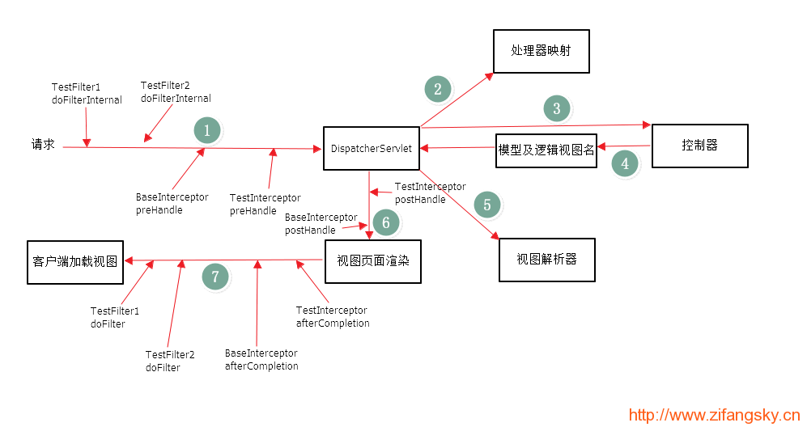
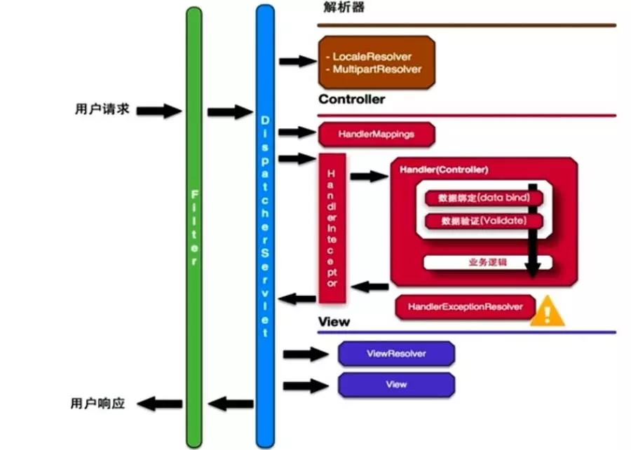
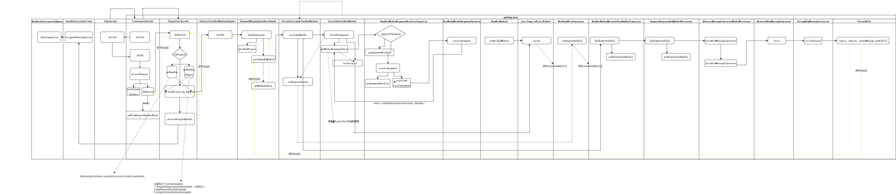
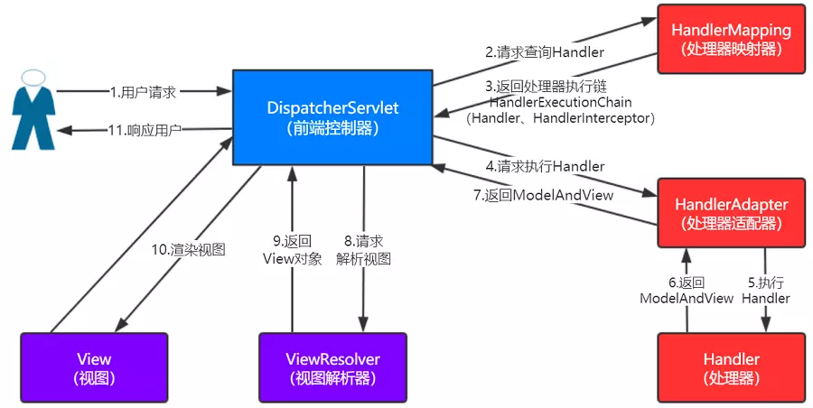

Spring MVC执行步骤
=======================

overview
----------

-----

-----

执行流程

1. 首先客户端发起用户请求，以http形式进入到servlet容器中，servlet容器解析http数据成为一个endpoint对象，endpoint对象包含了请求url、http header以及解析完或者读取完的body数据流。

2. 首先进入Filter父类 OncePerRequestFilter ,然后进入用户自定义的filter，在filter中用户可以对request进行处理，然后经过多个filter处理完后，进入到 dispatcherservlet ，也就是springmvc的入口。

3. 进入dispatcherservlet,实际调用的是FrameworkServlet的service方法,然后调用的父类的HttpServlet的service方法....

最后到达DispatcherServlet的doService方法 -> doDispatch

4.  前端控制器请求HandlerMapping(controller集合)查找 Handler(对应请求的controller) （可以根据xml配置、注解进行查找）

5. 处理器映射器HandlerMapping向前端控制器返回Handler，HandlerMapping会把请求返回的Handler映射为HandlerExecutionChain对象（包含一个Handler处理器（页面控制器）对象，多个HandlerInterceptor拦截器对象），通过这种策略模式，很容易添加新的映射策略

6. 根据返回的Handle返回需要的HandlerAdapter(RequestMappingHandlerAdapter)

7. 调用RequestMappingHandlerAdapter的handleInternal

8. 然后会先进入到一些常用的解析器中，比如用来解析上传文件的MultipartResolver，如果请求是Multipart，也就是说header包含Multipart，springmvc就会解析上传的请求里面的上传文件，解析成字节流，以及把一些字符串k、v读出来，封装到对象中以供后续的comtroller进行接收，从解析器出来后，就是根据请求url寻找handler(controller)的过程。

也可以是自定义的解析器,然后调用自定义解析器的resolveArgument方法(注意,每个参数只有一个解析器)

然后返回所有解析器解析参数生成的一个object[],将这个数据传递给controller方法

9. 由于我们在controller方法中使用requestMapping注解定义了url映射，在启动过程中springmvc就会将controller及对应的方法注册到HandlerMapping中，如果无法在handlerMapping中找到请求对应的controller，就会报404错误。

10. 找到controller后进入到HandlerInterceptor，即拦截器，在拦截器中可以进行打印日志，身份鉴权等操作。

11. 经过拦截器后，springmvc会对数据进行绑定(与方法参数进行绑定)，及数据验证，反射调用我们的controller方法，执行方法体中的业务逻辑，执行完成后创建ModelAndView。model就是数据，此时的view只是个viewName(String)。

12. 如果我们定义了异常处理器，在拦截器处理数据绑定、数据验证、业务处理这些所有环节，只要出现了异常，都会被异常处理器拦截，可以在异常处理中返回相应的错误页面。

13. 如果正常执行，会通过ViewResolver进行view的资源定位,找到view之后就会进入渲染页面的过程，实际是将数据进行模版的变量替换的过程，数据来源于request,modelMap,session中。

14. 渲染之后就经过dispatcherservlet返回，再经过filter后续的处理，最终通过servlet容器形式http响应返回给客户端。

执行流程

1. 客户端请求被DispatcherServlet(前端控制器)接收
2. DispatcherServlet请求HandlerMapping查询Handler
3. HandlerMapping根据请求URL查找Handler，将Handler和HandlerInterceptor以HandlerExecutionChain的形式一并返回给DispatcherServlet
4. DispatcherServlet请求HandlerAdapter执行Handler
5. HandlerAdapter调用Handler的方法做业务逻辑处理
6. HandlerAdapter处理完Handler会生成一个ModelAndView对象
7. 将ModelAndView对象返回给DispatcherServlet
8. DispatcherServlet将获取的ModelAndView对象传给ViewResolver视图解析器，请求进行视图解析
9. ViewResolver将逻辑视图解析成物理视图View，返回给DispatcherServlet
10. DispatcherServlet根据View进行视图渲染(将模型数据填充到视图中)
11. DispatcherServlet将渲染后的视图响应给客户端

.. image:: ./images/overview3.png

