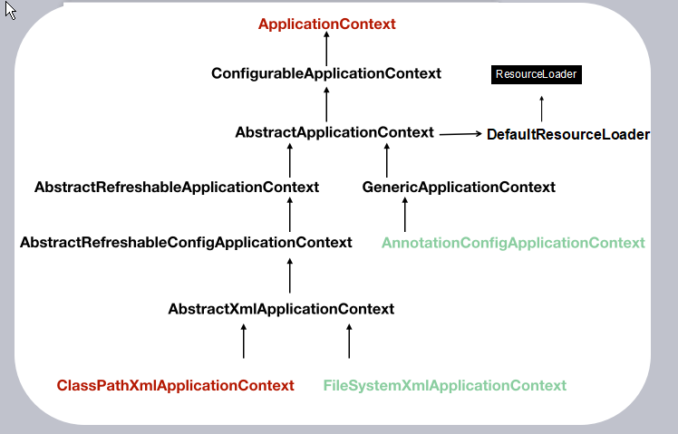

为什么要阅读spring源码
=========================

阅读《Spring技术内幕》是因为面试官会提问关于Spring的内容，会提问怎么使用，还有实现的原理，那么为什么面试官要问这些东西呢？ 

其实，学习编程不是学习配置东西，然后写编程套路。

写程序最重要的是你能心中有自己的一套架构思路，比如我现在就没有写Java的项目了。我设计了一个Python的测试系统用来测试我们的服务。

一个好的架构和一个差的架构区别很大的，好的架构，简单优雅。要设计架构就要阅读架构。 

如果你有认真好好的看《Java编程思想》，你应该能认识到，
里面一句深刻的一句话，“**编程语言是程序员的表达的方式，而架构是程序员对世界的认知**”。 

读源码三问：“为什么要有这样的架构”，“他是什么样子的”，“他是怎么工作的”。 

首先，我们来说说，IoC容器。 

IoC容器存在的原因在于对象的解耦，有了简单来说就是我们自己定义我们要怎么去实现对象中调用的接口。其实我们不用去看他的实现，我们先假想，我们怎么实现它。嗯，嗯嗯嗯。嗯嗯嗯嗯嗯嗯。有了。 
我们做的不就是容器嘛（我们用新的方式来管理类，那就是容器），

我们就定义一个读文件的方法，然后把读到的内容用加载器进行加载，然后放在一个容器里面，名字对应Object，然后开始注入了，我们定义了注入类的位置和被注入类的位置（约定优于配置），我们就去容器中获取。我们想象这样是不是挺完美的。好像是的。 

好了，我们有了宏观的定义了，他就是一个简陋的图。所有的想法都是起源**简单的结构**。我们想象怎么填充这个简陋的架构吧。要有一个感性的认知的话，
要用Java调用一点Spring试试。(Java方式去看IoC模型)

.. code:: java

  ApplicationContext ct=new ClassPathXmlApplicationContext("applicationContext01.xml");
  ct.getBean("xxx");

来看看啊，ClassPathXmlApplicationContext这是东东是我们用来读文件的，可以读配置的文件的类不计其数，只取一个分析，足矣。 

ClassPathXmlApplicationContext这个东东，
我们可以追踪他的祖先，

::

  AbstractXmlApplicationContext
  AbstractRefreshableConfigApplicationContext
  AbstractRefreshableApplicationContext
  AbstractApplicationContext
  DefaultResourceLoader
  ResourceLoader

哇塞，怎么这么多类啊，要一个个读那不是死人了。因此，我一般只读第一个和最后一个，老祖先可以知道它的根基，

.. code:: java

    public interface ResourceLoader {
      String CLASSPATH_URL_PREFIX = "classpath:";

      Resource getResource(String var1);

      ClassLoader getClassLoader();
    }

很明显啊，老祖先ResourceLoader 就是干了这么三件事嘛，定义了加载地址，第二，定义了资源加载的方法，第三，定义了类加载器。

哦哦，原来如此，ResourceLoader就是IoC的灵魂嘛，负责就是找到资源和加载资源嘛。 
好了，那我们来看看，Resource，这个就是定义了资源，然后你们自己看吧。 
ClassLoader 你们也自己看吧。 
我们来看下一个重要的类吧。那就是getBean()接口提供类。

.. code:: java

  public interface BeanFactory {
      String FACTORY_BEAN_PREFIX = "&";

      Object getBean(String var1) throws BeansException;

      <T> T getBean(String var1, Class<T> var2) throws BeansException;

      <T> T getBean(Class<T> var1) throws BeansException;

      Object getBean(String var1, Object... var2) throws BeansException;

      <T> T getBean(Class<T> var1, Object... var2) throws BeansException;

      boolean containsBean(String var1);

      boolean isSingleton(String var1) throws NoSuchBeanDefinitionException;

      boolean isPrototype(String var1) throws NoSuchBeanDefinitionException;

      boolean isTypeMatch(String var1, Class<?> var2) throws NoSuchBeanDefinitionException;

      Class<?> getType(String var1) throws NoSuchBeanDefinitionException;

      String[] getAliases(String var1);
  }

BeanFactory 很明显就是类的工厂。这下子清晰了吧，我们的Resource经过ResourceLoader的调和，用ClassLoader加载，最后变成了BeanFactory。这又是一个粗路线了。 
我们想想资源是不是都需要定义和约束，于是有了BeanDefinition，我们需要封装，于是有了各种**wrapper。 

我们再来想想细节吧，比如说循环注入问题，A引用B，B引用A，那么怎么吧，那不是循环插入到爆炸？那么Spring是怎么实现的。 
我们越想越多，越来越有一种感觉就是，也许那么一刻，那些编程大师，那时候也和你一样这样低头沉思。保持这样的思考，画图，擦涂，重构，最后就是一个能和别人说的思想（架构）。

https://blog.csdn.net/nuomizhende45/article/details/81158383