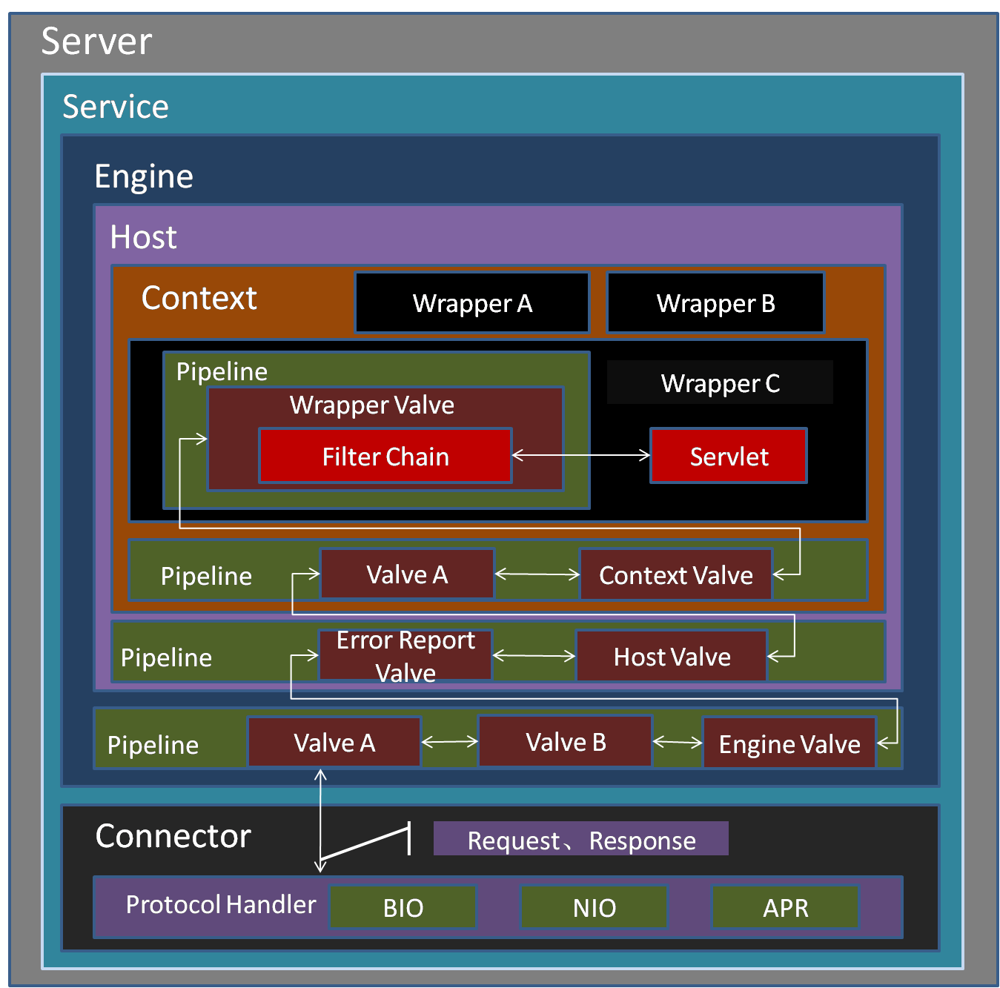

tomcat 总体架构
==========================

首先看两张图

.. image:: ./images/arch_1.jpg
   :height: 1000px
   :width: 900 px
   :scale: 50 %
   :alt: alternate text
   :align: left

一个Server可以包含多个Service，
而一个Service可以包含多个Connector和一个Engine，
一个Engine可以包含多个Host，
一个Host可以包含多个Context，
一个Context可以包含多个Wapper。

从功能的角度将Tomcat源代码分成5个子模块，它们分别是：

    - Jsper子模块：这个子模块负责jsp页面的解析、jsp属性的验证，同时也负责将jsp页面动态转换为java代码并编译成class文件。在Tomcat源代码中，凡是属于org.apache.jasper包及其子包中的源代码都属于这个子模块；

    - Servlet和Jsp规范的实现模块：这个子模块的源代码属于javax.servlet包及其子包，如我们非常熟悉的javax.servlet.Servlet接口、javax.servet.http.HttpServlet类及javax.servlet.jsp.HttpJspPage就位于这个子模块中；

    - Catalina子模块：这个子模块包含了所有以org.apache.catalina开头的java源代码。该子模块的任务是规范了Tomcat的总体架构，定义了Server、Service、Host、Connector、Context、Session及Cluster等关键组件及这些组件的实现，这个子模块大量运用了Composite设计模式。同时也规范了Catalina的启动及停止等事件的执行流程。从代码阅读的角度看，这个子模块应该是我们阅读和学习的重点。

    - Coyote 子模块：如果说上面三个子模块实现了Tomcat应用服务器的话，那么这个子模块就是Web服务器的实现。所谓连接器(Connector)就是一个连接客户和应用服务器的桥梁，它接收用户的请求，并把用户请求包装成标准的Http请求(包含协议名称，请求头Head，请求方法是Get还是Post等等)。同时，这个子模块还按照标准的Http协议，负责给客户端发送响应页面，比如在请求页面未发现时，connector就会给客户端浏览器发送标准的Http 404错误响应页面。

    - Resource子模块：这个子模块包含一些资源文件，如Server.xml及Web.xml配置文件。严格说来，这个子模块不包含java源代码，但是它还是Tomcat编译运行所必需的。

通过上图我们可以看出Tomcat中主要涉及Server,Service,Connector,Engine,Host,Context,Wapper组件。这几大组件在第一节介绍的conf/server.xml文件当中有体现，这也是为嘛，server.xml文件是Tomcat的主要配置文件的原因。默认情况下，server.xml文件的内容如下：

Server
--------------------

Server(服务器)是Tomcat构成的顶级构成元素，所有一切均包含在Server中，Server的实现类StandardServer可以包含一个到多个Services。在Tomcat当中Server接口的默认实现是

    org.apache.catalina.core.StandardServer  

StandardServer的主要功能点如下：

- 管理Service。包括添加，查找等
- 实现Lifecycle，主要管理多个Service的声明周期
- 主线程开启await()监听端口，接收shutdown命令。此处是重点。

Service
------------

多个 Connector 和一个 Container 就形成了一个 Service.

Service 的概念大家都很熟悉了，有了 Service 就可以对外提供服务了，但是 Service 还要一个生存的环境，必须要有人能够给她生命、掌握其生死大权，那就非 Server 莫属了，所以整个 Tomcat 的生命周期由 Server 控制。Service 只是在 Connector 和 Container 外面多包一层，把它们组装在一起，向外面提供服务，一个 Service 可以设置多个 Connector，但是只能有一个 Container 容器。Tomcat中Service的默认实现是

    org.apache.catalina.core.StandardService  

其中StardardService还保持了其管理者Server的引用，另外而需要说明的一点就是，

    org.apache.catalina.startup.Catalina  

也是Service的一个实现。StandardService和Catalina的继承关系图如下：

.. image:: ./images/service_1.png

StandardService的主要功能点如下：

- 管理多个Connecter
- 管理一个容器Container
- 实现Lifecycle，主要管理多个Connector和一个Container的生命周期