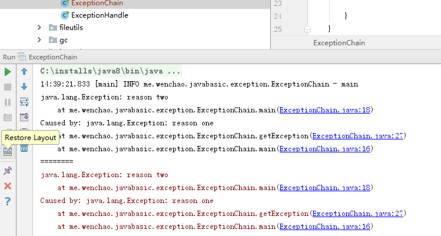
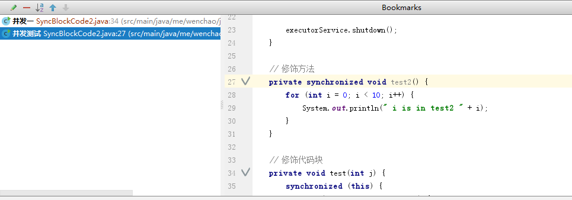
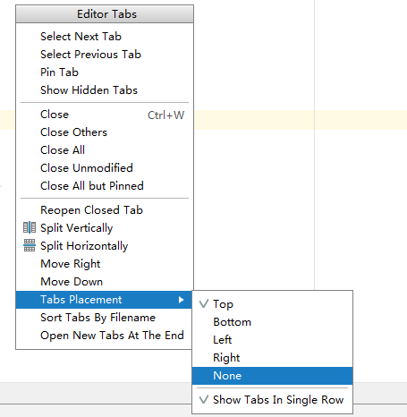
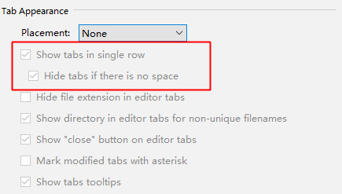
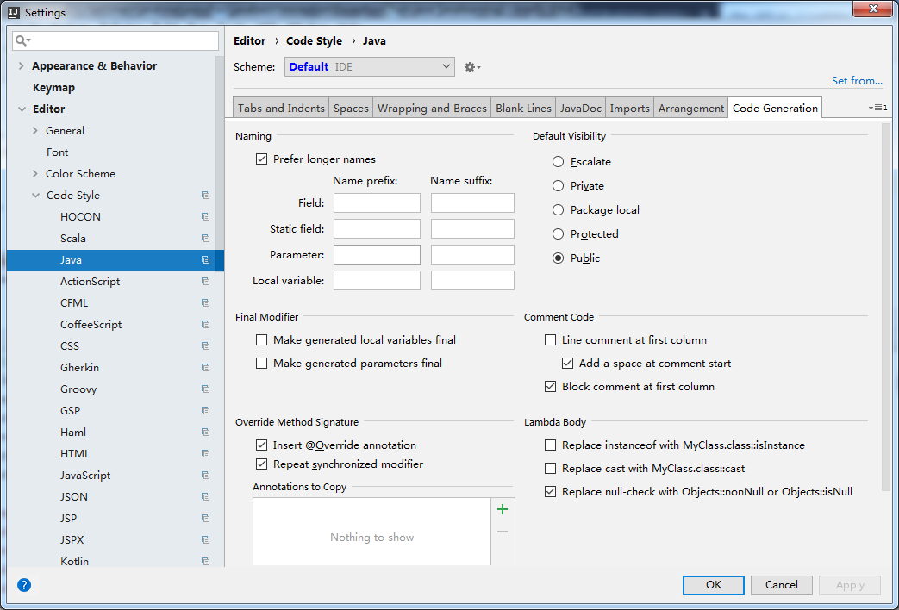
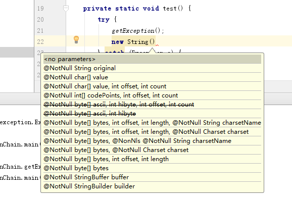

Intellij IDEA 小技巧
==========================

演出模式 Presentation Mode
-------------------------------

Alt+v ---> 选中 enter Presentation Mode

(ctrl+n ctrl+shift+n ctrl+e )

输入Json串
--------------

String str = "";

定位到引号之间 alt+enter ，选择inject language or reference ---> json ---> alt + enter ---> edit json fragment

使用快捷键移动分割线
----------------------

分割线挡住了 java 类的全名，怎么办，之前一直是用鼠标拖分割线

now： alt+1 定位到project视图 ----> ctrl+shift+左右箭头 来移动分割线

ctrl+shift+enter 不只是用来行尾加分号的
--------------------------------------------

ctrl+shift+enter 表示 **收尾** 的意思

比如 

    if (s == null)

这个时候输入 ctrl+shift+enter ，IDEA会自动加上大括号

不要动不动就用idea重构功能
--------------------------

重构
-----------

方法 ： 选中代码块 ctrl + shift + p  ---> 修改为 ctrl + alt + m

变量 ： ctrl + alt + v

静态变量 ： ctrl + alt + c

成员变量： ctrl + alt + f

增加方法参数： ctrl + alt + p

快速补全
------------

ctrl + shift + enter

把鼠标定位到project视图中
-----------------------------

alt+F1 ---> project view --> Project

强大的symbol
----------------

只记得 方法的部分， ctrl+ shift + alt + n

比如 checkuser 只输入 user 即可

或者 

类名首字母.

比如 DemoTest

DT.xxx

如何找到目录
---------------

使用 ctrl + shift + n （找文件的）后， 使用 / 然后输入 文件夹名称 (或者双击shift)

/resour

窗口复位
-------------

生成自动not null 判断语句
----------------------------------

    x.notnull

---->

.. code:: java

    if(x != null){
        
    }

当然你也可以输入 

    x.null

按照模板找内容
---------------------

ctrl + shifte + a  ---> Search Structurally --> 回车跳转到模板视图 ---> 点击 existing templates 按钮 ，选择 try 模板

为了能找出 catch 里面没有处理了异常的代码块，我们需要配置一下 CatchStatement 的 Maxinum count 的值 为 1

点击 edit variable,在界面修改 Maximun count 的值

最后点击 find 按钮

ctrl+shift+a find action
--------------------------

在idea中，每一个操作都可以看作是一个action，使用 ctrl+shift+a  --> 输入action名称即可

ctrl+alt+h call Hierarchy
----------------------------

ctrl+alt+h ----> 调用层次： f4 进入源代码； alt + 8 回到 调用视图

alt + F7  ---> find usage in File

bookmark -- 了解项目关键业务流程方法的利器
---------------------------------------------

将你觉得关键的方法加入标记

步骤如下：

1. 找到你 care about 的方法，按f11，加入到bookmark中

2. 按下 shift + f11，将bookmark列表弹出来

3. 按下 ctrl + enter 修改 bookmar 的名字

只留下一个tab
-----------------

美观简洁 

按 ctrl + shift + a；输入 Editor Tabs

多行tab
-----------

设置代码的注释风格
-------------------

显示同名类或者方法的不同参数
-------------------------------

ctrl + p

ctrl + e 找到最近修改

如何阅读又臭又长的代码
--------------------------------------

- 折叠代码块 定位到想要折叠的代码块，输入 ctrl + shift + . ; ctrl  + + 取消

- 括号匹配 将光标定位到括号的一边， ctrl + [/] 来回定位即可

- 定位变量  ctrl + shift + f7 可以高亮某个变量 ， f3 找到下一个

- ctrl + shift + i 可以查看代码中某个类的定义，定位到类，按该快捷键

- alt + f7 找到使用的地方 （列出变量在那些地方使用了）

撤销
-----

undo ctrl + z

redo ctrl + shift + z

切换皮肤
--------

ctrl + ` 快捷键

增加右侧拖动条 类似sublime
------------------------------

ctrl + shift + a  ---> plugins ---> 安装 codeglance

弹出想看的类
----------------

ctrl + shfit + i

后悔药
--------

ctrl + z

ctrl + shift + z

ctrl + shift + h 小心
-------------------------

查看方法的调用关系

但是要细心看

建议使用 alt + f7 这个快捷键

问题

::

    1. 如何调到源代码  选择条目，点击鼠标或者 f4
    2. 如何回到 ctrl + shift + h 视图 ； alt + 8

参考
------------

http://tengj.top/2017/02/22/idea1-1/