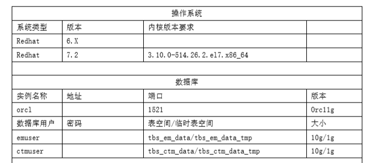
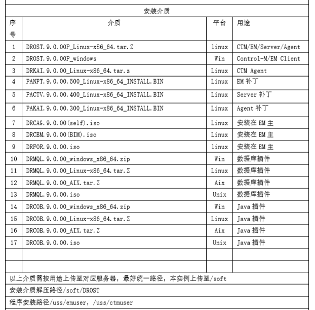
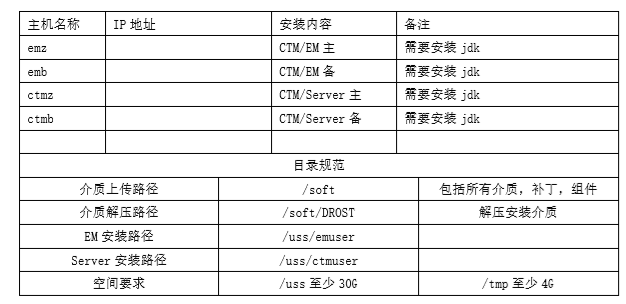
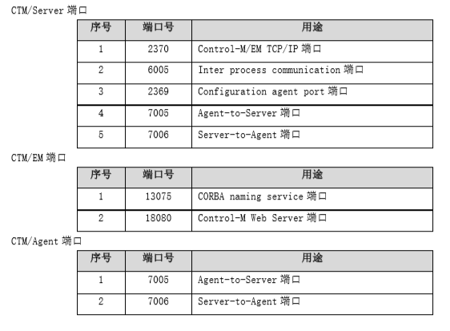
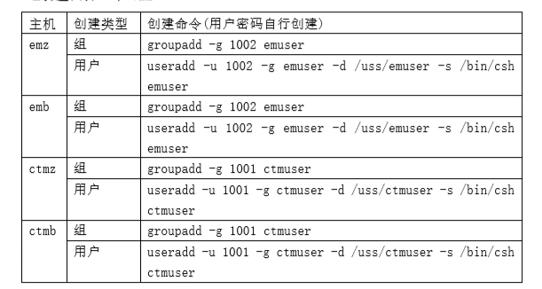

controlM安装手册
==================

系统架构
---------

Control-M 主要包括三大组件：Control-M/Enterprise Manager、Control-M/Server、 Control-M/Agent。其逻辑架构如下图

- Control-M/Enterprise Manager: 主要为终端用户提供图形化交互服务，包括作业 定义界面、作业流监控界面，另外在多个 Control-M/Server 存在的情况下，提供 跨 Control-M/Server 的作业关联，在本项目设置为双机互备。 

- Control-M/Server: 主要充当调度引擎，是整个调度系统的核心。当条件满足的情 况下，自动将作业提交给 Control-M/Agent 端执行，在本项目设置为双机互备。 

- Control-M/Agent、Agentless remote host: 以代理及无代理两种方式部署在应用 服务器端，主要负责作业的执行和状态跟踪，并把结果反馈给 Control-M/Server。 

- .. image:: ./images/controlM_install1.png

生产环境配置建议 
------------------

根据调研资料及 Control-M 容量计算工具计算结果，主要服务器建议配置如下： 

Control-M/Enterprise Manager
  Linux    x86_64 Memory   20G Disk Space 100G 以上 
Control-M/Server
  Linux   x86_64 Memory  32G Disk Space 100G 以上 
Control-M/Agent
  Memory  12G  Disk Space 18G 以上

环境准备 
-------------

- 操作系统

- 安装介质

- 服务器

安装准备
----------

1. 系统内核要求 

  RedHat 7.2：3.10.0-514.26.2.el7.x86_64 

2. 上传介质到服务器

3. 配置主机名、添加解析(上面 4 台机均配置如下 hosts) 

::

  15.0.19.40 emserver1 emserver1.bocd.com.cn
  15.0.19.41 emserver2 emserver2.bocd.com.cn
  15.0.10.12 ntp1.bocd.com.cn
  15.0.19.38 ctmserver1 ctmserver1.bocd.com.cn
  15.0.19.39 ctmserver2 ctmserver2.bocd.com.cn
  15.0.19.42 ctmdb ctmdb.bocd.com.cn

4. 检查如下软件包是否安装 

- Jdk  检测方法：which java/java --version 
- audit-libs-devel/audit-libs  检测方法：rpm –qa|grep audit 
- cracklib  检测方法：rpm –qa|grep cracklib 
- Glibc/glibc-devel  检测方法：rpm –qa|grep glibc 
- Tcsh/ksh  检测方法：rpm –qa|grep tcsh/ksh 
- libgcc  检测方法：rpm –qa|grep libgcc 
- Libselinux/libselinux-devel  检测方法：rpm –qa|grep libselinux 
- libstdc++-devel/libstdc++  检测方法：rpm –qa|grep libstdc++ 
- ncompress  检测方法：rpm –qa|grep ncompress 
- psmisc 检测方法：rpm –qa|grep psmisc 
- compat-libstdc++- 检测方法：rpm –qa|compat-libstdc 

 如果如上包有缺失，可以使用 yum -y install 包名，来安装相关包 

5. 开通对应网络策略 

6.  创建用户和组 

7. 修改用户限制 

vi /etc/security/limits.conf 根据对应的用户添加限制如下： 

.. image:: ./images/controlM_install2_limit.png

8. 修改登录认证 

vi /etc/pam.d/login 添加如下： 

  session    required     /lib64/security/pam_limits.so 

9. 修改系统参数 

vi /etc/sysctl.conf 添加如下： 

::

  kernel.shmmni = 800  
  kernel.sem = 250 32000 100 500  
  fs.file-max = 65536  
  net.ipv4.ip_local_port_range = 32768 61000 
  然后执行 sysctl –p

10. 修改用户目录权限

::

  chmod 755 /uss/emuser
  chmod 755 /uss/ctmuser 

11. 创建数据库用户和表空间 

  *数据库要支持中文，要和 DBA 确认(utf-8) 

**CTM 表空间和用户创建**

1. 创建表空间 

创建临时表空间： 

  create temporary tablespace tbs_ctm_data_temp tempfile 'tbs_ctm_data_temp.dbf' size 500M autoextend on next 62M maxsize 1024M extent management local; 

创建数据表空间： 

  create tablespace tbs_ctm_data logging datafile 'tbs_ctm_data.dbf' size 1024M autoextend on next 62M maxsize 10240M extent management local; 

2. 用户资源限制 

create profile profile_ctmuser limit idle_time unlimited password_life_time unlimited; 

3. 创建用户 

  create user ctmuser identified by ctmuser default tablespace tbs_ctm_data temporary tablespace tbs_ctm_data_temp quota unlimited on tbs_ctm_data profile profile_ctmuser; 

4. 创建角色 

  create role BMC_ROLE_CTMUSER; 

5. 用户授权 

  grant alter session,create procedure,create sequence,create session,select 
  any dictionary,create synonym,create table,create trigger,create view,connect,resource 
  to BMC_ROLE_CTMUSER; 

  grant BMC_ROLE_CTMUSER to ctmuser; grant create table to ctmuser; grant create view to ctmuser; 
 

**EM 表空间和用户创建**

1. 创建表空间 

创建临时表空间 

  create temporary tablespace tbs_em_data_temp tempfile 'tbs_em_data_temp.dbf' size 500M autoextend on next 62M maxsize 1024M extent management local; 

创建数据表空间 

  create tablespace tbs_em_data logging datafile 'tbs_em_data.dbf' size 1024M autoextend on next 62M maxsize 10240M extent management local; 

2. 用户资源限制 

  create profile profile_emuser limit idle_time unlimited password_life_time unlimited; 

3. 创建用户 

  create user emuser identified by emuser default tablespace tbs_em_data temporary tablespace tbs_em_data_temp quota unlimited on tbs_em_data profile profile_emuser; 

4. 创建角色 

  create role BMC_ROLE_EMUSER; 

5. 用户授权 

  grant alter session,create procedure,create sequence,create session,select any dictionary,create synonym,
  create table,create trigger,create view,connect,resource to BMC_ROLE_EMUSER; 

  grant BMC_ROLE_EMUSER to emuser; grant create table to emuser; grant create view to emuser; 

12. 安装介质检测 
