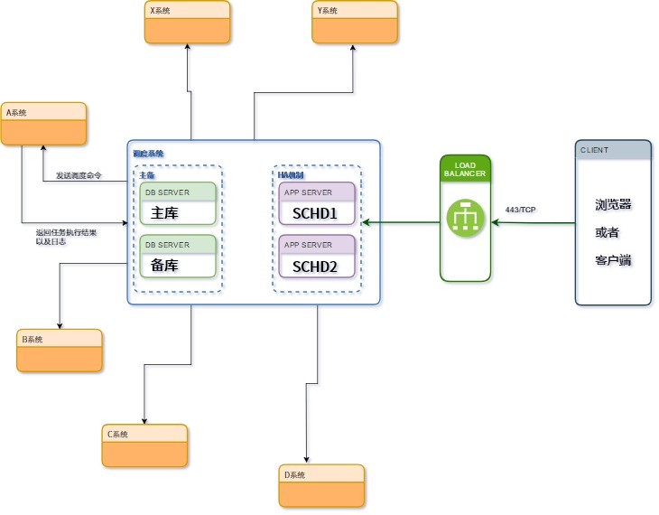

关于调度系统的一些想法
==========================

功能上
-----------

1. 文件传输功能如何做 linux <-> windows 之间

2. 调度程序的类型 (shell,python,java,sql,infa等)

3. 多系统之间如何隔离

4. 如何日切(成功,失败,未执行)

5. 跨系统的依赖问题时通过ok文件传递还是条件传递

6. 如何远程杀死任务

7. 如何暂停任务的执行

8. 如果对任务的跑批状态做一定的判断(如某任务跑批时间超过多久就默认失败,某任务在固定时间段内执行)

9. 文件夹的日历配置

10. 如何定义全局性的变量与局部性的变量

11. 对任务的状态做通知(邮件,短信)

12. 如何获取远程日志

13. 如何查看历史的运行状态(开始时间,结束时间等)

14. 对整个文件夹做任务的统计分析(完成多少,未开始多少,进行中多少,等待资源多少)

15. 对象对弈(包括全局的资源定义,系统级别的资源定义,作业运行时的服务器定义,心跳检查机制)

架构上
-------

