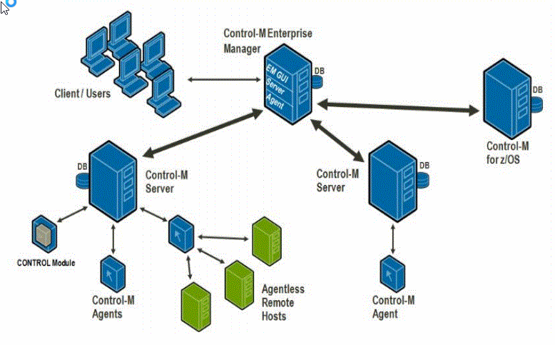
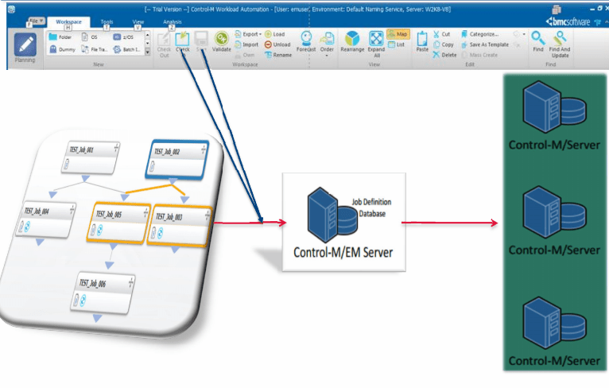
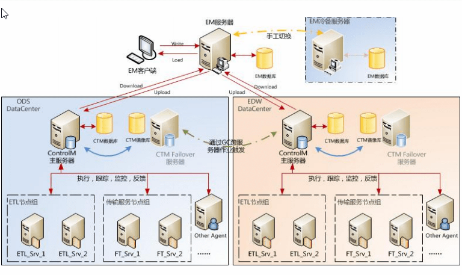
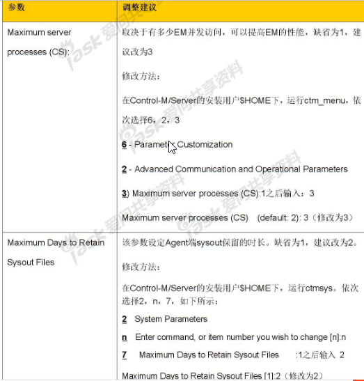

controlM 问题汇总
========================

版权所有 @wenchaofu

1. controlM 连不通 infa
----------------------------

- 描述

    controlM manager 中 etl1.bocd.com 中的 infa插件 的 INFA_ETL --> Test 失败

- 解决

    1. 登录41 ctmagt/ctmagt
    #. shut-ag
    #. start-ag

    重新测试，如果还是失败的话（可能性较大）

    ps –ef|grep p_ctm 杀掉所有进程

    start-ag

- 如果还是不行的话

    那可能是infa服务没有启动(可以手动执行pmcmd startworkflow命令测试一下)；

按照如下步骤启动

::

    首先登陆web界面

    node2:6007/adnimistartor/#admin/

    服务和节点  -> BOCD_REP_SERVICE -> 操作 -> 再次应用服务 -> 中止

- 如果还是不行

::

    重启 WEB 服务

    cd $INFA_HOME/server/tomcat/bin

    sh infaservice.sh  shutdown
    sh infaservice.sh  startup

- 如果还是不行

    
::

    首先登陆web界面

    node2:6007/administartor/#admin/

    服务和节点  -> Domain_node1 -> web 服务中心
    

2. controlM 接收不到返回信息
----------------------------

- 描述

    在agent上的任务已经跑完,查看日志已经返回success,但是controlM中该任务还是黄色(executing)状态

- 解决

    修改agent与en的通讯端口

::

    1. 登录 agent
    2. 切换用户 su - ctmagt
    3. ctmagcfg 命令
    4. 选择 7)      Advanced parameters
    5. 选择 3)      Tracker Event Port 修改端口号

3. EM重启
--------------

- 什么是EM?

用于客户端的GUI作业开发,通过gateway与server连接,管理与控制所有的server与agent

- 步骤

1. 使用emuser登录jobsched1
2. root_menu
3. 1

4. SERVER的重启
---------------------

调度作业,管理作业执行流程,

- 步骤

1. 使用ctmuser登录jobschd1
2. ctm_menu

增补: controlM架构
----------------------

**整体架构**

.. image:: ./images/controlM_arch.png

**作业定义的数据流向**

**案例**

5.限制并发数
-----------------

并发数限制的地方

1. Quality Resource 的 INFA_RC , DB_XXX_RC
2. INFA CONTAINER中的ETL连接连接配置的高级选项中
3. controlM 中的HOSTs MANAGER,在tools->config manager->hosts manager中配置
4. INFA WEB SERVICE 中连接并发数,在console中设置
5. INFA进程并发数,console中设置

逐级递增

详见 `ControlM调用informatica作业性能分析`_

.. _ControlM调用informatica作业性能分析: ./solution_concurrent_performance_report.html

6. container
-------------------

- 问题描述

::

    - Control-M for Databases job fails to complete successfully
    - Error: "<Failed to create or connect to Container. io exception: expected hessian reply at <> , error code <1> "
    - Control-M for Databases jobs give this kind of message to the proclog:
       0526 000500 32 JOB <Job Name> (ORDERID <Order ID>, RUNNO <Run Count>) FAILED TO SUBMIT.
       Error: Failed to create or connect to Container. io exception: expected hessian reply at <
    - Managing Control-M for Databases Account on Control-M Configuration Manager give the same error
    - Non Control-M for Databases job are running well

- 原因

::

    1. Incorrect installation of Control-M for Databases Fix Pack 2. Control-M for Databases container is not stop properly before fixpack installation or not start properly

- 解决步骤

::

    1. Hold all the jobs that to be submitted to this Control-M/Agent
    2. Wait for all jobs to completed on this Control-M/Agent
    3. Stop the Control-M/Agent
    4. Stop the Control-M for Database container by running: ctmdbcontainer stop
    5. Ensure there is no Control-M/Agent or Control-M for Database processes running
        If found, kill the processes
        For example,
        $ ps aux | grep java | grep ctmdb
       ... ./JRE/bin/java -Xmx512m -XX:+HeapDumpOnOutOfMemoryError -Djavax.net.ssl.trustStore=./data/ctmdbcerts -classpath exe/ctmdb.jar:exe/jars/* com.bmc.cm.Start start 0
    6. Restart the Control-M/Agent
    7. Order the Control-M for Database job to start the Control-M for Database Container
    If the above does not resolve this incident and the Control-M for Databases fixpack is being installed before experiencing this problem:
    1. Hold all the jobs that to be submitted to this Control-M/Agent
    2. Wait for all jobs to completed on this Control-M/Agent
    3. Stop the Control-M/Agent
    4. Stop the Control-M for Database container by running: ctmdbcontainer stop
    5. Ensure there is no Control-M/Agent or Control-M for Database processes running
        If found, kill the processes
        For example,
        $ ps aux | grep java | grep ctmdb
       ... ./JRE/bin/java -Xmx512m -XX:+HeapDumpOnOutOfMemoryError -Djavax.net.ssl.trustStore=./data/ctmdbcerts -classpath exe/ctmdb.jar:exe/jars/* com.bmc.cm.Start start 0
    6. Uninstall the Control-M for Database fixpack by following the uninstall procedures provided in the Release Note of the Control-M for Databases fixpack
    7. Reinstall the Control-M for Database fixpack again by following all steps provided in the Release Note of the Control-M for Databases fixpack
    8. Restart the Control-M/Agent
    9. Order the Control-M for Database job to start the Control-M for Database Container

因调度异常造成任务循环发起到2022年
------------------------------------

-- 将edms的作业 HOLD 住

ctmpsm -UPDATEFOLDER EDMS HODS|FREE...

-- 将edms的作业设为END OK 状态

update public.cmr_ajf set status='Y',state='8' where appgroup ='EDMS' and dailyname = 'UD_EDMS' and odate between '20220101' and '20221231'

注意:

::

    controlM 上线需要双人,检查方向如下

    全局影响:

        1. 确认调度是否有问题,比如这回遇到的问题,调度循环发起,作业跑到2022年
        2. 确认全局变量最好不要定义,如若,请符合规范
        3. 检查是否设置资源限制,否则可能容易导致作业并发太大出现agent与server通讯异常

    局部影响:

        1. 检查作业依赖性
        2. 检查作业运行的HOST是否设置正确
        3. 检查Scheduler

调整controlM参数
-------------------------

- 调整 watchdog  参数

修改配置文件

     $HOME/ctm_server/data/config.dat

调整参数

::

        1. WD_CTMEXIT_1_CMD_LINE -LIMIT "2000 M" -PATH $HOME

            该参数设置WD进程对$HOME空间的自动监控,如果少于2000 M 则告警

        2. WD_CTMEXIT_1_CMD_LINE -LIMIT 50

                该参数设置WD进程对DB使用的自动监控,如果少于50% 则告警,因为超过50% 可能临时空间会满

        3. RUNINF_PURGE_LIMIT 

                默认20,建议调整为10,减少保留的统计信息数量,可以提高NEW DAY 性能

        4. RUNINF_PURGE_MODE

                对统计信息进行清理,缺省保留2天,参数取决IOALOG保留的天数,可以提高NEW DAY 性能

- 调整controlM参数

- 数据清理与养护

controlM运行过程中,会产生很多的临时数据,告警数据何警告数据,这些信息累计时间久了,会严重影响controlM的性能

**告警日志的清理**

将7天前的告警日志清理[ctm用户]

        erase_alerts -U <user> -P <password> [-D <date>] [-H <hour>] [-F]

        erase_alerts -U ctem -P xxxx -D 20180404 -H 0000 -F

**condition的清理**[em用户]

        清除时间段内的日期

        ctmcontb -DELETEFROM "*" "20080101" "20081231"

参数设置
----------------

controlM server 参数设置

    ctm_menu 命令

controlM agt 参数设置

    ctmagcfg

日切的作用是什么
--------------------

controlM的安装,HA安装
-----------------------
        

