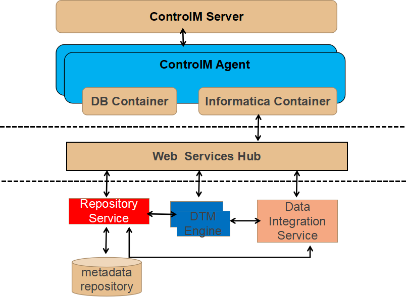
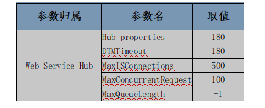

ControlM调用informatica作业性能分析
========================================

问题描述
------------

当ctm 大批量向infa web hub提交作业时，虽然ctm 显示作业处于运行态，但是在infa中显示工作流已完成或者尚未提交。

具体日志如下：

::

  ========================CTM  server=======================
  For example job 1iele. It started at 02:25, then did not receive any update from the informatica until 4:26.
  0409 022553  34 JOB job_xtrc_ifm_tbhissquare (ORDERID 1iele, RUNNO 00001) ACCEPTED, OWNER infa, APPL TYPE ETL_INFA, AGENT NAME etl2.bocd.com.cn
  0409 022553   1 JOB job_xtrc_ifm_tbhissquare (ORDERID 1iele, RUNNO 00001) STARTED (1136069), OWNER infa, APPL TYPE ETL_INFA
  0409 022704  30 JOB job_xtrc_ifm_tbhissquare (ORDERID 1iele, RUNNO 00001) SHORT EXIT SENT TO Control-M/SERVER 'jobschd1.bocd.com.cn'
  0409 042651  29 JOB job_xtrc_ifm_tbhissquare (ORDERID 1iele, RUNNO 00001) RECEIVED EVENT FROM 'ETL_INFA' CM
  0409 042651   2 JOB job_xtrc_ifm_tbhissquare (ORDERID 1iele, RUNNO 00001) ENDED OK   elapsed - 7257.69 Sec   cpu - 100.76 Sec   sysout size - 5001 bytes
  0409 042651  30 JOB job_xtrc_ifm_tbhissquare (ORDERID 1iele, RUNNO 00001) LONG EXIT SENT TO Control-M/SERVER 'jobschd1.bocd.com.cn'
  ==========================Agent==========================
  On Control-M/Agent, the AT process kept tracking the job status from 2:26, then did not receive any update from Informatica server until 4:26pm.
  0409 02:26:02:352 AT:ag_mtrack_file_loop: Got status file '1iele_0001.dsect'
  0409 02:26:02:352 AT:OS_FILE_stat enter: file_name = './status/1iele_0001.dsect'
  .......
  0409 04:26:14:053 AT:ag_mtrack_file_loop: Got status file '1iele_0001.dsect'
  0409 04:26:14:053 AT:OS_FILE_stat enter: file_name = './status/1iele_0001.dsect'
  0409 04:26:44:393 AT:ag_mtrack_file_loop: Got status file '1iele_0001.dsect'
  0409 04:26:44:393 AT:OS_FILE_stat enter: file_name = './status/1iele_0001.dsect'
  0409 04:26:51:211 AT:'_INFA 1iele 00001 1136069
  0409 04:26:51:211 AT:OS_EVENT_receive_from_multiple_senders: got event, or id of tracker-worker: '1iele 00001 1136069
  0409 04:26:51:211 AT:Trying to distribute event '1iele 00001 1136069

从日志中Agent在发起发起作业后，在轮询作业状态；CTM 一直未收到状态信息。

::

    注意： agent 通过轮询文件夹下“~./Comtrol_M_Soft/Agent/DRKAI.9.0.00_Linux-x86_64/ctm/status/”文件，获取作业运行状态；当作业运行期间，hold 时间过久(超过一天)，系统会自动清理status、sysout等文件夹下文件，导致任务无法再从执行态退出。

调用系统架构
-----------------

组件说明
------------

(1)Web service hub

Web service hub 从 Web 服务客户端接收请求，并将 PowerCenter 工作流以服务形式显示出来。

::

  a.构建在tomcat 上，作为独立进程，避免其他informatica 服务故障导致不可用
  b.Web service hub以块为单位处理请求和响应。它将多个请求整合到一个数据块中，集中发送到DTM，
      同理从DTM中以块为单位接收多个响应(针对处理web service 数据流)。
  c.每个从web service hub 到DTM的连接是独立的，请求或响应的每个数据块通过独立连接发送，不会排在其他请求之后；
  d.Web service hub 通过重用活动客户端线程限制上下文交换(DTM 池)

(2)Data Transformation Manager (DTM) 

数据集成服务的组件，用于提取、转换并加载数据以完成数据转换作业。每个session会启用一个DTM

(3)Integration Service process：集成服务进程 

一种接受 PowerCenter 客户端和 pmcmd 发出的请求的进程。集成服务进程管理工作流计划、锁定并读取工作流以及启动 DTM 进程。 

(4)Integration Service：集成服务 

一种应用程序服务，可运行数据集成工作流并将元数据加载到 Metadata Manager 仓库。PowerCenter 集成服务运行 PowerCenter 会话和工作流。

(5)Repository Service：存储库服务 

管理 PowerCenter 存储库的应用程序服务。它在存储库数据库表中检索、插入和更新元数据。 

作业执行流程
--------------

ControlM 执行infa作业流程如下：

a. CTM server 根据调度计划向指定Agent发起作业，根据资源配置情况设置作业状态，如果逻辑资源被占用，则作业处于“等待资源”状态；

b. Agent根据连接并发数和作业并发数限制，判断作业是否被执行，如果被限制，作业处于“等待HOST”状态；否则，与informatica WEB HUB 
   建立连接发送Http请求，等待响应；

c. Web Hub 接收到Http 请求后，访问repository service判断Workflow 是否有效；

d. 如果workflow 在知识库中存在的，在向集成服务发送请求；集成服务接收到请求后管理工作流计划、锁定并读取工作流以及启动 DTM 进程；

e. WEB HUB与具体执行的DTM建立连接，获取运行状态，并向ctm agent 发送响应信息。

从作业执行流程看，在如下地方会对作业并发执行数量有限制：

::

  (1)infa作业逻辑资源限制，包括infa共享资源和抽取对应系统的DB资源；
  (2)Infa作业日志获取粒度，是否获取工作流日志；
  (3)Infa container JVM 大小设置；
  (4)Ctm agent中Maximum Concurrent workflow 大小；
  (5)Agent 节点 Max Concurrent jobs限制；
  (6)Informatica 中节点进程数上限；
  (7)知识库连接上限；
  (8)Web hub 中DTM超时时间；
  (9)Web hub 中SessionExpiryPeriod、MaxISConnections、日志级别、最大并发请求数、堆大小上限

参数分析
-------------

**Informatica中节点配置**

最大进程数(maximum processes threshold)

在节点上运行的每个 PowerCenter 集成服务进程允许的正在运行的最大会话任务或命令任务数。例如，如果您将该值设置为 5，则最多可以同时运行 5 个命令任务和 5 个会话任务。

如果将此阈值设置为较大数字（例如 200），负载平衡器会忽略该阈值。要阻止负载平衡器将任务分派给此节点，请将此阈值设置为 0。默认值为 10。最小值为 0。最大值为 1,000,000,000。用于所有分派模式。

**知识库服务连接数（maximum Connection）**

知识库服务配置会影响节点上启用的进程数量，因为一个任务或者服务进程都需要一个知识库连接，因此知识库连接数与资源(任务)限制有直接关系。如下操作会创建与知识库的连接：

::

  a.客户端工具
  b.管理控制台
  c.集成服务
  d.工作流和session 运行

该参数可以在管理控制台设置，默认值是200,修改该值即时生效。

**Web Service Hub 配置**

- DTMTimeout

Web 服务中心为运行会话而尝试连接或重新连接到 DTM 的时间长度（秒）。默认值为 60 秒。

- SessionExpiryPeriod

会话可以保持空闲状态的秒数 - 超过此时间后会话将超时而且会话 ID 将变为无效。每次客户端应用程序发送具有有效会话 ID 的请求时，Web 服务中心都会重置超时时限的起点。如果请求需要比 SessionExpiryPeriod 属性中设置的时间更长的时间来完成，则会话会在操作期间超时。要避免超时，请将 SessionExpiryPeriod 属性设置为更高值。Web 服务中心会向具有无效会话 ID 的任何请求返回错误响应。
默认值为 3600 秒。可以将 SessionExpiryPeriod 设置在介于 1 和 2,592,000 秒之间。

- MaxISConnections

可以为 Web 服务中心同时打开的到 PowerCenter 集成服务的连接的最大数量。默认值为 20。

- 日志级别

要在日志中包括的 Web 服务中心错误消息的级别。这些消息会写入日志管理器和日志文件。指定以下严重级别之一：

::

  - 致命。将 FATAL 代码消息写入日志。
  - 错误。将 ERROR 和 FATAL 代码消息写入日志。
  - 警告。将 WARNING、ERROR 和 FATAL 代码消息写入日志。
  - 信息。将 INFO、WARNING 和 ERROR 代码消息写入日志。
  - 跟踪。将 TRACE、INFO、WARNING、ERROR 和 FATAL 代码消息写入日志。
  - 调试。将 DEBUG、INFO、WARNING、ERROR 和 FATAL 代码消息写入日志。

默认值为 INFO。

- MaxConcurrentRequests

请求处理线程的最大允许数量，它确定了可以处理的并发请求最大数量。默认值为 100。

- 堆大小上限

分配给运行 Web 服务中心的 Java Virtual Machine (JVM) 的 RAM 数量。使用此属性可提高性能。

- JVM 命令行选项

用于运行基于 Java 的程序的 Java Virtual Machine (JVM)命令行选项。配置 JVM 选项时，必须设置 Java SDK 类路径属性、Java SDK 内存下限属性和 Java SDK 内存上限属性。
必须设置以下 JVM 命令行选项：

- Dfile.encoding。

文件编码。默认值为 UTF-8。

整理资料配置
-------------

解决方案
---------------

一: ControlM 配置
^^^^^^^^^^^^^^^^^^

::

  (1)Infa作业配置全部添加infa_rc资源，资源数设置为90
  (2)为infa作业连接的数据库设置资源DB_XXX_RC，默认值为30
  (3)取消infa 作业获取工作流日志选项
  (4)Agent informatica connection[INFA_ETL] 配置中设置Maximum Concurrent workflow 为100
  (5) Agent 节点Hosts Manager中的 Max Concurrent jobs 为150
  (6) 设置Informatica container 最大和最小内存堆栈为2G

           修改~/Comtrol_M_Soft/Agent/DRKAI.9.0.00_Linux-x86_64/ctm/cm/INF/exe
           路径下ctminfcontainer 脚本，修改内容如下：

          ./JRE/bin/java -Xms2048m -Xmx2048m -classpath exe/${cm_jar} com.bmc.ctm.cminf.Start $*  

通过命令 ctminfcontainer stop 停止当前进程，通过ps -ef|grep ctminf.jar 查看服务是否启停。

二: Informatica设置
^^^^^^^^^^^^^^^^^^^^^^^^^

::

  (1)Informatica node中节点进程数(maximum processes threshold)上限设置为100
  (2)BOCD REP中 知识库连接上限（maximum Connection）设置为300
  (3)Web hub 中DTM超时时间60
  (4)Web hub 中SessionExpiryPeriod设置为21600
  (5)Web hub 中MaxISConnections设置为100
  (6)Web hub 中 日志级别设置为 警告
  (7) Web hub 中 最大并发请求数（MaxConcurrentRequests）设置为 300
  (8) Web hub 中 堆大小上限 4086m
  (9) Web hub 中JVM 命令行选项:
            -Xms4096m 
            -Dfile.encoding=UTF-8 
            -Dcom.sun.management.jmxremote 
            -Dcom.sun.management.jmxremote.rmi.port=8899
            -Dcom.sun.management.jmxremote.port=8899
            -Dcom.sun.management.jmxremote.authenticate=false
            -Dcom.sun.management.jmxremote.ssl=false

三: 定期清理日志
^^^^^^^^^^^^^^^^^^^^^^^^^^

定期清理Informatica 日志，包括：

(1) pmrep truncatelog -t 5 （保留最近5天日志）

(2) 清理会话日志与工作流日志

::

  /home/infa/Informatica/9.6.1/server/infa_shared/SessLogs
  /home/infa/Informatica/9.6.1/server/infa_shared/WorkflowLogs