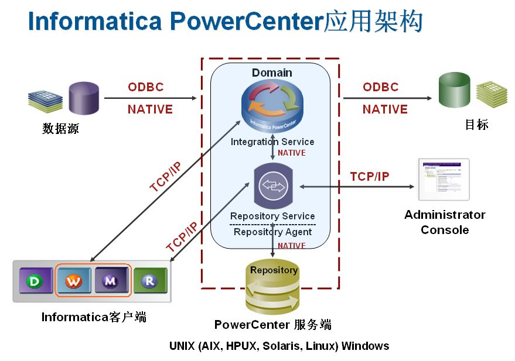
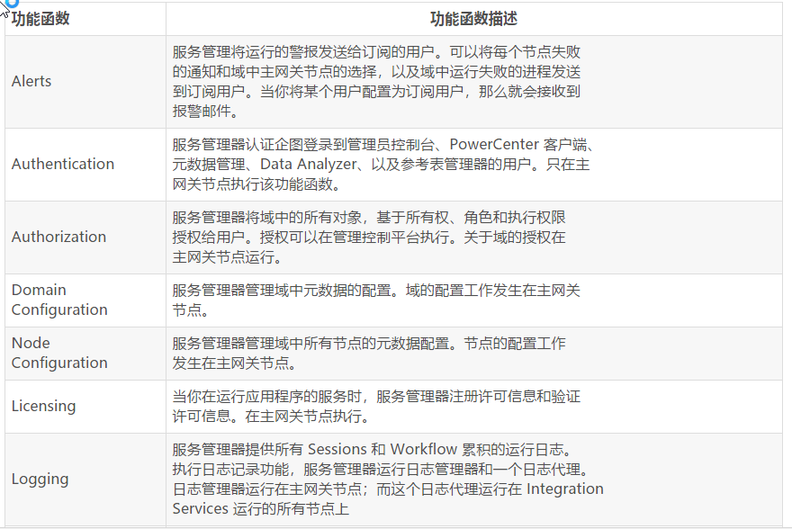

infa 学习
==============

架构
----

- Informatica Service：PowerCenter服务引擎

- Integration Service：数据抽取、转换、装载服务引擎

- Repository Service：知识库Service，管理ETL过程中产生的元数据

- Repository 的数据存储在第三方数据库（如oracle）中

体系架构之 Domain
-----------------------

PowerCenter 是一种基于服务的体系架构。它可以通过在多台机器上面建立集群来共享资源，
这就极大的扩展了它的可用性。由于集群的高可用性可以极大的缩小由于不可预期的系统故障
或者定期的维护导致的系统停机的概率。

PowerCenter 的 Domain(域) 是 PowerCenter 的基本管理单元。域支持分布式的管理模式。
一个域是一系列的 Nodes (节点) 和 Services (服务) 的集合，可以基于权限在文件夹中进行分组管理。

domain = n(nodes) + n(services)

一个Nodes (节点) 在逻辑上代表着一个域中一台机器。域中的一个充当网关的节点负责从客户端接收服务请求，同时把他们路由到合适的服务和节点中去。所有的服务和流程都在域中的节点上运行。在节点上运行的服务或者流程的可用性取决于你如何配置服务和节点。

services 主要包括 Service Manager (管理服务) 和 一组 Application Services (应用程序服务)：

::

    Service Manager：是指管理所有域操作的服务。它来运行 Application Services (应用程序服务) 
    以及执行在每个节点上运行的域功能函数。域功能函数主要包括身份验证、授权以及记录日志。 

    Application Services：主要是指代表着 PowerCenter 的给予服务的功能，
    例如 Repository Service (资料库服务) 以及 Integration Service (集成服务)。
    一个节点上运行的应用程序服务主要取决于你配置服务的方式。 

    Service Manager (管理服务) 和 Application Services(应用程序服务)控制着 PowerCenter 的安全。

    Service Manager 主要负责管理登录到 PowerCenter 应用程序的用户和用户组，
    以及对试图登录到 PowerCenter 应用程序的用户或者用户组进行权限验证。

    Service Manager 和 Application Services 处理已授权用户的从应用程序端发出的请求。

    关于更多安全方面的知识，参见“第五部分 安全”。

通过域管理控制台可以集中管理域中的所有任务和对象，

包括

Services (服务)、Nodes (节点)、licenses (授权码)、grids (网格)、Users (用户)、Groups (组)和 Roles。可以在域管理控制台管理域以及配置域的安全性。

如果你有高可用性的需求，可以扩展服务以消除单点故障。这样就可以避免由于网络故障或者硬盘损坏造成系统的不可用。

Nodes (节点)
----------------

在一台机器上面安装 PowerCenter 服务的时候，就将这台机器添加到域中作为一个节点。可以将多个节点添加到域中。

域中每个节点都运行一个 Service Manager，用于管理域操作。Service Manager (服务管理器) 执行的操作依赖于节点的类型。

一个节点可以是网关节点或者是工作节点。你可以订阅警报来接收节点的(异常)事件，包括节点故障或主网关的选择。

- 网关节点

可以将域中的任意节点配置为网关节点。在任何给定的时间内充当网关的节点被称为主网关节点。一个网关节点可以运行应用程序服务，也可以作为一个主网关节点。主网关节点是整个域的入口。

在域主网关节点上运行的服务管理执行所有域主网关节点上的操作，而在其他网关节点上运行的服务管理只能在其上执行有限的域操作。

你可以将不止一个节点配置为网关节点。如果一个主网关节点失效，那么在其他网关上运行的服务管理器会选出另外一个主网关节点。如果你配置的所有网关节点都失效之后，那么整个域都不能接收服务请求。

- Worker Nodes

没有被配置为网关的节点称为工人节点。

工人节点可以运行应用程序服务，但是不能作为网关。服务管理器在工人节点上只能运行有限的域操作。

Service Manager 服务管理器
---------------------------------

管理所有域操作的服务。它以服务的形式运行在 Informatica 的服务中

在 Windows 环境中它以服务的形式展现，而在 Unix 系统中它以守护进程的方式运行。

当你启动 Informatica Services 的时候，就启动了服务管理器。服务管理器在每个节点上运行。如果服务管理器没有运行，那么该节点就无效。

在域中所有节点上运行的服务管理器负责支撑应用程序的运行和域操作：

- 支撑应用程序

::

  在每个节点上运行的服务管理器负责启动配置在该节点上的应用程序服务。服务管理器根据客户端的请求，
  来启动或者关闭服务以及相应的服务进程；
  而且服务管理器还将请求应用于应用服务。服务管理器和应用程序间通过 TCP/IP 协议进行沟通。

- 支撑域

::

  在域中的各个节点上运行的服务管理器执行各种功能函数来支撑整个域。
  在节点上运行的服务管理器执行的功能函数取决于该节点的类型。
  比如：在主网关节点上运行的服务管理器负责执行所有的域功能函数；
  而在其他节点上运行的服务管理器则执行某些功能函数。

服务管理器运行的域功能函数列表：

Application Services
-------------------------

应用程序服务主要是代表 PowerCenter 基于服务的功能函数。

主要包括 

::

  Repository Service
  Integration Service
  Reporting Service
  Metadata Manager Service
  Web Services Hub
  SAP BW Service
  Reference Table Manager Service

当你配置应用程序服务时，它会运行在你分配的节点上。

你还可以在多个节点上创建一个网格，然后分配 Integration Service 在网格上运行。
当你在一个网格上运行一个 Workflow 的时候，Integration Service 会分发 Workflow Tasks 在网格中的各个节点上运行。

安全管理
----------

服务管理器、应用程序服务控制 PowerCenter 安全应用程序。

服务管理器和应用程序服务通过以下功能函数控制安全性：

加密：当你登录到 PowerCenter 客户端应用程序时，PowerCenter 会加密登录密码。

身份验证：当你登录到 PowerCenter 客户端应用程序时，服务管理器会验证你的用户名和密码。

授权：当你在 PowerCenter 的应用程序中请求某个对象的时候，Service Manager, Repository Service, Metadata Manager Service, Reporting Service, 或者 Reference Table Manager Service 会基于你的所有权、角色、执行权进行相应的判断是否有该项权利。

PowerCenter 的一个选项高可用性，主要为了消除单点故障以及尽力缩短由于故障导致的宕机时间。

高可用性
---------

弹性时间：所谓弹性时间是指，PowerCenter 服务能够忍受一定时间的网络故障，直到超出弹性时间或者外部系统故障已经修复。

故障转移：当一个正在运行服务的节点失败时，会将服务或者是执行的任务转移到另外一个节点上面。

故障恢复：当一个运行的服务失败后，会自动修复执行任务。Integration Service 和 Reporting Services 的失败可以自动恢复。你也可以手动恢复 Workflows 和 Sessions ，当然了手动恢复故障不属于高可用性。

参考
-----

https://blog.csdn.net/u012174410/article/category/3077547

