kettle快速入门
====================

安装
-------

kettle 是免安装版本,下载下zip后直接解压缩就可以运行

开发作业是,运行

::

  windows下: spoon.bat
  linux  下: spoon.sh

运行如上命令会打开作业定义界面,如下

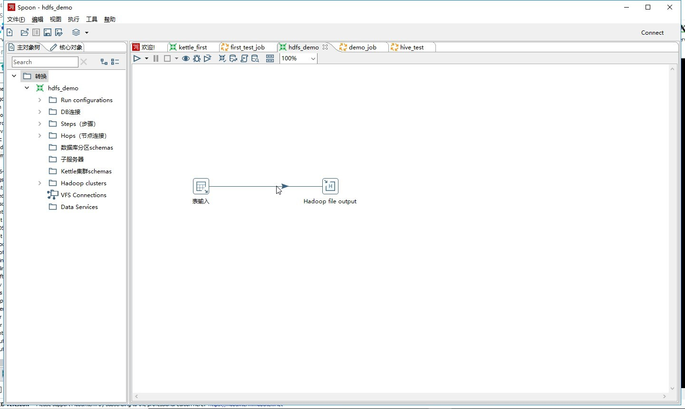

使用
-------

概述
^^^^^^

先定义转换作业,然后将转换作业串起来就是作业流程了

转换作业类似于infa的design里面定义的mapping

流程作业类似月infa的workflow里面的作业流

作业转换的定义
^^^^^^^^^^^^^^^^^^^

1. 打开主界面 spoon.bat

2. 文件 -> 新建 -> 转换 或者快捷键ctrl-N

在[核心对象]中,找到输入,输出,拖到右侧编辑面板

将输入输出连接起来[shift + 鼠标左键]

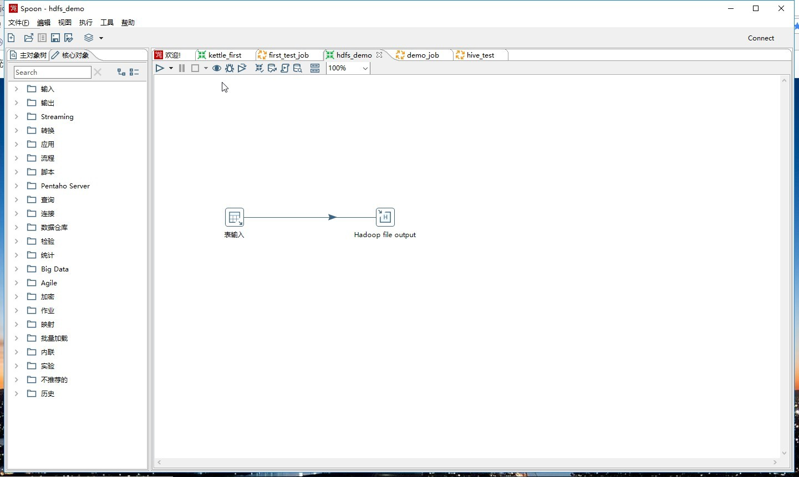

作业流程的定义
^^^^^^^^^^^^^^^^^^^

1. 打开主界面 spoon.bat

2. 文件 -> 新建 -> 作业 或者快捷键ctrl-ALT-N

在通用里面拖入 start,转换等组件

如图所示

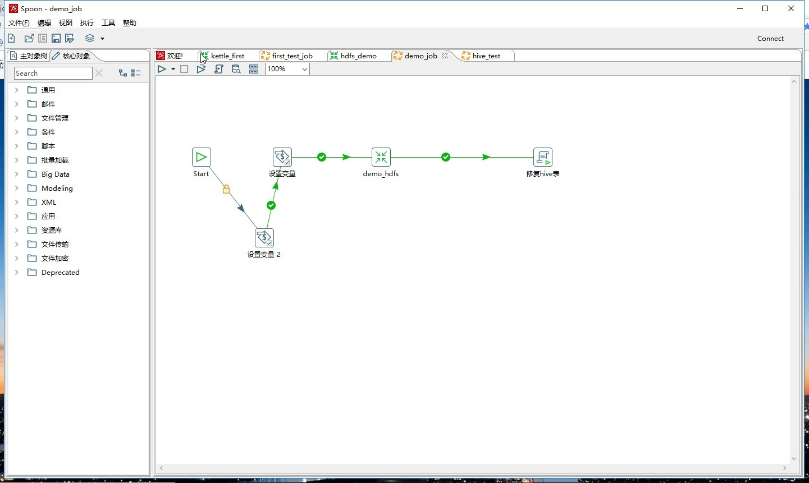

作业运行
^^^^^^^^^^^^^

在作业界面点击左上方三角形运行作业

jdbc连接
^^^^^^^^^^

例: mysql jdbc连接配置

1. 将mysql驱动放入kettle安装路径的lib文件夹中

2. 在转换的主对象树中,右键[DB连接],新建

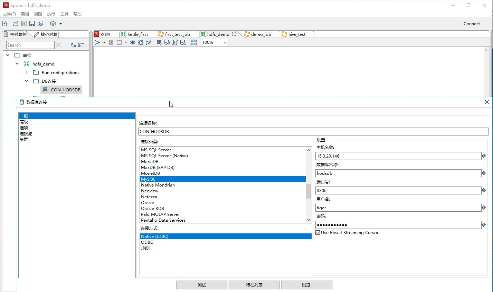

测试连接

hive连接问题处理
^^^^^^^^^^^^^^^^^^^^^^

hive连接也是配置jdbc连接,按道理来说跟上面的jdbc连接一样,事实上在windows版本中确实如此,
但是在linux中却报各种错误

解决方案如下

1: 将hive驱动放入kettle安装路径的lib文件夹中

2. 将hive驱动放入 ${KETTLE_INSTALL_HOME}/plugins/pentaho-big-data-plugin/hadoop-configurations/cdh61/lib

3. 删除${KETTLE_INSTALL_HOME}/plugins/pentaho-big-data-plugin/hadoop-configurations/cdh61/lib路径下的其他版本的驱动

4. 删除缓存

rm -rf ${KETTLE_INSTALL_HOME}/system/karaf/cache

5. 启动调用程序

sh kitchen.sh -file:myjob/demo_job.kjb -param:JOB_PROPERTIES=properties/demo1.properties

::

  2019/07/29 14:47:43 - CON_HODSDB - 为'CON_HODSDB'创建数据库连接池成功
  七月 29, 2019 2:47:43 下午 org.apache.cxf.endpoint.ServerImpl initDestination
  信息: Setting the server's publish address to be /marketplace
  2019/07/29 14:47:45 - 表输入.0 - Finished reading query, closing connection.
  2019/07/29 14:47:45 - 表输入.0 - 完成处理 (I=78, O=0, R=0, W=78, U=0, E=0)
  2019/07/29 14:47:45 - Hadoop file output.0 - 完成处理 (I=0, O=79, R=78, W=78, U=0, E=0)
  2019/07/29 14:47:45 - Carte - Installing timer to purge stale objects after 1440 minutes.
  2019/07/29 14:47:45 - demo_job - 开始项[修复hive表]
  2019/07/29 14:47:46 - demo_job - 完成作业项[修复hive表] (结果=[true])
  2019/07/29 14:47:46 - demo_job - 完成作业项[demo_hdfs] (结果=[true])
  2019/07/29 14:47:46 - demo_job - 完成作业项[设置变量] (结果=[true])
  2019/07/29 14:47:46 - demo_job - 完成作业项[设置变量 2] (结果=[true])
  2019/07/29 14:47:46 - demo_job - 任务执行完毕
  2019/07/29 14:47:46 - Kitchen - Finished!
  2019/07/29 14:47:46 - Kitchen - Start=2019/07/29 14:47:36.896, Stop=2019/07/29 14:47:46.567
  2019/07/29 14:47:46 - Kitchen - Processing ended after 9 seconds.

配置如下图所示

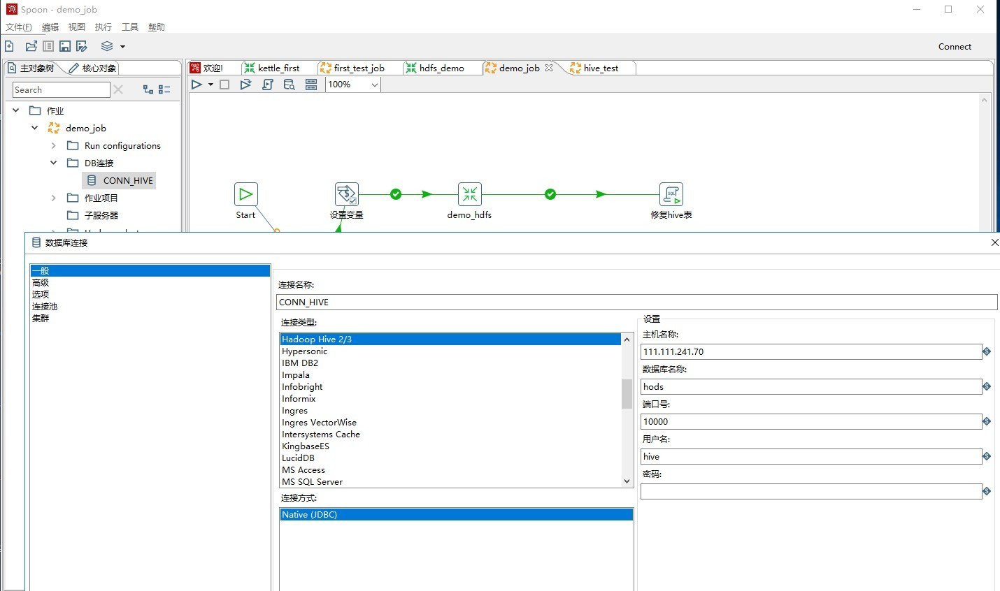

写入hdfs
^^^^^^^^^^^^

1. 转换中配置大数据环境

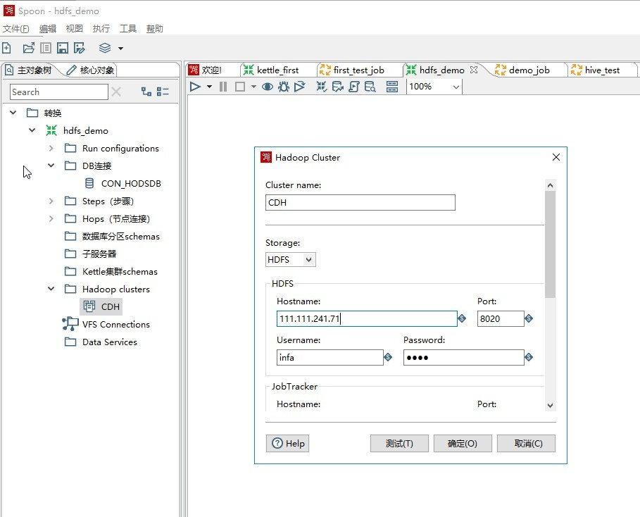

用户密码不重要

点击测试会报错,按如下方式解决

1.1. 修改配置文件

::

  cd ${KETTLE_INSTALL_HOME}/plugins/pentaho-big-data-plugin
  vi plugin.properties

    修改该项为 active.hadoop.configuration=cdh61

  cdh61 来自于 
  cd ${KETTLE_INSTALL_HOME}/plugins/pentaho-big-data-plugin/hadoop-configurations下文件夹的名称

1.2. 修改大数据配置文件

复制集群中的 core-site.xml，

将该 xml 文件复制到 plugins\pentaho-big-data-plugin\hadoop-configurations\cdh61，

替换原有 core-site.xml

2. 配置输入

3. 配置hdfs输出

[转换]的[核心对象]中找到[Big Data],拖入[Hadoop file output],如下配置

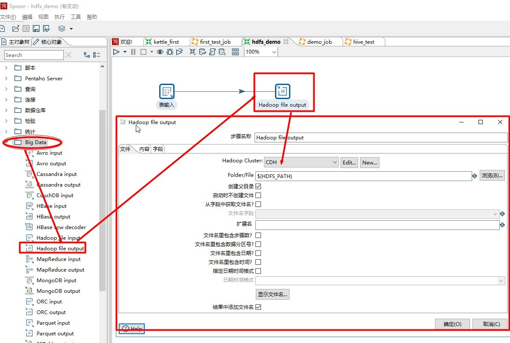

参数定义
^^^^^^^^^

**变量的定义**

参数只有在作业的位置参数中定义,命令行调用的时候才能传递进来

1. 在作业中定义位置参数,作业的空白处双击,或者右键

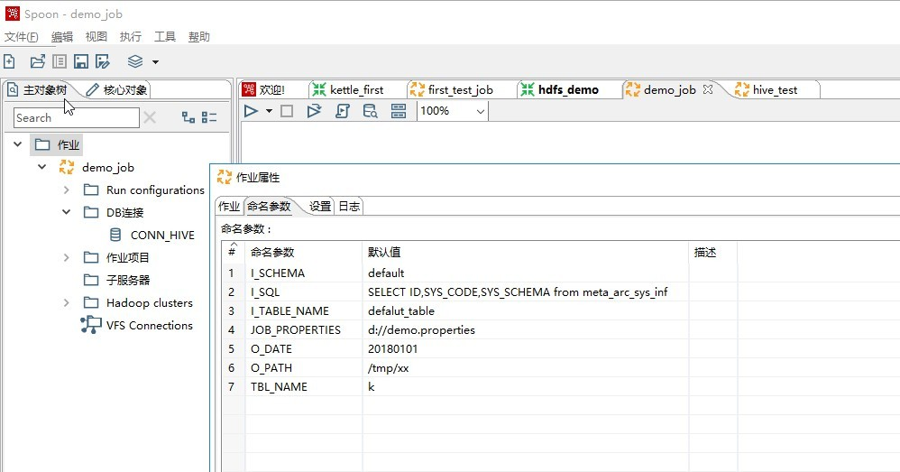

填写上默认值,如果这里没有定义该参数, -param选项传递不进来

2. 在[核心对象]中[通用]拖一个[设置变量]组件

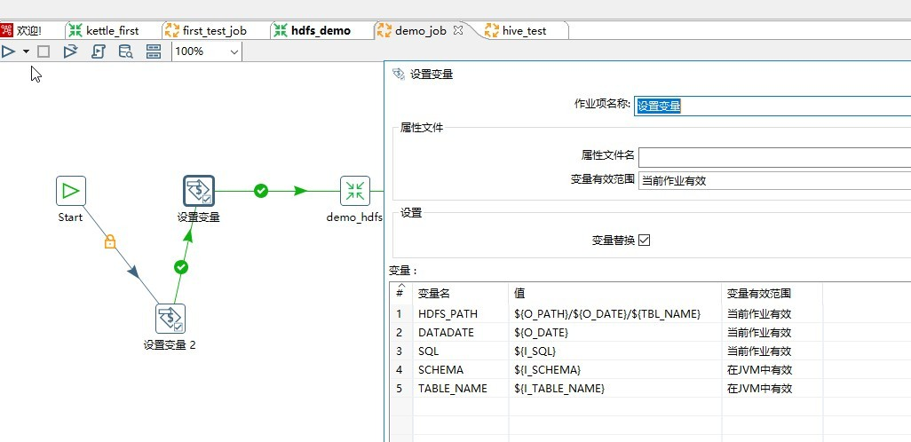

3. 在后面的 转换 组件中 就可以使用该变量

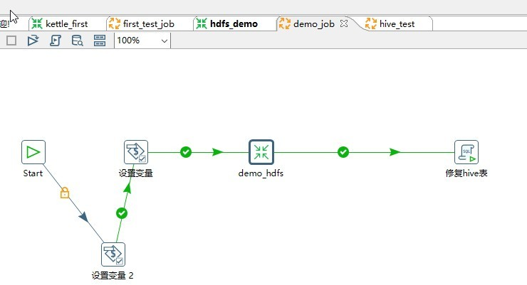

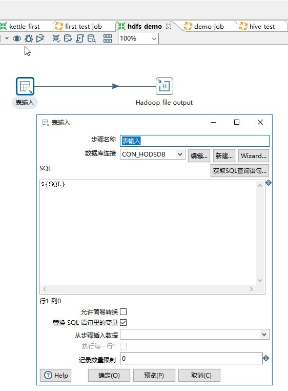

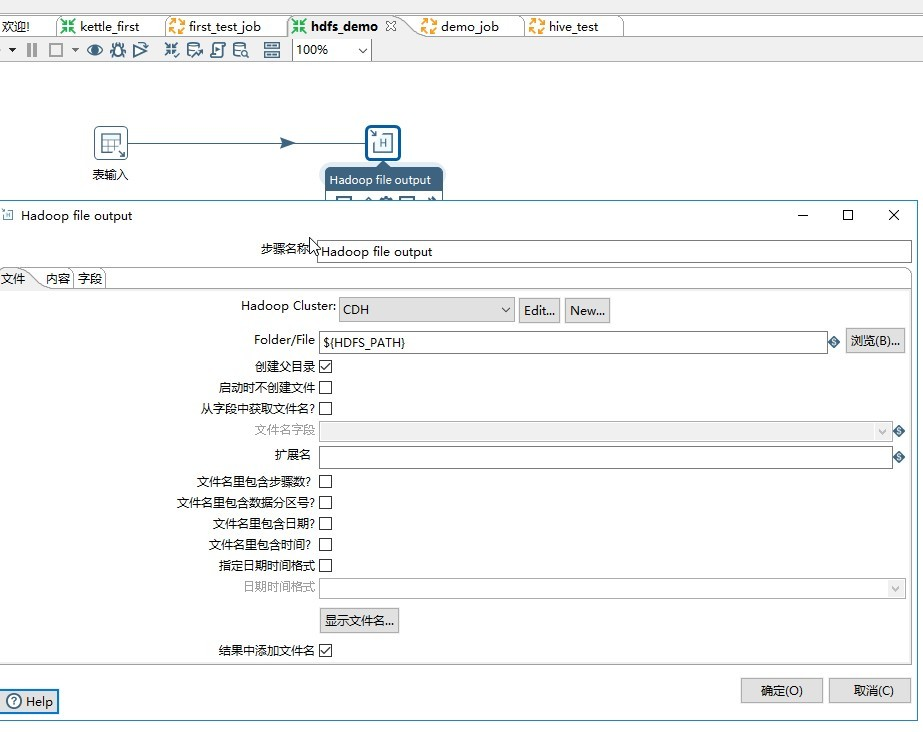

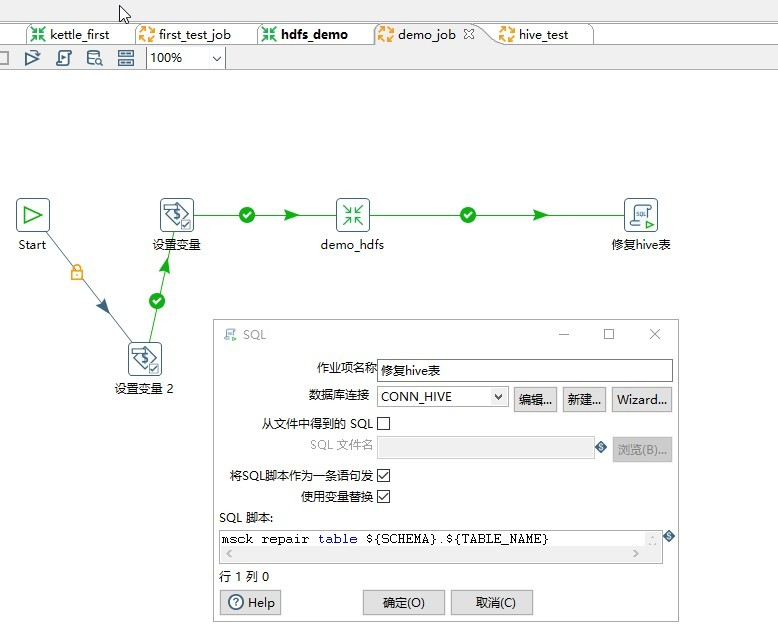

4. 调用命令

::

  sh kitchen.sh -file:myjob/demo_job.kjb \
  -param:I_SQL=SELECT ID,SYS_CODE,SYS_SCHEMA from meta_arc_sys_inf -param:I_TABLE_NAME=cdc_prm_users \
  -param:I_SCHEMA=hods -param:O_DATE=20190105 \
  -param:O_PATH=/tmp/xxx -param:TBL_NAME=kettle

这里写了一个脚本,参数从配置文件中获取,只需要在配置文件中配置每个作业传递的参数键值对

::

  [kettle@app2 conf]$ more test.conf
    [JOB.DEMO1]
    #I_SQL:='SELECT\ ID,SYS_CODE,SYS_SCHEMA\ from\ meta_arc_sys_inf'
    I_TABLE_NAME:=cdc_prm_users
    I_SCHEMA:=hods
    ODATE:=20190105
    O_PATH:=/tmp/xxx
    TBL_NAME:=kettle

脚本名字叫 kitchen_batch.sh,见附录

这里参数传递有一个**问题**,就是参数值不能包含空格,不如sql语句,否则会报错,所有换成了下面参数文件的传递方式

**参数文件的定义**

作业执行的时候将文件作为参数传递进来

1. 第一个 [设置参数] 将文件传递过来

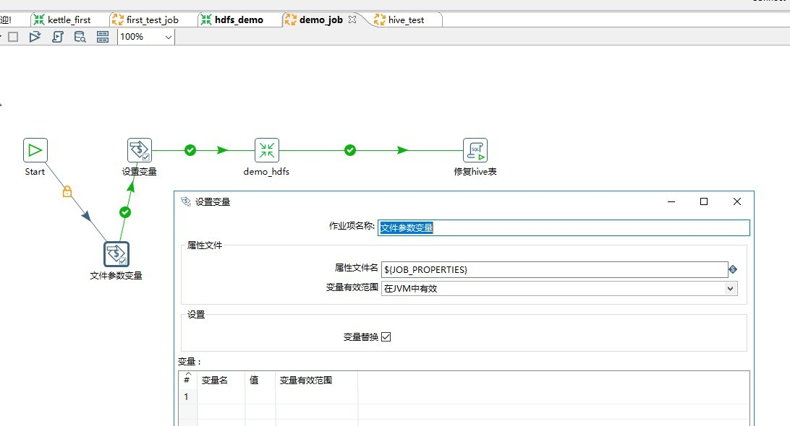

2. 第一个 [设置参数] 获取文件中配置的参数传给内部变量

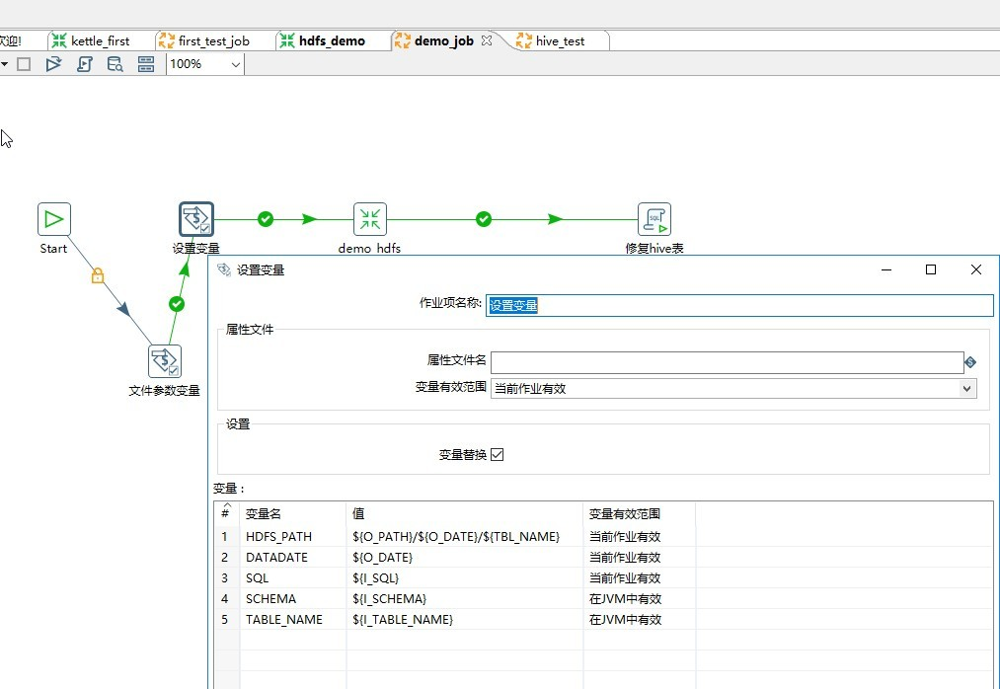

3. 作业空白处双击,弹出作业属性配置框

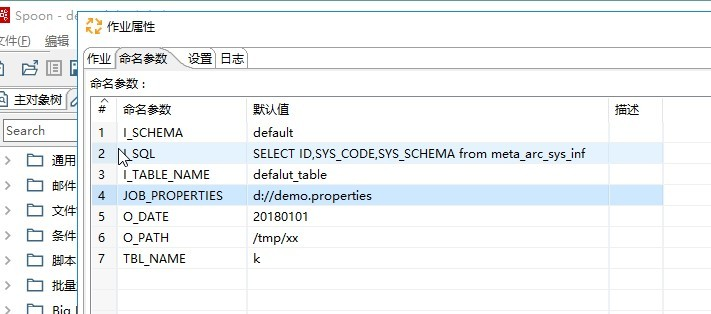

只有第四行的JOB_PROPERTIES参数需要,其他不需要

4. 配置文件

::

  [kettle@app2 properties]$ more demo1.properties
  I_SQL=SELECT ID,SYS_CODE,SYS_SCHEMA from meta_arc_sys_inf
  I_TABLE_NAME=cdc_prm_users
  I_SCHEMA=hods
  O_DATE=20190111
  O_PATH=/tmp/xxx
  TBL_NAME=kettle
  [kettle@app2 properties]$  

5. 命令行调用

  sh kitchen.sh -file:myjob/demo_job.kjb \
  -param:JOB_PROPERTIES=properties/demo1.properties

附录A
^^^^^^^

kitchen_batch.sh 脚本内容如下

::

  #!/bin/sh
  # @AUTHOR   wenchaofu 
  # @DATE     2019年7月26日14:57:26      
  # @VERSION  1.0\
  # @DESC     

  ## 参数检查
  if [ $# -ne 2 ];then
     echo "Usage: $0 <SECTION> <ODATE>"
     echo " --<ODATE> : YYYYMMDD "
     exit 0
  fi

  declare -r SECTION=$1
  declare -r ODATE=$2

  declare -r BASE_PATH=$(cd `dirname $0`; pwd)
  declare -r CTL_CONFIG="${BASE_PATH}/conf"
  declare -r TOOL_PATH=/home/kettle/opt/data-integration

  declare -r FORMAT_DATE=$(date -d $ODATE +%Y%m%d) 
  declare -r YEAR=$(echo ${FORMAT_DATE}|cut -c1-4)
  declare -r MONTH=$(echo ${FORMAT_DATE}|cut -c5-6)
  declare -r DAY=$(echo ${FORMAT_DATE}|cut -c7-8)

  #读取配置文件
  #
  #read_cfg  cfg_path  section key
  # 
  function getKeyValuePairs(){

          local filename=$1
          local section=$2   

          local cfgFile=${CTL_CONFIG}/${filename}

          if [ -f ${cfgFile} ];then
              echo $(grep -v "#" ${cfgFile}|sed -n "/\[${section}/,/\[JOB\./p"|grep -v "\[JOB\."|grep -v ^$|sed "s#[Yy]\{4\}\(.\?\)[Mm]\{2\}\(.\?\)[D|d]\{2\}#${YEAR}\1${MONTH}\2${DAY}#g"|awk -F ":=" '{print "-param:"$1"="$2" "}')
          else
              echo "can't find value via key,exit this shell..." 
              exit 3
          fi
  }

  function main(){
          local params=$(getKeyValuePairs test.conf ${SECTION})
          echo "params pair is "$params
          ${TOOL_PATH}/kitchen.sh -file:jobs/demo_job.kjb $params

  }

  main

附录B
^^^^^^^

kitchen_profile.sh 脚本内容如下

::

  #!/bin/sh
  # @AUTHOR   wenchaofu
  # @DATE     2019年7月26日14:57:26
  # @VERSION  1.0
  # @DESC     表名，日期

  ## 参数检查
  if [ $# -ne 2 ];then
     echo "Usage: $0 <TABLENAME> <ODATE>"
     echo " --<ODATE> : YYYYMMDD "
     exit 0
  fi

  declare -lr TABLENAME=$1
  declare -r ODATE=$2

  declare -r FORMAT_DATE=$(date -d $ODATE +%Y%m%d)
  declare -r YEAR=$(echo ${FORMAT_DATE}|cut -c1-4)
  declare -r MONTH=$(echo ${FORMAT_DATE}|cut -c5-6)
  declare -r DAY=$(echo ${FORMAT_DATE}|cut -c7-8)

  declare -r BASE_PATH=$(cd `dirname $0`; pwd)
  declare -r TEMPLATES_CONFIG="${BASE_PATH}/templates"
  declare -r PROFILES_CONFIG="${BASE_PATH}/profiles/${FORMAT_DATE}"
  declare -r TOOL_PATH=/home/kettle/opt/data-integration

  declare -r TEMPLATE_FILE=${TEMPLATES_CONFIG}/${TABLENAME}.properties.template
  declare -r PROFILE_FILE=${PROFILES_CONFIG}/${TABLENAME}.properties

  [ -d ${PROFILES_CONFIG} ] || {
    mkdir -p ${PROFILES_CONFIG}
    echo "mkdir success..."
  }

  #读取配置文件
  # get conf file from template file with tablename; like tab.properties.template
  #
  function genProfileWithTemplate(){

          echo "begin to gen profile ... "
          [ -f ${TEMPLATE_FILE} ] && grep -v "#" ${TEMPLATE_FILE}|grep -v ^$ \
                  |sed "s#[Yy]\{4\}\(.\?\)[Mm]\{2\}\(.\?\)[D|d]\{2\}#${YEAR}\1${MONTH}\2${DAY}#g" \
                   >${PROFILE_FILE} 
          return $?
  }

  function main(){
          genProfileWithTemplate || {
            echo -e "******************** \n gen profile failed \n ******************** "
            exit 1
          }

          echo -e "******************** \n begin to execute job \n *********************"
          ${TOOL_PATH}/kitchen.sh -file:myjob/demo_job.kjb -param:JOB_PROPERTIES=${PROFILE_FILE} && \
          echo -e "************************* \n job complete successed  \n ****************"
  }

  main

参考
^^^^^^^^^

`kettle 从数据库表将数据写入 hadoop hdfs`_

.. _`kettle 从数据库表将数据写入 hadoop hdfs`: https://blog.csdn.net/maenlai0086/article/details/81170633