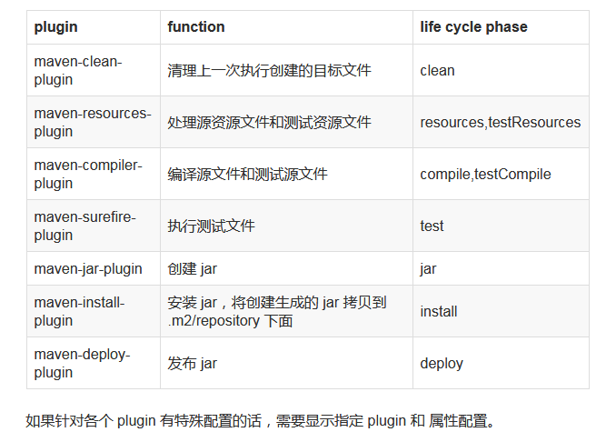

maven plugin
====================

Maven 默认插件
---------------

已知 Maven 使用 plugin 来执行实际操作的，在默认情况下，Maven 会绑定以下几个插件来完成基本操作。

创建一个空的 maven 项目 HelloWorld，pom.xml 文件不包含任何 plugin。

.. code:: java

    <?xml version="1.0" encoding="UTF-8"?>
    <project xmlns="http://maven.apache.org/POM/4.0.0" xmlns:xsi="http://www.w3.org/2001/XMLSchema-instance"
             xsi:schemaLocation="http://maven.apache.org/POM/4.0.0 http://maven.apache.org/xsd/maven-4.0.0.xsd">
        <modelVersion>4.0.0</modelVersion>
        <groupId>com.meituan.log</groupId>
        <artifactId>HelloWorld</artifactId>
        <version>1.0-SNAPSHOT</version>
        <packaging>jar</packaging>
        <dependencies>
            <dependency>
                <groupId>org.apache.hadoop</groupId>
                <artifactId>zookeeper</artifactId>
                <version>3.3.1</version>
            </dependency>
            <dependency>
                <groupId>org.apache.hadoop</groupId>
                <artifactId>zookeeper</artifactId>
                <version>3.3.1</version>
            </dependency>
        </dependencies>
    </project>

下面是执行 mvn clean install 产生的执行日志，通过日志可以看到每个步骤都显示 plugin 名称，版本号，生命周期阶段，执行操作等。

- maven-clean-plugin:2.5:clean (default-clean)
- maven-resources-plugin:2.6:resources (default-resources)
- maven-compiler-plugin:3.1:compile (default-compile)
- maven-resources-plugin:2.6:testResources (default-testResources)
- maven-compiler-plugin:3.1:testCompile (default-testCompile)
- maven-surefire-plugin:2.12.4:test (default-test)
- maven-jar-plugin:2.4:jar (default-jar)
- maven-install-plugin:2.4:install (default-install)

集中常用plugin
---------------------

https://www.cnblogs.com/zhangxh20/p/6298062.html

------

参考
-----

`Maven 默认插件以及功能`_

.. -`Maven 默认插件以及功能`: https://www.jianshu.com/p/977b71e2837e