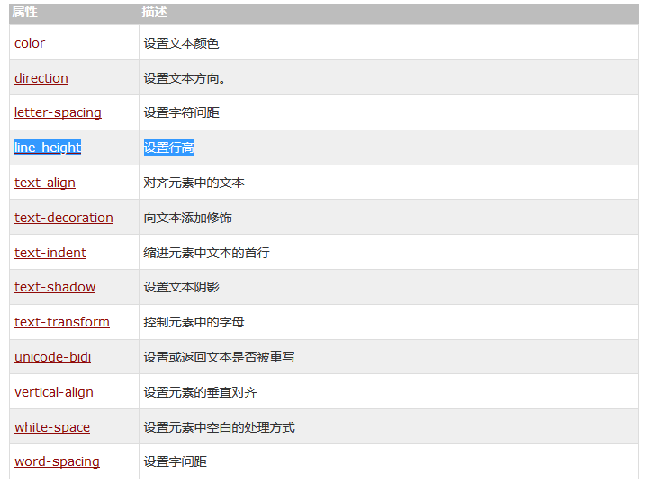

背景
-----

::

    h1{
        background-color:#6495ed;
    }
    p{
        background-color:#e0ffff;
    }
    div{
        background-color:#b0c4de;
    }

CSS 属性定义背景效果：

::

    background-color
    background-image
    background-repeat
    background-attachment
    background-position

文本
----

**color**

三种类型定义

::

    十六进制值 - 如"＃FF0000"

    一个RGB值 - "RGB（255,0,0）"

    颜色的名称 - 如 red

**文本的对齐方式**

::

    h1 {text-align:center;}
    p.date {text-align:right;}
    p.main {text-align:justify;}

**文本修饰**

::

    h1 {text-decoration:overline;}
    h2 {text-decoration:line-through;}
    h3 {text-decoration:underline;}

比如a标签内的值会在html中显示带下划线，可以使用如下方式去掉下划线

    a {text-decoration:none;}

**文本转换**

::

    p.uppercase {text-transform:uppercase;}
    p.lowercase {text-transform:lowercase;}
    p.capitalize {text-transform:capitalize;}  // 首字母大写

**文本缩进**

    p {text-indent:50px;}

**文本间隔**

word-spacing 属性可以改变字（单词）之间的标准间隔。其默认值 normal 与设置值为 0 是一样的。

::

    p{
    word-spacing:30px;
    }

**行高**

::

    p.small {line-height:70%;}
    p.big {line-height:200%;}

**指定字符之间的空间**

::

    h1 {letter-spacing:2px;}
    h2 {letter-spacing:-3px;}

**不换行**

::

    p{
    white-space:nowrap;
    }

**图片与文字的对齐位置**

::

    img.top {vertical-align:text-top;}
    img.bottom {vertical-align:text-bottom;}

**文本阴影**

h1 {text-shadow:2px 2px #FF0000;}  // 第一个2px是往左的偏移，第二个是往右的偏移，第三个是偏移的颜色

**所有的文本属性**

css text from : https://www.w3cschool.cn/css/css-text.html

字体
--------

字体系列

font-family 属性设置文本的字体系列。

font-family 属性应该设置几个字体名称作为一种"后备"机制，如果浏览器不支持第一种字体，他将尝试下一种字体。

注意: 如果字体系列的名称超过一个字，它必须用引号，如Font Family："宋体"。

多个字体系列是用一个逗号分隔指明：

::

    p{font-family:"Times New Roman", Times, serif;}

**font**

{
    font:italic bold 12px/30px Georgia,serif;
}

font 简写属性在一个声明中设置所有字体属性。

设置的属性是（按顺序）： "font-style font-variant font-weight font-size/line-height font-family"

font-size和font-family的值是必需的。如果缺少了其他值，默认值将被插入，如果有默认值的话。

**字体大小**

::

    h1 {font-size:40px;}
    h2 {font-size:30px;}
    p {font-size:14px;}

**字体加粗**

::

    p.normal {font-weight:normal;}
    p.light {font-weight:lighter;}
    p.thick {font-weight:bold;}
    p.thicker {font-weight:900;}

**字体转变**

::

    p.small {font-variant:small-caps;}

**字体风格**

::

    p.normal {font-style:normal;}
    p.italic {font-style:italic;}
    p.oblique {font-style:oblique;}

链接
-----------

::

    a:link {color:#FF0000;}      /* 未访问链接*/
    a:visited {color:#00FF00;}  /* visited link */
    a:hover {color:#FF00FF;}  /* mouse over link */
    a:active {color:#0000FF;}  /* selected link */

当设置为若干链路状态的样式，也有一些顺序规则：

    a:hover 必须跟在 a:link 和 a:visited后面

    a:active 必须跟在 a:hover后面

:: 

    a:link {background-color:#B2FF99;}
    a:visited {background-color:#FFFF85;}
    a:hover {background-color:#FF704D;}
    a:active {background-color:#FF704D;}

列表
------------

无序列表
^^^^^^^^^

::

    ul.a {list-style-type: circle;}
    ul.b {list-style-type: square;}

实例

::

    <ul class="a">
      <li>Coffee</li>
      <li>Tea</li>
      <li>Coca Cola</li>
    </ul>

有序列表
^^^^^^^^^

::

    ol.c {list-style-type: upper-roman;}
    ol.d {list-style-type: lower-alpha;}

一些值是无序列表，以及有些是有序列表。

下列是对list-style-type属性的常见属性值的描述：

- none：不使用项目符号
- disc：实心圆
- circle：空心圆
- square：实心方块
- demical：阿拉伯数字 
- lower-alpha：小写英文字母 
- upper-alpha：大写英文字母 
- lower-roman：小写罗马数字 
- upper-roman：大写罗马数字

**图象显示**

::

    ul{
    list-style-image: url('sqpurple.gif');
    }

::

    ul
    {
    list-style-type: none;
    padding: 0px;
    margin: 0px;
    }
    ul li
    {
    background-image: url(sqpurple.gif);
    background-repeat: no-repeat;
    background-position: 0px 5px;
    padding-left: 14px;
    }

**列表 -缩写属性**

::

    ul{
    list-style: square url("sqpurple.gif");
    }

如果使用缩写属性值的顺序是：

::

    list-style-type
    list-style-position (有关说明，请参见下面的CSS属性表)   // inside、outside、inherit
    list-style-image

如果上述值丢失一个，其余仍在指定的顺序，就没关系。

表格
--------

下面的例子指定了一个表格的Th和TD元素的黑色边框：

::

    table, th, td
    {
    border: 1px solid black;
    }

**表格宽度和高度**

::

    table
    {
    width:100%;
    }
    th
    {
    height:50px;
    }

**表格文字对齐**

::

    td
    {
    text-align:right;
    }

**垂直方向**

::

    td
    {
        height:50px;
        vertical-align:bottom;
    }

**表格填充**

如果在表的内容中控制空格之间的边框，应使用td和th元素的填充属性：

::

    td
    {
    padding:15px;
    }

**表格颜色**

::

    th
    {
        background-color:green;
        color:white;
    }

**设置表格标题的位置**

::

    caption {caption-side:bottom;}

表格如下

::

    <table border="1">
    <caption>Table 1.1 Customers</caption>
    <tr>
    ......