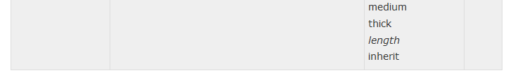

CSS 盒子模型(Box Model)
=================================

所有HTML元素可以看作盒子，在CSS中，"box model"这一术语是用来设计和布局时使用。

CSS盒模型本质上是一个盒子，封装周围的HTML元素，它包括：边距，边框，填充，和实际内容。

盒模型允许我们在其它元素和周围元素边框之间的空间放置元素。

下面的图片说明了盒子模型(Box Model)：

.. image:: ./images/box-model.gif

不同部分的说明：

    - Margin（外边距） - 清除边框区域。Margin没有背景颜色，它是完全透明
    - Border（边框） - 边框周围的填充和内容。边框是受到盒子的背景颜色影响
    - Padding（内边距） - 清除内容周围的区域。会受到框中填充的背景颜色影响
    - Content（内容） - 盒子的内容，显示文本和图像

边框
------

**边框样式**

**边框宽度**

您可以通过 border-width 属性为边框指定宽度。

为边框指定宽度有两种方法：可以指定长度值，比如 2px 或 0.1em；或者使用 3 个关键字之一，它们分别是 thin 、medium（默认值） 和 thick。

**边框颜色**

border-color属性用于设置边框的颜色，它一次可以接受最多 4 个颜色值。可以设置的颜色：

::

    name - 指定颜色的名称，如 "red"
    RGB - 指定 RGB 值, 如 "rgb(255,0,0)"
    Hex - 指定16进制值, 如 "#ff0000"

您还可以设置边框的颜色为"transparent"。

注意： border-color单独使用是不起作用的，必须得先使用border-style来设置边框样式。

::

    p.one
    {
    border-style:solid;
    border-color:red;
    } 

**边框-单独设置各边**

::

    p
    {
    border-top-style:dotted;
    border-right-style:solid;
    border-bottom-style:dotted;
    border-left-style:solid;
    }

    //等于

    border-style:dotted solid;

border-style属性可以有1-4个值：

- border-style:dotted solid double dashed;

::

    上边框是 dotted
    右边框是 solid
    底边框是 double
    左边框是 dashed

- border-style:dotted solid double;

::

    上边框是 dotted
    左、右边框是 solid
    底边框是 double

- border-style:dotted solid;

::

    上、底边框是 dotted
    左、右边框是 solid

- border-style:dotted;

::

    四面边框是 dotted

**透明边框**

CSS2 引入了边框颜色值 transparent，这个值用于创建有宽度的不可见边框。

透明样式的定义如下：

::

    a:link, a:visited {
      border-style: solid;
      border-width: 5px;
     border-color: transparent;
      }
    a:hover {border-color: gray;}

利用 transparent，使用边框就像是额外的内边距一样；此外还有一个好处，就是能在你需要的时候使其可见。这种透明边框相当于内边距，因为元素的背景会延伸到边框区域（如果有可见背景的话）。 

**边框-简写属性**

上面的例子用了很多属性来设置边框。

你也可以在一个属性中设置边框。

你可以在"border"属性中设置：

::

    border-width
    border-style (required)
    border-color

实例

    border:5px solid red;

outline
-------------

轮廓（outline）是绘制于元素周围的一条线，位于边框边缘的外围，可起到突出元素的作用。

CSS outline 属性规定元素轮廓的样式、颜色和宽度。

Margin(外边距)
--------------------

CSS Margin(外边距)属性定义元素周围的空间。

CSS Margin属性接受任何长度单位、百分数值甚至负值。

上 右 下 左

Padding（内边距）
---------------

::

    padding-top:25px;
    padding-bottom:30px;
    padding-right:50px;
    padding-left:55px;

=

::

    padding:25px 50px  30px 55px;

上 右 下 左

::

    padding:25px 50px;

25px 上下

50px 左右

