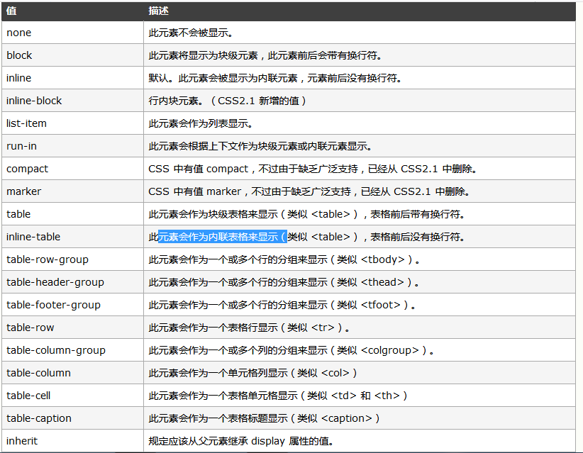
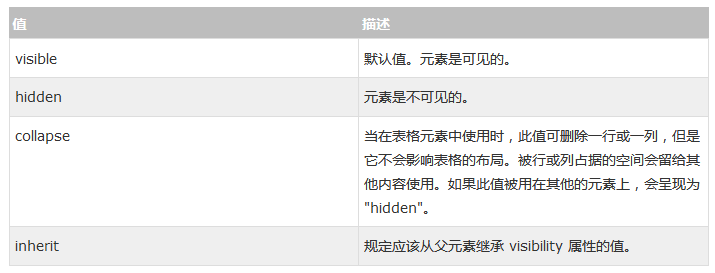

分组与嵌套
--------------------

**分组**

**嵌套**

显示
--------

- display 
- Visibility  

隐藏元素 - display:none或visibility:hidden

visibility:hidden可以隐藏某个元素，但隐藏的元素仍需占用与未隐藏之前一样的空间。也就是说，该元素虽然被隐藏了，但仍然会影响布局。

**display 属性**

**visibility 属性**

定位
--------

position
^^^^^^^^^^^

**Static 定位**

HTML元素的默认值，即没有定位，元素出现在正常的流中。

静态定位的元素不会受到top, bottom, left, right影响。

**Fixed 定位**

元素的位置相对于浏览器窗口是固定位置。

即使窗口是滚动的它也不会移动：

Fixed定位使元素的位置与文档流无关，因此不占据空间。

Fixed定位的元素和其他元素重叠。

**Relative 定位**

相对定位元素的定位是相对其正常位置。

可以移动的相对定位元素的内容和相互重叠的元素，它原本所占的空间不会改变。

相对定位元素经常被用来作为绝对定位元素的容器块。

 即使相对定位元素的内容是移动,预留空间的元素仍保存在正常流动。

 相对定位的元素的位置相对于最近的元素

**Absolute 定位**

绝对定位的元素的位置相对于最近的已定位父元素，如果元素没有已定位的父元素，那么它的位置相对于<html>:

Absolutely定位使元素的位置与文档流无关，因此不占据空间。

Absolutely定位的元素和其他元素重叠。

总结： absolute 文档流无关 ，相对于最近的已定位的父元素 fixed 文档流无关
      relative 文档流有关 static 有关

bottom
^^^^^^^^^^^

定义了定位元素下外边距边界与其包含块下边界之间的偏移。

(注意 position 的 absolute 和 relative 对 bottom 的影响)

relative: 相对于该元素本来的位置的偏移

absolute: 相对于父元素的偏移

left
^^^^^^^

定义了定位元素左外边距边界与其包含块左边界之间的偏移

同上

top
^^^^^^

同上

right
^^^^^^^^

同上

float
^^^^^^^^

CSS float 属性定义元素在哪个方向浮动，浮动元素会生成一个块级框，直到该块级框的外边缘碰到包含框或者其他的浮动框为止。

::

    .thumbnail 
    {
        float:left;
        width:110px;
        height:90px;
        margin:5px;
    }
    .text_line
    {
        clear:both;
        margin-bottom:2px;
    }

详见 https://www.w3cschool.cn/css/css-float.html

::

    img 
    {
        float:right;
        border:1px dotted black;
        margin:0px 0px 15px 20px;
    }

裁剪元素的外形
^^^^^^^^^^^^^^^^

剪辑一个绝对定位的元素

::

    img 
    {
        position:absolute;
        clip:rect(0px,60px,200px,0px);
    }

滚动 overflow 
^^^^^^^^^^^^^^^^

如何使用滚动条来显示元素内溢出的内容

::

    div.scroll
    {
        background-color:#00FFFF;
        width:100px;
        height:100px;
        overflow:scroll;
    }

改变光标
----------

::

    <body>
    
将鼠标移动到这些字上改变鼠标样式cursor.

    auto 
    crosshair 
    default 
    e-resize 
    help 
    move 
    n-resize 
    ne-resize 
    nw-resize 
    pointer 
    progress 
    s-resize 
    se-resize 
    sw-resize 
    text 
    w-resize 
    wait 
    </body>